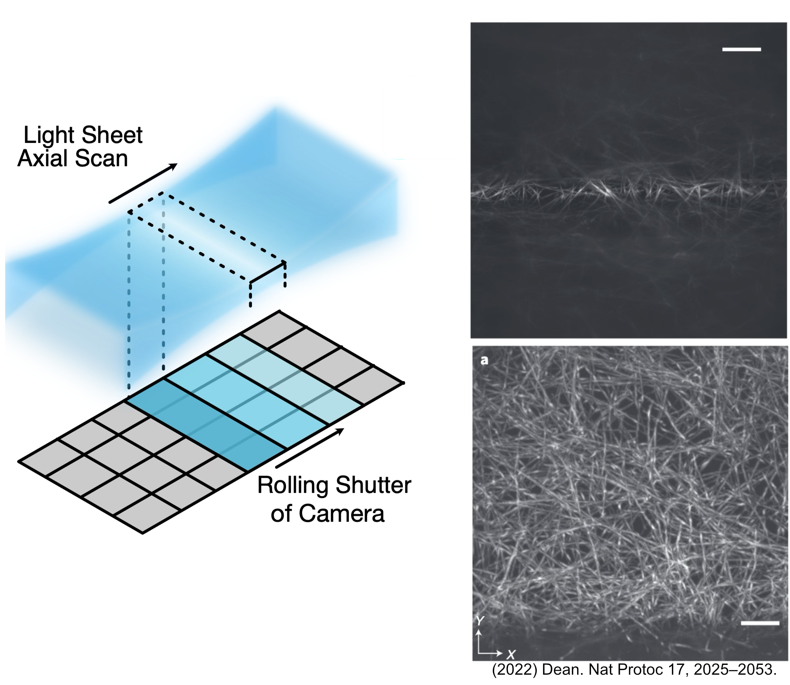
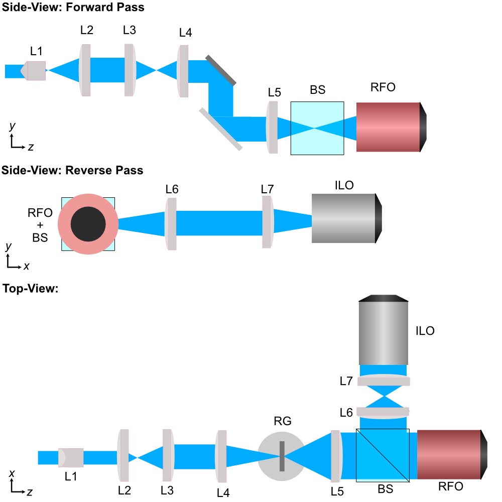
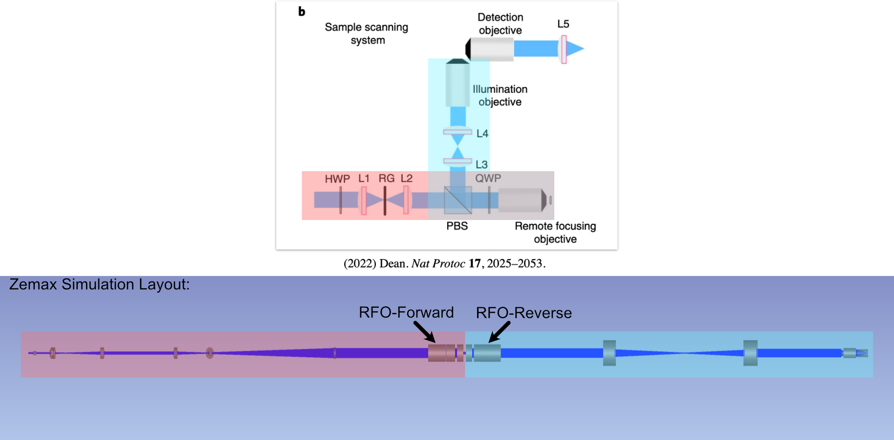

.. _aslmbaseplate-home:

##############
Altair ALSM/CTASLM Baseplate
##############

---------------

Overview
______________________

For the second iteration of our Altair baseplate system, we set out to make a number of different updates/upgrades
from our first baseplate system design.

For starters, the second iteration of our Altair LSFM baseplate incorporates 3 different microscope configurations:
    1. Traditional Sample-Scanning SPIM
    2. Sample-Scanning Axially-Swept Light Sheet Microscope (ASLM)
    3. Sample-Scanning Cleared-Tissue ASLM (CTASLM)

Where each of these microscope paths incorporate as many of the same elements as possible between them, such that
switching or upgrading between these modes is as accessible as possible and doesn't require repurchasing all
components along their respective illumination paths.

The primary distinction between ASLM/CTASLM and our SPIM paths is the incorporation of a remote focusing objective (RFO)
system into the illumination path itself. The RFO system essentially allows the light sheet focus to be swept across
the full field of view (FoV) of your imaging sensor, in comparison to the traditional SPIM system which is limited to a
thin line profile on the imaging sensor. More information on ASLM can be found `here <https://www.nature.com/articles/s41596-022-00706-6>`_.
Figure 1 below details the ASLM process, where on the left a schematic of how the focus of the light sheet is swept and
synced with the rolling shutter of an associated camera system in ASLM is shown. On the right is two different images
taken where the top image is taken without utilizing the RFO and the bottom is utilizing the RFO, where when it's
utilized the beam is able to be swept across the full FoV of the image.

    **Figure 1:** Introduction to the features of ASLM.

Another notable update for these microscope systems are that they also are fully optimized via simulation for three
different illumination wavelengths (488 nm, 560 nm, and 640 nm), whereas our first baseplate design was optimized
specifically for 488 nm. This should improve the overall quality of imaging between the different excitation
wavelengths used in various fluorescent tags.

In addition to the aforementioned upgrades, this iteration of Altair also utilizes a Powell lens instead of a
cylindrical lens as the element that forms our light sheet profile itself. Powell lenses are a specialized variant of
lenses that are known to produce line profiles with consistent and uniform intensity. When utilized in light-sheet
imaging, these lenses essentially help provide a more uniform intensity of illumination across the full FoV of the
imaging sensor when compared to cylindrically formed light-sheets which feature more of a gaussian intensity
distribution associated with them. More information on Powell lenses can be found at `Laserline Optics <https://www.laserlineoptics.com/powell_primer.html`_.

----------------

Zemax Simulation Setup Process
______________________________

Similarly to our methods used for designing our first iteration of our baseplate (link to page), we first start by
using basic magnification equations to select theoretical focal lengths of lenses that would be needed along our
illumination path to form a light sheet with our desired physical characteristics. A basic schematic of what one of
these ALSM-based systems would look like is shown below in Figure (3).

    **Figure 1:** Schematic of the ASLM illumination path design.

.. list-table::
       :header-rows: 1

       * - Lens #
         - Lens Description
         - Link
       * - L1
         - L2
         - L3
         - L4
         - L5
         - L6
         - L7
         - RFO
         - ILO
       * - Powell Lens - LOCP-8.9R20-2.0
         - Achromatic Doublet f = 30 mm
         - Achromatic Doublet f = 80 mm
         - Achromatic Doublet f = 75 mm
         - Achromatic Doublet f = 300 mm
         - Tube Lens f = 200 mm
         - Tube Lens f = 200 mm
         - Remote Focus Objective TL15X-2P, EFL = 13.3 mm
         - Illumination Objective TL20X-MPL, EFL = 10 mm
       * - https://www.laserlineoptics.com/store/product/powell-lens/
         - https://www.thorlabs.com/thorproduct.cfm?partnumber=AC254-030-A
         - https://www.thorlabs.com/thorproduct.cfm?partnumber=AC254-080-A
         - https://www.thorlabs.com/thorproduct.cfm?partnumber=AC254-075-A
         - https://www.thorlabs.com/thorproduct.cfm?partnumber=AC254-300-A
         - https://www.thorlabs.com/thorproduct.cfm?partnumber=TTL200-A
         - https://www.thorlabs.com/thorproduct.cfm?partnumber=TTL200-A
         - https://www.thorlabs.com/thorproduct.cfm?partnumber=TL15X-2P
         - https://www.thorlabs.com/thorproduct.cfm?partnumber=TL20X-MPL

Mapping between RFO and ILO

Selection of lenses

Split between ASLM and CTASLM Systems

Baseplate design

    **Figure 2:** Conceptual setup of the ASLM-based Zemax simulations.

