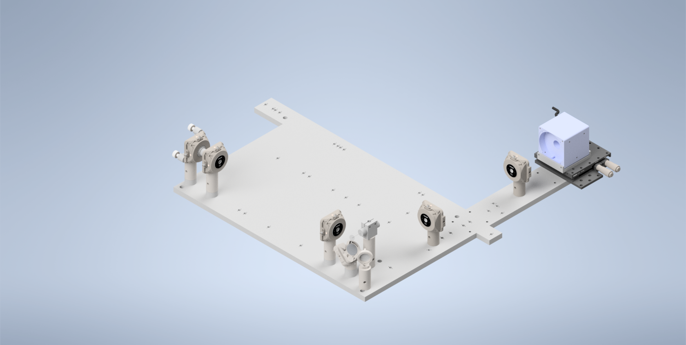
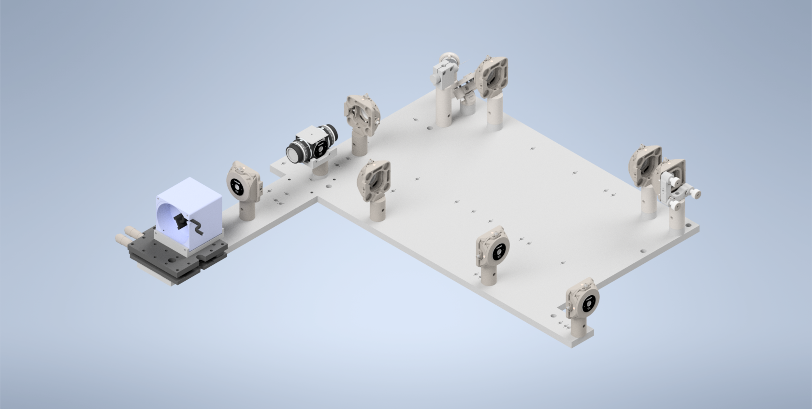

.. _aslmbpalignment-home:

###############################
ALSM/CTASLM Baseplate Alignment
###############################

Overview
______________________

For the second iteration of our Altair baseplate system, the construction and alignment process is more involved than
our first iteration, but should still be a straightforward step-by-step process.

-------------------------

Step 1: Laser Collimation
_________________________

When first assembling the system, ensuring proper output collimation from the fiber laser source is critical. There are multiple checks that one can take for this step, but we utilize a combination of a `shear-plate interferometer <https://www.thorlabs.com/newgrouppage9.cfm?objectgroup_id=2970>`_ and two pinhole apertures placed at opposite ends along the length of the baseplate. Shear-plate interferometers are designed to split and interfere an input beam of coherent light, such that when the beam is collimated there are interference fringes aligned vertically with a reference line. The fiber laser collimator we used for this system is the `Thorlabs CFC11A-A <https://www.thorlabs.com/thorproduct.cfm?partnumber=CFC11A-A>`_, which features an adjustable barrel which controls the position of collimation optics within the element.

The basic assembly process involves first inserting and fixing the CFC11A-A into a Thorlabs AD15S2 adapter, which allows it to then be mounted into a 2.5" Polaris K1XY mount. This assembly is then mounted onto the respective Polaris post at the start of the baseplate. The fiber laser source is then able to be directly mounted into the CFC11A-A, making sure that the protrusion on the fiber wire aligns with the open section of the CFC11A-A port. The basic process of ensuring collimation then involves turning on the laser source, and placing the shear-plate interferometer such that the input port aligns with the output of the laser unit. Then, by slowly adjusting the barrel of the CFC11A-A and observing the interference fringe orientations along the top display of the interferometer, one is able to adjust the beam until it is properly collimated.

.. figure:: Images/LaserAlignment1.png
    :align: center
    :alt: Shear Plate interferometer and collimator lens

    **Figure 1:** Shear Plate interferometer and collimator lens

----------------------

Step 2: Beam Walking 1
______________________

**Section Goal: Ensure that the beam is traveling parallel to the baseplate surface and through the center of all
mounted elements up to the RFO location (part 1).**

With the beam properly collimated, we can begin the series of steps to walk the beam such that it is both centered on
all of our optical elements as well as runs parallel to the surface of the baseplate. Then place one 2.5” Polaris
post at these three locations: the hole corresponding to the Powell lens, the hole corresponding to L4, and the hole
corresponding to the remote focus objective (RFO) location. Then place 1XY mounts on each of those 2.5” Polaris Posts
. Then screw SM1-threaded adjustable irises (`SM1D12 <https://www.thorlabs.com/thorproduct
.cfm?partnumber=SM1D12>`_) into those 1XY Mounts.
Then place a 1” mirror in a Polaris B1F mount and mount it on a 3” optical post in the 45 degree oriented mounting position on the board as shown in the image below.
With the irises and mirror in place, this step becomes and iterative process of adjusting the XY and Tip/Tilt of the laser K1XY mount until the beam passes through the center of all irises and roughly onto the center of the mirror. As a general direction, starting with the irises opened more and then steadily closing them further as you refine the tip/tilt and XY of the K1XY is recommended. If adjusting the tip/tilt of the K1XY becomes a bit overwhelming, it might be helpful to screw all of the tip/tilt knobs on the mount fully in, such that the starting point that you’re working from should be roughly flat (perpendicular to the surface of the baseplate).

.. figure:: Images/PCBaseplateV2LaserAlignment1.png
    :align: center
    :alt: Beam Walking 1

    **Figure 2:** Beam Walking 1

----------------------

Step 3: Beam Walking 2
______________________

Test Text

    **Figure 3:** Beam Walking 2

----------------------

Step 4: Beam Walking 3
______________________

Test Text

.. figure:: Images/PCBaseplateV2LaserAlignment3.png
    :align: center
    :alt: Beam Walking 3

    **Figure 4:** Beam Walking 3

------------------------------

Step 5: Beamsplitter Alignment
______________________________

Test Text

.. figure:: Images/PCBaseplateV2BSAlignment1.png
    :align: center
    :alt: Beamsplitter Alignment

    **Figure 5:** Beamsplitter Alignment

----------------------

Step 6: Beam Walking 4
______________________

Test Text

    **Figure 6:** Beam Walking 4

----------------------

Step 7: Beam Walking 5
______________________

Test Text

.. figure:: Images/PCBaseplateV2LaserAlignment5.png
    :align: center
    :alt: Beam Walking 5

    **Figure 7:** Beam Walking 5

