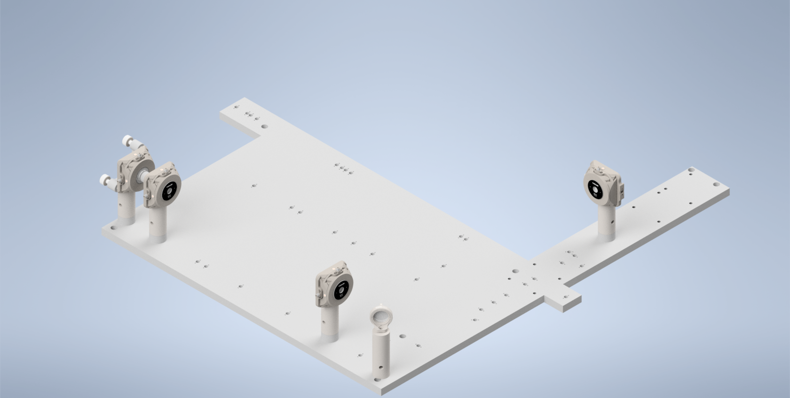
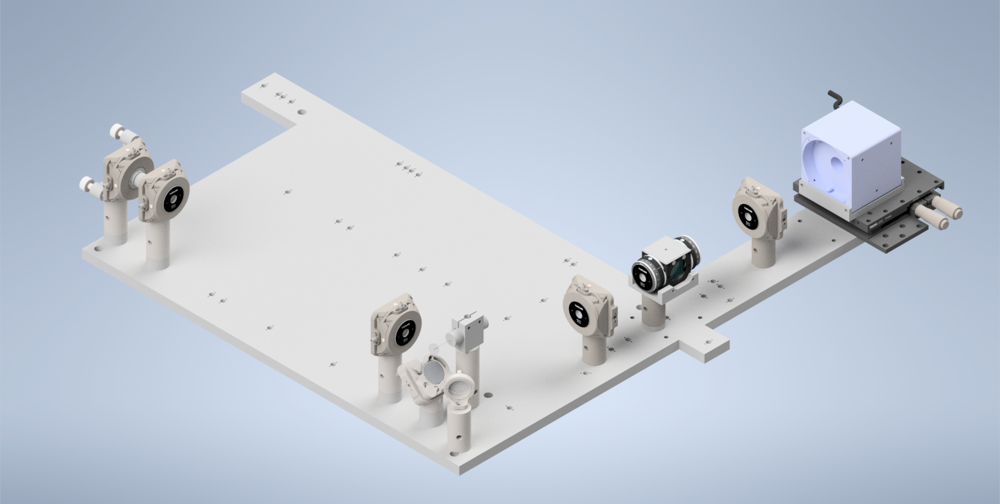

.. _aslmbaseplatealignment-home:

############################
Altair ALSM/CTASLM Baseplate
############################

Overview
______________________

For the second iteration of our Altair baseplate system, the construction and alignment process is more involved than
our first iteration, but should still be a straightforward step-by-step process.

------------------------------

Step 1: Laser Collimation
______________________________

When first assembling the system, ensuring proper output collimation from the fiber laser source is critical. There are multiple checks that one can take for this step, but we utilize a combination of a `shear-plate interferometer <https://www.thorlabs.com/newgrouppage9.cfm?objectgroup_id=2970>`_ and two pinhole apertures placed at opposite ends along the length of the baseplate. Shear-plate interferometers are designed to split and interfere an input beam of coherent light, such that when the beam is collimated there are interference fringes aligned vertically with a reference line. The fiber laser collimator we used for this system is the `Thorlabs CFC11A-A <https://www.thorlabs.com/thorproduct.cfm?partnumber=CFC11A-A>`_, which features an adjustable barrel which controls the position of collimation optics within the element.

The basic assembly process involves first inserting and fixing the CFC11A-A into a Thorlabs AD15S2 adapter, which allows it to then be mounted into a 2.5" Polaris K1XY mount. This assembly is then mounted onto the respective Polaris post at the start of the baseplate. The fiber laser source is then able to be directly mounted into the CFC11A-A, making sure that the protrusion on the fiber wire aligns with the open section of the CFC11A-A port. The basic process of ensuring collimation then involves turning on the laser source, and placing the shear-plate interferometer such that the input port aligns with the output of the laser unit. Then, by slowly adjusting the barrel of the CFC11A-A and observing the interference fringe orientations along the top display of the interferometer, one is able to adjust the beam until it is properly collimated.

.. figure:: Images/LaserAlignment1.png
    :align: center
    :alt: Shear Plate interferometer and collimator lens
    :width: 60%

    **Figure 4:** Shear Plate interferometer and collimator lens

------------------------------

Step 2: Beam Walking 1
______________________________

Test Text

    **Figure 2:** Beam Walking 1

------------------------------

Step 3: Beam Walking 2
______________________________

Test Text

.. figure:: Images/PCBaseplateV2_LaserAlignment2.png
    :align: center
    :alt: Beam Walking 2

    **Figure 3:** Beam Walking 2

------------------------------

Step 4: Beam Walking 3
______________________________

Test Text

    **Figure 4:** Beam Walking 3

------------------------------

Step 5: Beamsplitter Alignment
______________________________

Test Text

.. figure:: Images/PCBaseplateV2_BSAlignment1.png
    :align: center
    :alt: Beamsplitter Alignment

    **Figure 5:** Beamsplitter Alignment

------------------------------

Step 6: Beam Walking 4
______________________________

Test Text

.. figure:: Images/PCBaseplateV2_LaserAlignment4.png
    :align: center
    :alt: Beam Walking 4

    **Figure 6:** Beam Walking 4

------------------------------

Step 7: Beam Walking 5
______________________________

Test Text

.. figure:: Images/PCBaseplateV2_LaserAlignment5.png
    :align: center
    :alt: Beam Walking 5

    **Figure 7:** Beam Walking 5