.. _aslmbpalignment-home:

##########################################
ASLM/CTASLM Baseplate Assembly & Alignment
##########################################

Available Configurations
________________________

The current iteration of the baseplate provides 5 different possible imaging configurations: 2 using a cylindrical
lens to form the light sheet (ASLM, CT-ASLM), and 3 using a Powell lens to form the light sheet (SPIM, ASLM, CT-ASLM).
Our primary focus in this section will be the construction and alignment of the Powell lens configurations, but the
cylindrical configurations will follow a similar process.

.. raw:: html

   

     <!-- Slides -->
     

       
       
Powell ASLM

     

     

       
       
Powell CT-ASLM

     

     

       
       
Powell SPIM

     

     

       
       
Cylindrical ASLM

     

     

       
       
Cylindrical CT-ASLM

     

     <!-- Left/Right Arrows -->
     <button onclick="prevSlide()"
             style="position:absolute; top:50%; left:0; transform:translateY(-50%); font-size:30px; background:none; border:none; cursor:pointer;">&#10094;</button>
     <button onclick="nextSlide()"
             style="position:absolute; top:50%; right:0; transform:translateY(-50%); font-size:30px; background:none; border:none; cursor:pointer;">&#10095;</button>
   

   

   

----------------------------

Breakdown of Baseplate Holes
____________________________

Here we show a breakdown of all the holes on the baseplate in terms of what configuration they're designed for
(Figure 1), the post height corresponding to those holes (Figure 1), and the elements corresponding to each hole
(Figure 2). It should be noted that we include a couple additional holes on the baseplate for alternative component
mounting schemes (Figure 2). Figure 2 also shows the orientation that each of the lenses should be in within the
setup, where for the TTL tube lenses the orientation is shown based on the direction of the TTL labeling on the
lenses themselves.

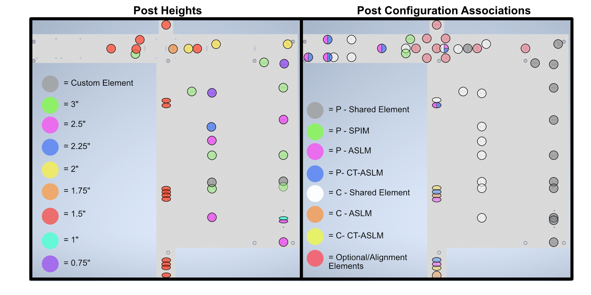

    **Figure 1:** Labeled baseplate holes based on post height (left) and configuration (right)

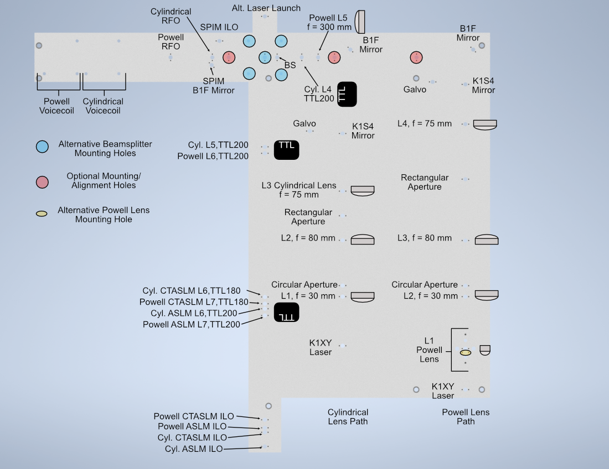

    **Figure 2:** Labeled baseplate holes based on what component is placed at each hole

--------

Assembly
________

Assembly Overview
^^^^^^^^^^^^^^^^^^^^^^^^^^

For the second iteration of our Altair baseplate system, the construction and alignment process is more involved than
our first iteration, but should still be a straightforward step-by-step process.

-------------------------

Powell Lens Assembly
^^^^^^^^^^^^^^^^^^^^^^^^^^

Our newest illumination path configurations utilize a Powell lens as the element that forms the light sheet profile
itself instead of a cylindrical lens. Our mounting scheme for the Powell lens offers control over all 3 axes (x, y,
and z), where the Polaris 1XY Mount covers x and y and the LNR25M covers z. We found that outside of the Polaris 1XY
for centering the Powell lens precisely on the beam, due to tolerances of the Powell lens from Laserline, we
also needed to adjust the distance between the Powell lens and L2 to have our physical system align with our
simulations.

**Step 1: Fixing the Powell lens into the AD9F Mount**

For the first step, get a piece of optical tissue paper and the AD9F and Powell lens. Place the flat face of the
Powell lens onto the tissue paper, and then place the AD9F onto the Powell lens such that the front surface of the
smaller side of the AD9F is flush with the flat face of the Powell lens. Use the two mounting screws on the AD9F to
secure the lens in place.

.. card:: Powell Lens into AD9F Assembly

   .. raw:: html

      <video controls style="width:50%;">
        <source src="../_static/baseplate2_alignment/assembly/videos/PowellAD9F.mp4" type="video/mp4">
        your browser doesn't support video
      </video>

**Step 2: Install the LRM1 rotation Mount into the Polaris 1XY**

Screw the threaded portion of the LRM1 into the threaded hole on the Polaris 1XY until the back surface of the LRM1
is flush with the front of the 1XY.

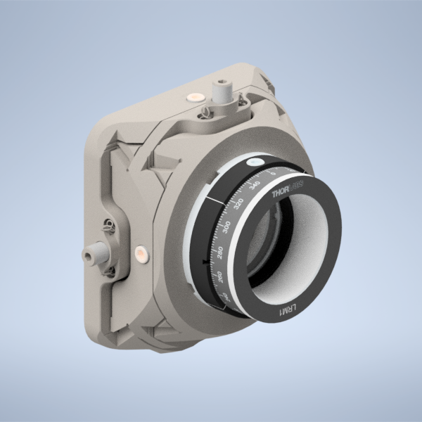

    **Figure 1:** Screwing the LRM1 into the 1XY

**Step 3: Install the LNR25M onto the Baseplate**

There are a variety of holes on the baseplate that one can use to fix the LNR25M in place. In the graphic below, the
two holes in red on the top of the LNR25M allow you to thread 1/4-20 screws directly through the LNR25M into the
threaded holes on the baseplate below. There are also two 3 mm-diameter dowel pins on the bottom of the LNR25M that
have corresponding holes on the baseplate in blue. Finally, there are three holes on the baseplate in yellow that
correspond to threaded holes on the bottom of the LNR25M, 1/4-20 screws can be used to secure the LNR25M through
these holes the same way that one would fix the other Polaris posts on the baseplate in place.

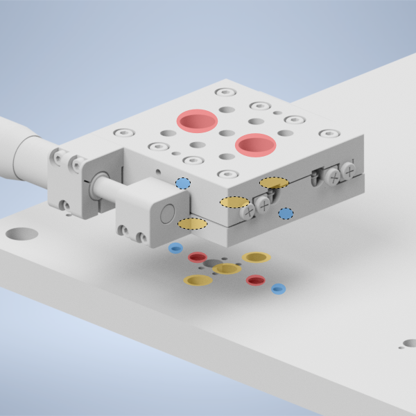

    **Figure 2:** placing the LNR25M onto the baseplate

**Step 4: Fix the 1" Polaris Post onto the LNR25M to Polaris adapter**

Then take the LNR25M to Polaris adapter and using the same 2 mm dowel pins and 1/4-20 screws that the other Polaris
posts in the system use, fix the 1" Polaris post onto the adapter by screwing in a 1/4-20 screw from the bottom of
the adapter into the post.

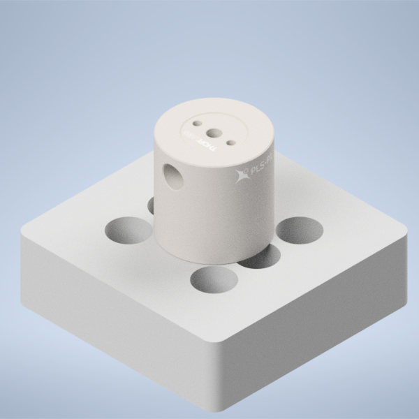

    **Figure 3:** placing the 1" Polaris Post onto the LNR25M Adapter

**Step 5: Install the LNR25M to Polaris adapter onto the LNR25M**

Then using the four holes on the top of the adapter surrounding the 1" post, place 1/4-20 screws in those holes and
screw them into the top of the LNR25M

.. figure:: Images/assembly/P1onLNR25AdapteronLNR25.png
    :align: center
    :alt: placing the LNR25M Adapter onto the LNR25

    **Figure 4:** placing the LNR25M Adapter onto the LNR25

**Step 6: Fix the Polaris 1XY onto the 1" Polaris post**

Using an 8-32 screw and the 2 mm dowel pins, fix the Polaris 1XY onto the top of the 1" Polaris post assembly.

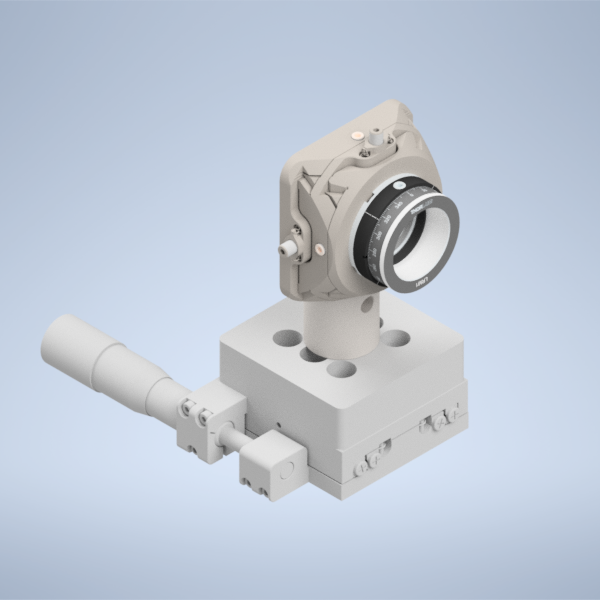

    **Figure 5:** Fixing the Polaris 1XY onto the 1" Polaris Post

**Step 7: Screw in the AD9F into the LRM1 mount until it's fully threaded**

Finally, screw in the AD9F fully into the LRM1 mount threading.

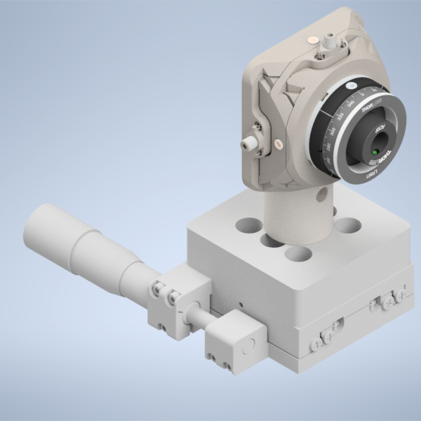

    **Figure 6:** Threading the AD9F into the LRM1 mount

------------------

Voicecoil Assembly
^^^^^^^^^^^^^^^^^^

**Step 1: Fixing the mirror into the voicecoil**

Start by taking a 0.5" mirror and fixing it into the central hole on our voicecoil using UV-cured resin adhesive.
Apply a thin layer of liquid resin to the back of the mirror, and place the mirror in the central voicecoil hole.
Then using a UV flashlight, cure the resin to secure the mirror in place.

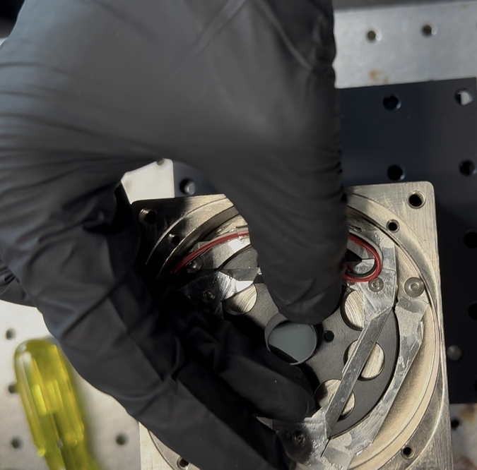

    **Figure 1:** Placing the mirror into the voicecoil hole

**Step 2: Secure the PY004 onto the baseplate**

Depending on if you're planning on the cylindrical or the Powell lens illumination paths, there will be a different
set of threaded holes to fix the PY004 onto the baseplate with, highlighted in the image below. The large 3-hole
pattern on the top of the PY004 should align directly with the three threaded holes on the baseplate. Screw 1/4"
screws into these holes to secure the PY004 in place.

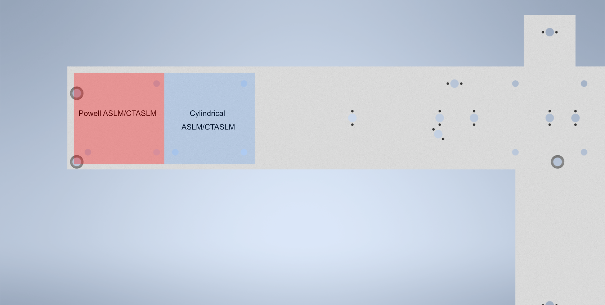

    **Figure 2:** Location of the holes used to secure the PY004 onto the baseplate depending on if you're doing an
    Powell or cylindrical lens system

**Step 3: Secure the voicecoil to PY004 adapter onto the PY004**

Using 1/4" screws in the 4 holes on the adapter, tighten the screws until the adapter is secured in place onto the
PY004.

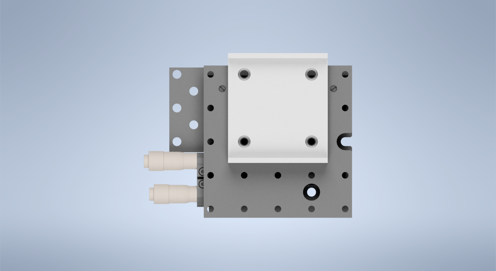

    **Figure 3:** Placement of the voicecoil adapter on the PY004

**Step 4: Secure the voicecoil to the adapter using the front screw holes**

Using 8/32" screws, secure the voicecoil onto the front of the adapter using the two thru-holes on the front of the
adapter.

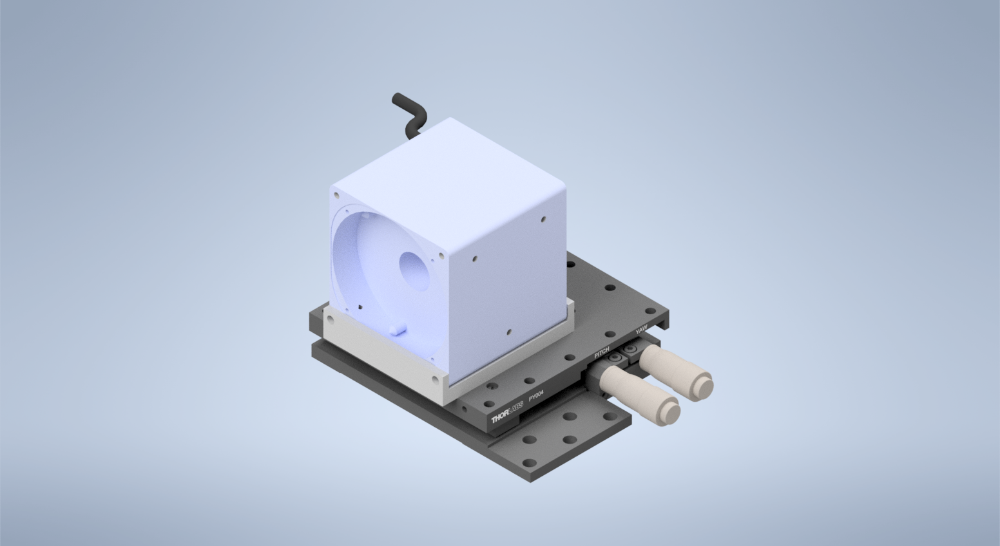

    **Figure 4:** Completed voicecoil assembly

-----------------------

Voice Coil Mirror Setup with Tiger Controller
==============================================

The voice coil mirror is driven by an analog waveform generated by the Tiger
Controller DAC card.

To achieve stable imaging:

- The signal must be wired correctly to the servo amplifier.
- The internal low-pass filter on the TGDAC must be enabled.

When configured properly, the mirror will move smoothly without visible oscillation
or image blur.

1. Wiring the Servo Amplifier
-----------------------------

The servo amplifier has two command input terminals, operated in a differential mode:

- Pin 1: ``+Cmd``
- Pin 2: ``-Cmd``

These are shown in the servo amplifier manual.

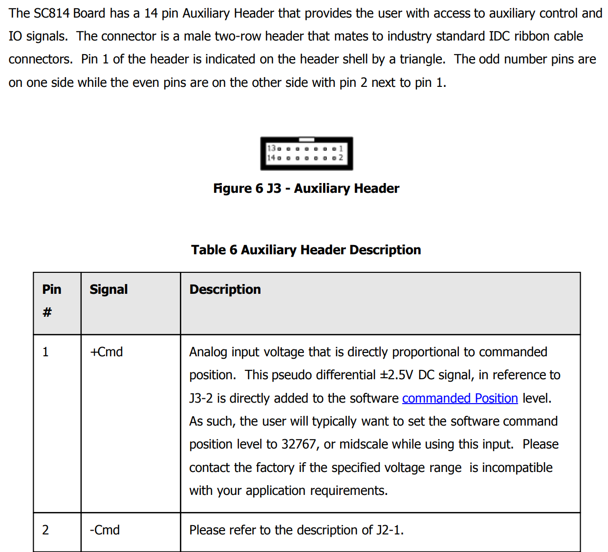

   Location of +Cmd and -Cmd terminals in the servo manual.

Connections
~~~~~~~~~~~

Two single-ended outputs from the Tiger DAC are used:

- DAC Output 1 → Control Signal
- Unused DAC Output → Reference

Connect as follows:

+----------------------+-----------------------+
| Tiger Output         | Connect To Servo      |
+======================+=======================+
| DAC Axis 1           | Pin 1: ``-Cmd``       |
| (Signal)             |                       |
+----------------------+-----------------------+
| DAC Axis 3           | Pin 2: ``+Cmd``       |
| (Reference)          |                       |
+----------------------+-----------------------+

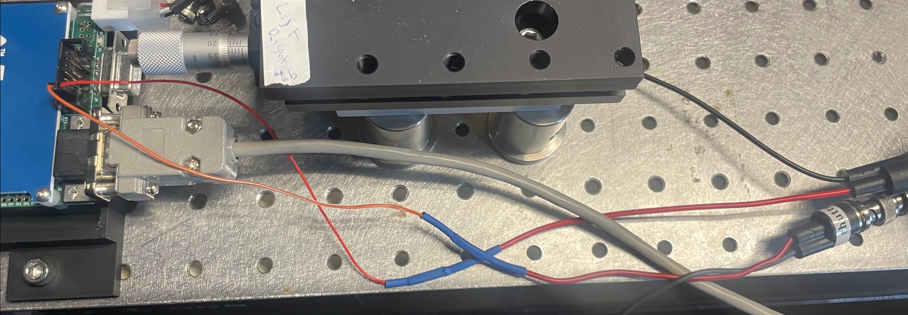

   Example of physical wiring between Tiger controller and servo amplifier.

2. Tiger Controller DAC Settings
---------------------------------

The DAC card includes a built-in **5th-order Bessel low-pass filter**.

This filter must be enabled to prevent mirror oscillation.

Required Setting
~~~~~~~~~~~~~~~~

- Low-pass filter cutoff frequency: **100 Hz**
- Apply this setting to:
  
  - The Signal axis
  - The Reference axis

This can be done in the Tiger Control Panel by sending the command ``B {axis}=0.1`` for each axis.

Both channels must use the same cutoff frequency.

This ensures the mirror receives a smooth waveform and prevents excitation of
mechanical resonance.

3. Waveform Requirements
------------------------

The mirror is sensitive to rapid changes in command voltage.

- Avoid instantaneous flyback transitions. 
- Include a short settling period if needed.

If oscillation or blur is observed:

- Increase fall time.
- Increase settle duration.
- Confirm the 100 Hz filter is enabled on both channels.

4. Verification Checklist
-------------------------

Before imaging, confirm:

- [ ] ``+Cmd`` and ``-Cmd`` wired correctly
- [ ] Analog ground connected
- [ ] 100 Hz filter enabled on both DAC channels
- [ ] No instantaneous flyback transitions

5. Notes
--------

- The system is sensitive to waveform shape.
- Even small changes in transition timing can affect image quality.
- If modifying scan parameters, re-check stability visually.

If further issues occur, contact the system maintainer before modifying
wiring or filter settings.

Tuning Remote Focus Waveform
==============================================

Within navigate, you are able to generate the remote focus waveform. The fundamental parts 
of the waveform include the rise time, flyback time, and settling time. The rise time is 
equivalent to the exposure time. This part must be aligned to the rolling shutter. This is
tuned by modifying the amplitude, offset, and remote focus and camera delays. The flyback time 
is the time for the mirror to return to the original position in order to be at the bottom 
of the shutter for the next image. This is followed by the settling time to allow the mirror 
to settle before the next image. Both the flyback and settling time must be long enough to 
ensure the mirror is not oscillating during the next exposure. This oscillation leads to a 
laser warble when looking at the beam, and image blur when viewing the sample.

To accurately tune the amplitude, offset, and delay values, follow the following steps:

**1. Find the center of the camera FOV**
  - An offset of about 5V with the Altair setup should bring the center of the focus to the 
    center of the camera FOV. 

.. list-table::
   :widths: 50 50
   :header-rows: 0

   * - .. figure:: Images/assembly/offset.png
          :width: 100%
          :align: center

          Aligning waveform center

     - .. figure:: Images/assembly/beam_offset.png
          :width: 100%
          :align: center

          Corresponding beam image (beam focus in center of camera FOV)

**2. Tune the amplitude to align with the rolling shutter**
  - Gradually increase the amplitude until the laser line is straight across the camera FOV.
    An amplitude of about 0.5 V aligns with the rolling shutter of the Hamamatsu Orca Flash. This 
    value will change based on the camera used, exposure time, and number of pixels (scan width).
    If the amplitude moves the thinnest part of the beam away from the center, the delay can be 
    adjusted to move it back to the center.

.. list-table::
   :widths: 50 50
   :header-rows: 0

   * - .. figure:: Images/assembly/amplitude.png
          :width: 100%
          :align: center

          Aligning waveform amplitude. 

     - .. figure:: Images/assembly/beam_amplitude.png
          :width: 100%
          :align: center

          Corresponding beam image

**3. Tune the delay values.**
  - There is an ideal waveform. The amplitude will adjust the slope and create a parallel waveform, 
    and the offset and delay values will shift the waveform vertically and horizontally respectively. 
    If the thinnest part of the beam is below the center of the camera FOV (as shown above), decreasing 
    the remote focus delay will bring the thinnest part of the beam up. If the remote focus delay reaches 
    0 ms, then the camera delay can be increased, essentially acting as a negative remote focus delay.

.. list-table::
   :widths: 50 50
   :header-rows: 0

   * - .. figure:: Images/assembly/delay.png
          :width: 100%
          :align: center

          Example of waveform that needs delay tuning.

     - .. figure:: Images/assembly/beam_delay.png
          :width: 100%
          :align: center

          Corresponding beam image.

Detection Path Assembly
^^^^^^^^^^^^^^^^^^^^^^^

Our detection path consists of our Nikon N25X-APO-MP detection objective, Hamamatsu ORCA Flash4.0 V3 Camera, ASI
C60-TUBE-400 tube lens, and ASI FW-0002-8 8-position filter wheel unit. These components are mounted together and
affixed onto an ASI LS-100-AMCCH translation stage for focus control. We currently use a prototype detection path
baseplate (available here) as a mounting stage for these elements and the sample chamber; however, this additional
baseplate is still undergoing design iterations and is not critical for a functional detection path.

We utilize two additional custom adapter elements in the construction of the detection path: a shell casing around
the tube lens that mounts to the translation stage and an adapter for the translation stage to mount it to an optical
breadboard table. The height thicknesses of these elements were chosen such that the height of the detection
objective center should match that of the illumination objective (which with the 1.5" tall posts our illumination
baseplate rests on is 4.75" above the optical table surface). These elements can be custom machined if desired;
however, we have found 3D printed PLA variants to perform their functions effectively as well.

The assembly of the detection path begins with the translation stage and its associated breadboard adapter
(available here in two variants, based on whether or not one is using the 0.5" thick detection path baseplate):

    1. Turn the translation stage upside-down
    2. Place the breadboard adapter upside-down on top of the inverted translation stage (such that the raised
       platform of the adapter is touching the bottom side of the translation stage)
    3. Align the recesses on the bottom of the adapter with the holes on the bottom of the translation stage
    4. Fix the adapter onto the translation stage by screwing M6 screws into the recesses aligned with the
       translation stage holes.

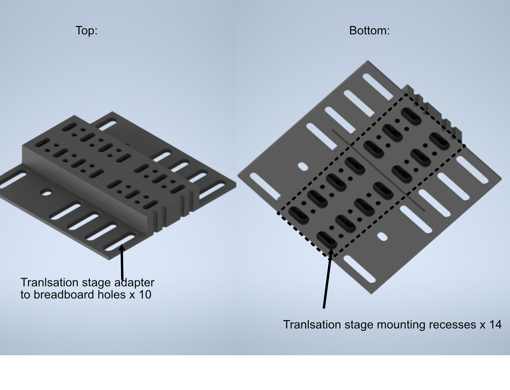

    **Figure 7:** Schematic of the translation stage breadboard adapter

The next step is flipping the translation stage assembly right side up again, and then fixing the first of two halves
of the tube lens adapter onto the top of the translation stage:

    1. Place the tube lens adapter half onto the top of the translation stage such that the block with two sets of
       five recessed holes is touching the top of the translation stage.
    2. Align the recess holes on the adapter with the holes on the top of the translation stage.
    3. Fix the adapter onto the translation stage by screwing M6 screws into the aligned recess holes

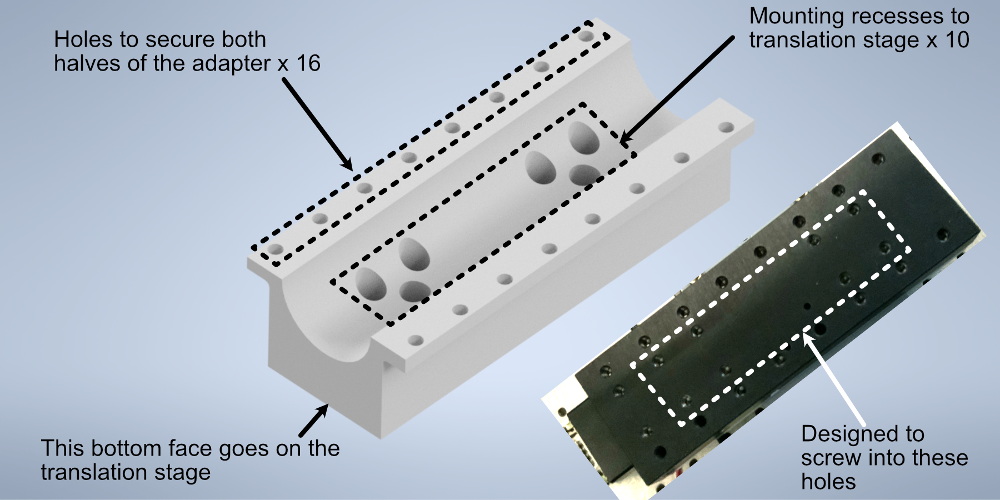

    **Figure 8:** Schematic of the tube lens to translation stage adapter

Next, we'll focus on assembling the tube lens and filter wheel:

    1. Take the MIM to Filter wheel adapter and fix it onto the front port of the filter wheel using the associated
       screw ports
    2. With the adapter fixed, now screw the 400 mm tube lens into the adapter.

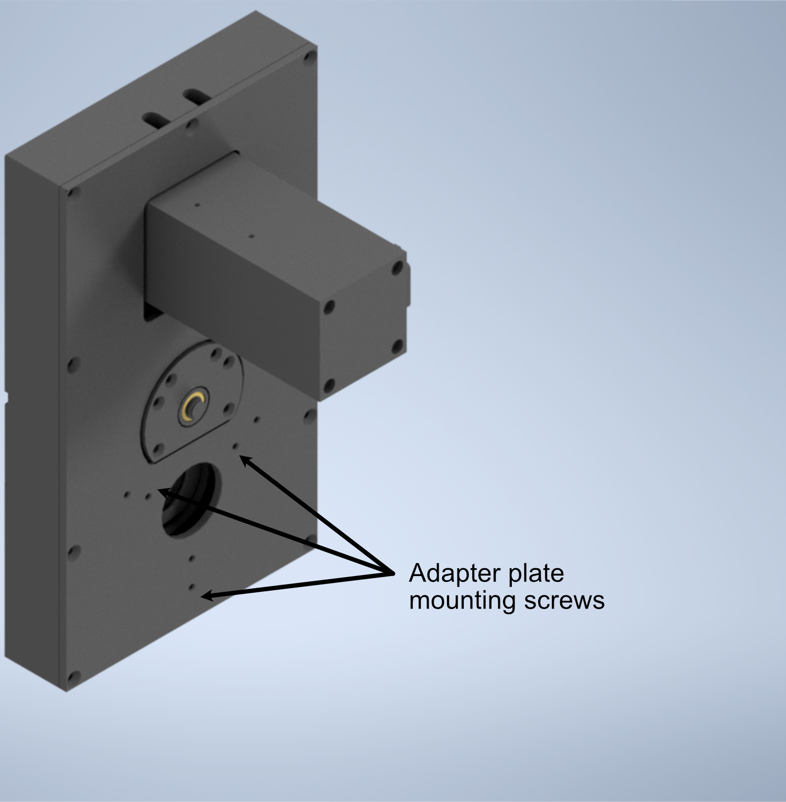

    **Figure 9:** Schematic of the filter wheel port for the tube lens

In order to fix our detection objective onto the tube lens, we must first prepare an extension and threading adapter:
    1. Take the C60-EXT-15 15 mm Tube extension piece and place the RAO-0051 M32x0.75 threaded sleeve inside
    2. Using the screws on the top of the extension piece, fix the threaded sleeve in place
    3. Insert/screw the extension piece into the front of the tube lens.

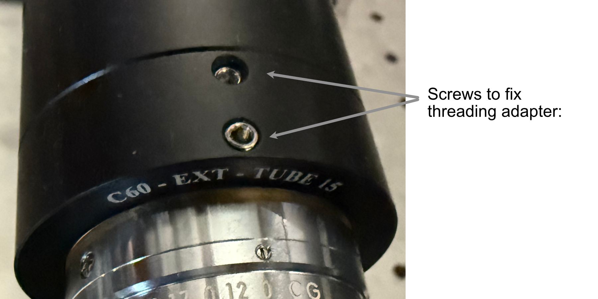

    **Figure 10:** Showcase of the screws used to secure the thread adapter for the tube lens

The tube lens assembly is now ready to be fixed onto the translation stage assembly:
    1. Place the tube lens assembly such that the tube lens lies within the curved region of the tube lens adapter
    2. While there isn't an exact science to the relative placement of the tube within the adapter, try to position
       it such that more of the tube is extended out on the side where the objective will be mounted (our setup is shown
       below for reference).
    3. Place the second half of the tube lens adapter such that the curved side fits onto the tube lens and position
       it such that the holes of both halves of the adapter align with each other.
    4. Using your choice of either M6 or 1/4"-20 screws and associated washers/nuts, place the screws with a washer
       placed on them first into the aligned holes of the adapter. We used 4 of the adapter holes on each side, but
       more can be used for extra security if desired.
    5. Screw a washer onto each of the screws until they're secured against the bottom lip of the adapter.

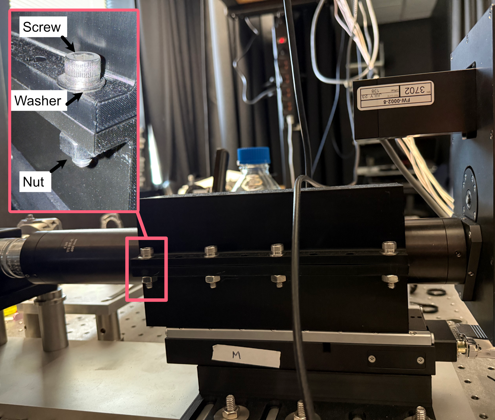

    **Figure 11:** Example of tube lens mounted in the corresponding adapter

The detection path assembly can now be fixed into place onto either the detection path baseplate or the optical
table. Keep in mind this process is meant to place the unit roughly where it should be; finer
adjustments will be made afterwards:

    1. Using the mounting holes on the translation stage assembly, place the assembly such that the edge of the
       translation stage adapter facing the illumination path is roughly 9-10" away from the location of the
       illumination objective.
    2. Using the adjacent edge of the translation stage adapter (the one that should be perpendicular to the
       orientation of the illumination path), try to align the side of the adapter with the mounting hole of the
       illumination objective.
    3. Screw the translation stage adapter into either the optical table or the detection path baseplate (we
       recommend using `Thorlabs 1" Spacers <https://www.thorlabs.com/newgrouppage9.cfm?objectgroup_id=851>`_ in place
       of washers here).

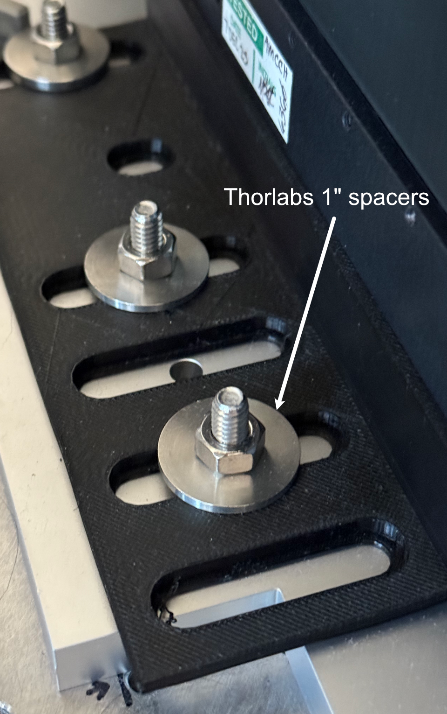
          baseplate

    **Figure 12:** Setup for securing the translation stage to breadboard adapter onto our detection path baseplate

With the assembly fixed in place, the camera can then be screwed into the filter wheel:
    1. Align the front thread of the camera with the back port of the filter wheel
    2. Screw the camera into the filter wheel until there is resistance
    3. Slowly adjust the camera tilt until the top surface is leveled (we use a bubble leveling tool for this, shown
       below)

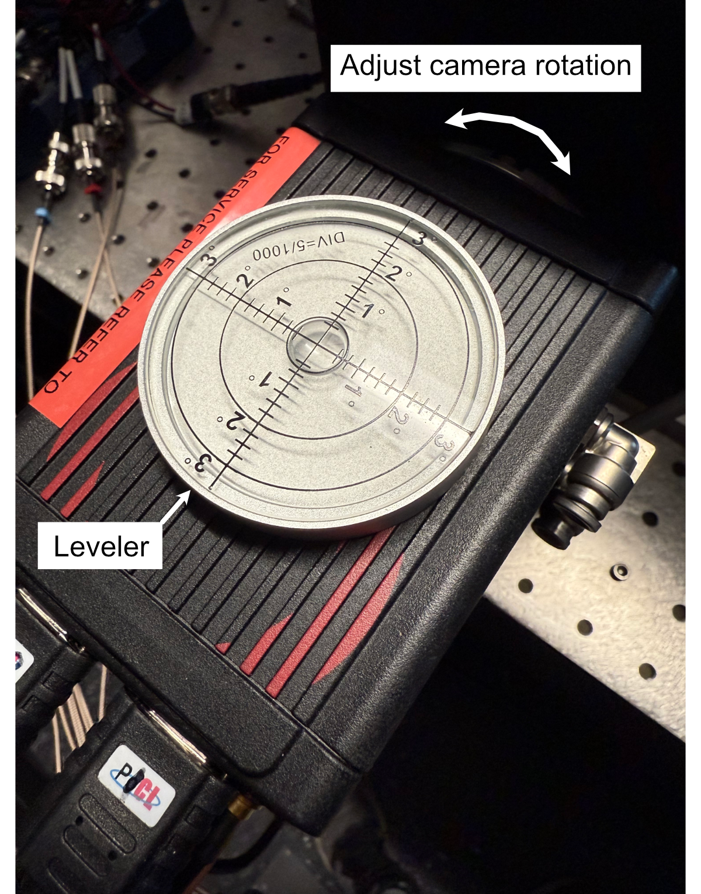

    **Figure 13:** Mounting of the camera

The final steps to assemble the detection path are to screw the detection objective into the front of the tube
lens and attach all associated wires to the camera, filter wheel, and translation stage. If there's not enough
clearance between the front of the tube lens and the sample chamber to screw in the detection objective, the
translation stage might need to be wired up first and translated backwards manually using either navigate or the
Tiger Control Panel software.

-----------------------------

Assembling the Sample Chamber
^^^^^^^^^^^^^^^^^^^^^^^^^^^^^

In order to ensure a watertight seal around our objectives, both of our objective ports feature two sets of o-rings
surrounding their circumference. For our smaller port associated with the TL20X-MPL objective, we use oil-resistant
Buna-N O-Rings with 11/16" inner diameter (ID) and 13/16" outer diameter (OD). For the larger port associated with
the Nikon 20X objective, we used Buna o-rings with roughly 1.3" ID and 1.7" OD. These o-rings and their associated
grooves are first coated with vacuum grease in the following process:

    1. Unscrew vacuum grease container
    2. Using either a finger or a cotton-tipped applicator, apply a layer of vacuum grease into and around the grooves
       on both ports
    3. Put more vacuum grease on the cotton-tipped applicator
    4. Using a finger or cotton-tipped applicator, take an o-ring and coat it fully in the vacuum grease.
    5. Place the o-ring in the appropriate groove using a finger or tweezers to help ensure it sits within the groove
    6. Repeat steps 3-5 for all 4 o-ring grooves in the chamber

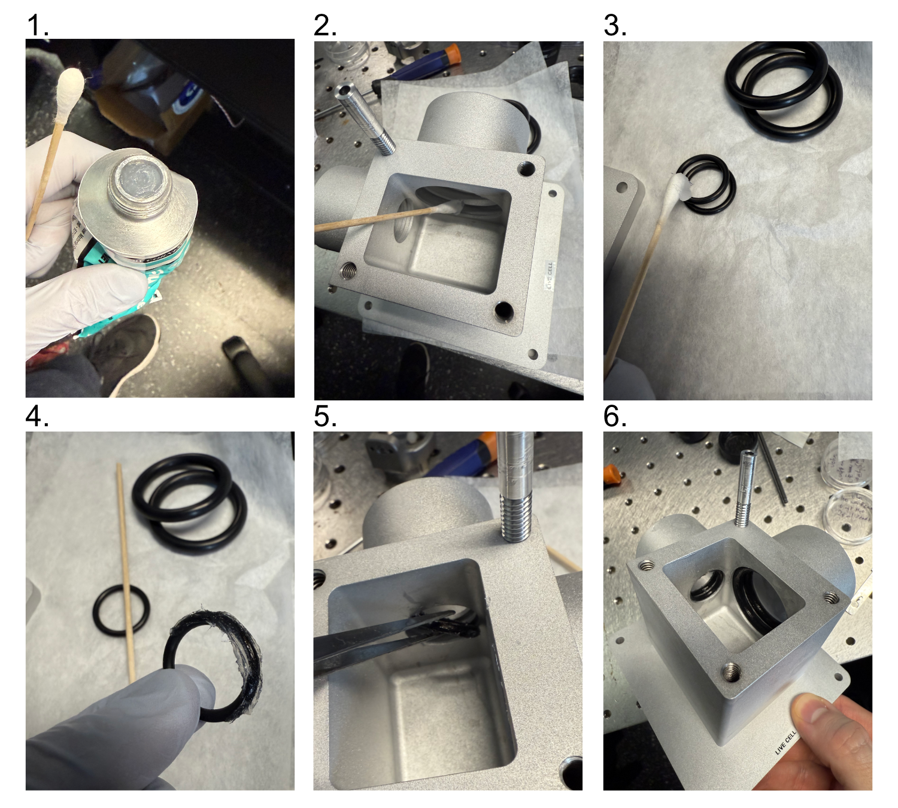

    **Figure 4:** Preparation and Placement of O-rings in the Sample Chamber

Then with the o-rings in place, if you're using a sample chamber variant that offers two detection path
configurations (traditional orthogonal and transmissive), install a gasket and gasket retainer on the transmissive
port:

    1. Cut a gasket sheet into a roughly 2x1.5" rectangle gasket section.
    2. Place the gasket onto the gasket retainer, poke a marker through the 4 holes on the gasket retainer to mark
       where the screw holes will be.
    3. Use scissors or another tool to make cuts at each of the 4 marked locations on the gasket, such that a 4-40"
       screw is able to pass through them.
    4. Align the gasket over the gasket retainer and place 4 4-40" screws into each of the holes such that the
       threading pokes out from the gasket side.
    5. Align the gasket assembly screws with the sample chamber transmissive port threaded holes, fully screw in the
       screws into the sample chamber holes.

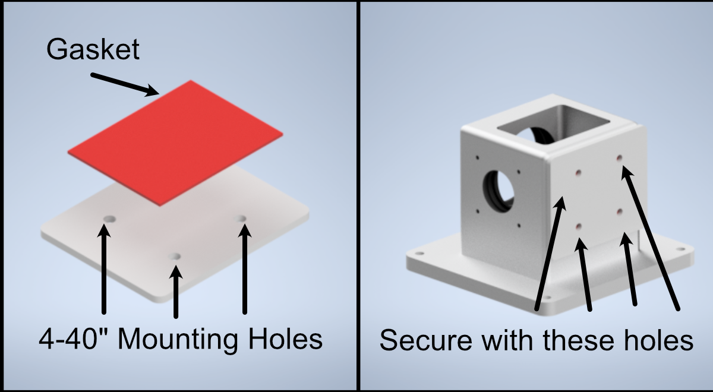

    **Figure 4:** Preparation and Placement of the gasket and gasket retainer on the sample chamber

Now fix 4 2.5" posts onto the corresponding holes on the detection path baseplate, and then secure the sample chamber
onto those posts using the four 8-32" holes on the base of the sample chamber.

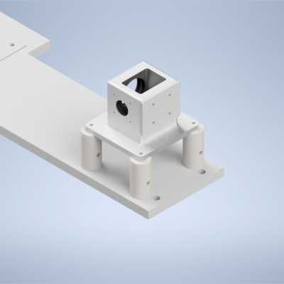

    **Figure 4:** Placement of sample chamber assembly onto detection path posts.

---------

Alignment
_________

Alignment Overview
^^^^^^^^^^^^^^^^^^

For the second iteration of our Altair baseplate system, the construction and alignment process is more involved than
our first iteration, but should still be a straightforward step-by-step process. To make things a little bit easier,
the system is first aligned and optimized without the presence of some of the lenses (L1, L2, L3, L4, L5 for the Powell
lens configurations), and then the rest of the lenses are added in and the system is recalibrated.

-------------------------

Step 1: Laser Collimation
^^^^^^^^^^^^^^^^^^^^^^^^^
When first assembling the system, ensuring proper output collimation from the fiber laser source is critical. There are multiple checks that one can take for this step, but we utilize a combination of a `shear-plate interferometer <https://www.thorlabs.com/newgrouppage9.cfm?objectgroup_id=2970>`_ and two pinhole apertures placed at opposite ends along the length of the baseplate. Shear-plate interferometers are designed to split and interfere an input beam of coherent light, such that when the beam is collimated there are interference fringes aligned vertically with a reference line. The fiber laser collimator we used for this system is the `Thorlabs CFC11A-A <https://www.thorlabs.com/thorproduct.cfm?partnumber=CFC11A-A>`_, which features an adjustable barrel which controls the position of collimation optics within the element.

The basic assembly process involves first inserting and fixing the CFC11A-A into a Thorlabs AD15S2 adapter, which allows it to then be mounted into a 2.5" Polaris K1XY mount. This assembly is then mounted onto the respective Polaris post at the start of the baseplate. The fiber laser source is then able to be directly mounted into the CFC11A-A, making sure that the protrusion on the fiber wire aligns with the open section of the CFC11A-A port. The basic process of ensuring collimation then involves turning on the laser source, and placing the shear-plate interferometer such that the input port aligns with the output of the laser unit. Then, by slowly adjusting the barrel of the CFC11A-A and observing the interference fringe orientations along the top display of the interferometer, one is able to adjust the beam until it is properly collimated.

.. figure:: Images/alignment/LaserAlignment1.png
    :align: center
    :alt: Shear Plate interferometer and collimator lens

    **Figure 1:** Shear Plate interferometer and collimator lens

----------------------

Step 2: Beam Walking 1
^^^^^^^^^^^^^^^^^^^^^^

**Section Goal: Ensure that the beam is traveling parallel to the baseplate surface and through the center of all
mounted elements up to the RFO location (part 1).**

With the beam properly collimated, we can begin the series of steps to walk the beam such that it is both centered on
all of our optical elements as well as runs parallel to the surface of the baseplate. Then place one 2.5” Polaris
post at these three locations: the hole corresponding to the Powell lens, the hole corresponding to L4, and the hole
corresponding to the remote focus objective (RFO) location. Then place 1XY mounts on each of those 2.5” Polaris Posts
. Then screw SM1-threaded adjustable irises (`SM1D12 <https://www.thorlabs.com/thorproduct
.cfm?partnumber=SM1D12>`_) into those 1XY Mounts.
Then place a 1” mirror in a Polaris B1F mount and mount it on a 3” optical post in the 45 degree oriented mounting position on the board as shown in the image below.
With the irises and mirror in place, this step becomes an iterative process of adjusting the XY and tip/tilt of the laser K1XY mount until the beam passes through the center of all irises and roughly onto the center of the mirror. As a general direction, starting with the irises opened more and then steadily closing them further as you refine the tip/tilt and XY of the K1XY is recommended. If adjusting the tip/tilt of the K1XY becomes a bit overwhelming, it might be helpful to screw all of the tip/tilt knobs on the mount fully in, such that the starting point that you're working from is roughly flat (perpendicular to the surface of the baseplate).

.. figure:: Images/alignment/PCBaseplateV2LaserAlignment1.png
    :align: center
    :alt: Beam Walking 1

    **Figure 2:** Beam Walking 1

----------------------

Step 3: Beam Walking 2
^^^^^^^^^^^^^^^^^^^^^^

**Section Goal: Ensure that the beam is centered on the galvo and K1S4 mirror, and that it travels parallel to the
baseplate surface and through the center of all mounted elements up to the RFO location (part 2).**

Next, assemble and add in the resonant galvo and the K1S4 mirror directly underneath it. Then replace the post of the
45 degree B1F mirror to be 2” instead of 3”. Then place two 1XY mounts on 1.5” posts, one at the location of the RFO
and one at the location of L5. Then place and screw in the PY004 onto the baseplate and then mount the voicecoil
adapter on top as shown below (have graphic that shows the location of the voicecoil mount on the PY004). Then mount
the voicecoil (Link assembling voicecoil section) onto the adapter, making sure the side with the mirror is facing
towards the beam path.
The iteration flow here will be to adjust the tilt of the resonant galvo until the beam is centered on the K1S4 mirror underneath it, and then adjust the tip/tilt of the K1S4 mirror until the beam is centered on the B1F mirror and the two irises after.
Then adjust the tip/tilt on the PY004 of the voicecoil until the back-reflected beam spot passes through the irises on its return path.

.. figure:: Images/alignment/PCBaseplateV2LaserAlignment2.png
    :align: center
    :alt: Beam Walking 2

    **Figure 3:** Beam Walking 2

----------------------

Step 4: Beam Walking 3
^^^^^^^^^^^^^^^^^^^^^^

**Section Goal: Place the beamsplitter in the system, ensure it’s oriented correctly.**

Assemble the beamsplitter, its mount, and the 1.75” Polaris post it rests on, and mount it on its corresponding hole (show the orientation of the beamsplitter). Ensure that the beamsplitter is oriented such that the beam passes through both sides (you can use pinholes or irises for this step; they should screw into the SM1 threading on the beamsplitter).

.. figure:: Images/alignment/PCBaseplateV2LaserAlignment3.png
    :align: center
    :alt: Beam Walking 3

    **Figure 4:** Beam Walking 3

---------------------------------------

Step 5: Optional Beamsplitter Alignment
^^^^^^^^^^^^^^^^^^^^^^^^^^^^^^^^^^^^^^^

**Section Goal: Use the alternative laser launch hole to ensure that the test beam goes straight through the
beamsplitter return path to the center of the ILO.**

Mount three Polaris 1XY units on 1.5” posts along the return path at the location of L6, L7, and the illumination objective (ILO), respectively. Then mount a 1.5” post and Polaris 1XY unit on the hole denoted for the alternative laser launch. Screw the laser (Thorlabs CPS532) into the Polaris 1XY mount. With each of the 1XY Mounts roughly centered in both X and Y, ensure that the laser beam passes through the center of all elements using a frosted pinhole or iris installed in them.

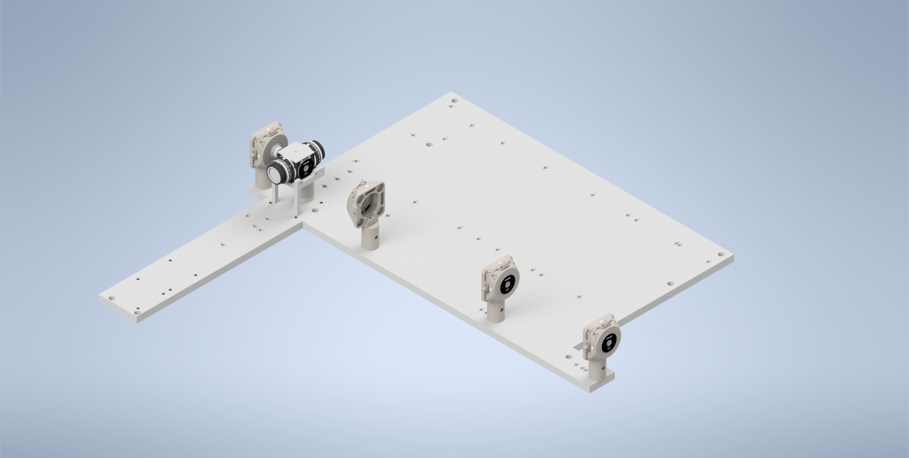

    **Figure 5:** Beamsplitter Alignment

----------------------

Step 6: Beam Walking 4
^^^^^^^^^^^^^^^^^^^^^^

**Section Goal: Install polarizers and ensure that the beam is traveling properly on its return path through the
beamsplitter.**

Start by threading an LRM1 rotation mount into both the side of the beamsplitter facing the RFO and the side opposite
facing L5. Then thread the half-waveplate into the L5 side and the quarter-waveplate into the RFO side.

Rotate the half-waveplate to make the beam as bright as possible in the direction of the RFO, then adjust the
quarter-waveplate to make the beam as bright as possible on the return path in the direction of the ILO.

Ensure that the return beam properly travels back through the beamsplitter and down the path to the ILO. Adjust tip/tilt of voicecoil mirror to manipulate the direction of the beam.

This establishes a ground-truth beam position for the next step where we add in the RFO.

.. figure:: Images/alignment/PCBaseplateV2LaserAlignment4.png
    :align: center
    :alt: Beam Walking 4

    **Figure 6:** Beam Walking 4

----------------------

Step 7: Beam Walking 5
^^^^^^^^^^^^^^^^^^^^^^

**Section Goal: Add in RFO, do initial alignment.**

Add the RFO back in, then adjust the XY on the RFO mount until the back reflections from the RFO are aligned (same method: put a pinhole card behind the RFO and center the pinhole on the beam).

.. card:: Achromat Back-Reflection Alignment

   The general method for centering back reflections on an aperture card is described in
   :ref:`Basics of Optical Alignment <optical_alignment_basics>`. Use that procedure here to align the RFO before
   continuing with the baseplate-specific beam-walking steps.

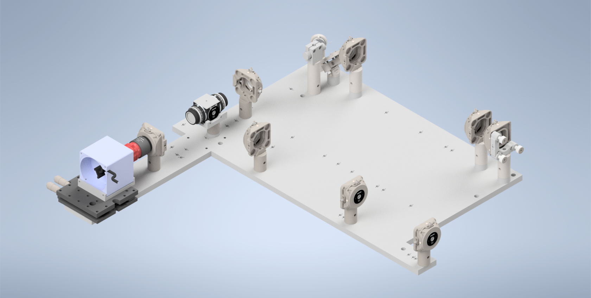

    **Figure 7:** Beam Walking 5

------------------

Step 8: RFO Offset
^^^^^^^^^^^^^^^^^^

**Section Goal: Install L6 and L7, Adjust the RFO offset in navigate such that it’s collimated between the beamsplitter
and L6 and L7 and the ILO.**

Start by installing SM1A2 threading adapters onto the Polaris 1XY mounts corresponding to L6 and L7. Then thread both
L6 and L7 into their respective mounts, such that the Thorlabs label on them is on the side farthest away from the
1XY mounts, shown above in the "Breakdown of Baseplate Holes" section.

With a shear-plate interferometer placed between the beamsplitter and L6 (and then L7 and the ILO), adjust the RFO
offset in navigate (leaving the amplitude at 0 for now) until the light between the beamsplitter and L6 and L7 and
the ILO is collimated. The available range should be between 1 to 10, with the optimal value varying for each system,
for our initial system this value was around 5.

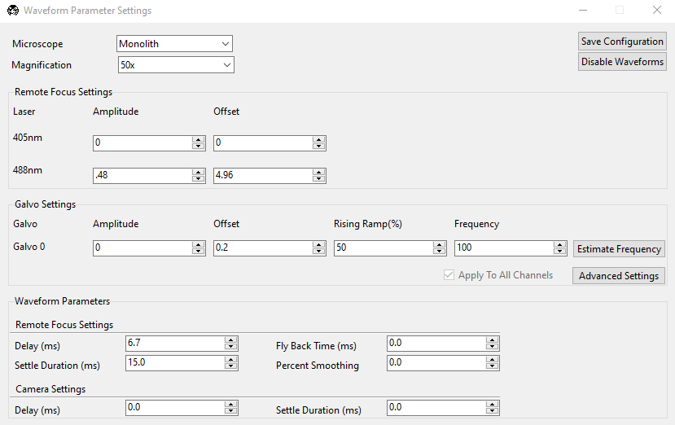

    **Figure 8:** The Waveform Parameters panel in navigate.

---------------------

Step 9: Add In Lenses
^^^^^^^^^^^^^^^^^^^^^

**Section Goal: Add in the rest of the non-Powell lenses into the illumination path.**

Install L2, L3, L4, and L5 into their respective B1S holders, and then screw those holders into the correct positions.

If the beam is no longer centered on the RFO, remove the RFO from the path and focus on adjusting the tip/tilt of the
voicecoil mirror so the return beam is centered on both the first tube-lens mount after the beamsplitter on the return
path and the ILO objective mount (using irises or frosted pinholes).

Add the RFO back in, then adjust the XY on the RFO mount until the back reflections from the RFO are aligned (same
method: put a pinhole card behind the RFO and center the pinhole on the beam).

Then add in TL1 and TL2, adjust the rotation and XY of TL2 to center the beam on the ILO again, use a shear plate, and
change VC offset to re-collimate the beam. Using the re-collimated offset position as the baseline, adjust the
detection path (ensuring it is as perpendicular as possible to the illumination path), and primarily adjust TL1 and TL2
XY to center the beam as much as possible on the back of the ILO.

-------------------------------

Step 10: Install Detection Path
^^^^^^^^^^^^^^^^^^^^^^^^^^^^^^^

**Section Goal: Assemble/incorporate detection path into the setup, ensure it’s centered on the beam by using the
chamber filled with water and fluorescein.**

First `assemble the detection path <https://thedeanlab.github.io/altair/baseplate2_alignment/baseplate2_alignment
.html#detection-path-assembly>`_.

------------------------------------------------

Step 11: Optimize System Light-Sheet Performance
^^^^^^^^^^^^^^^^^^^^^^^^^^^^^^^^^^^^^^^^^^^^^^^^

**Section Goal: Optimize navigate parameters and XY offsets of RFO, L6, L7, and ILO to verify the system is working.**

This section is focused on two main objectives:
    1. Verify that the focus remains sharp as you manually adjust the voicecoil offset to scan your focus across your
       camera FoV
    2. Tune your navigate waveform parameters to ensure that your beam is being scanned properly by your generated waveform.

For objective 1, with the detection path installed and the beam roughly centered vertically, adjust the VC offset
manually  until the beam looks like it reaches the top and bottom edges of the image FoV. In the optimized system, as
you manually change the offset your beam focus should stay sharp and not shift horizontally across the screen.

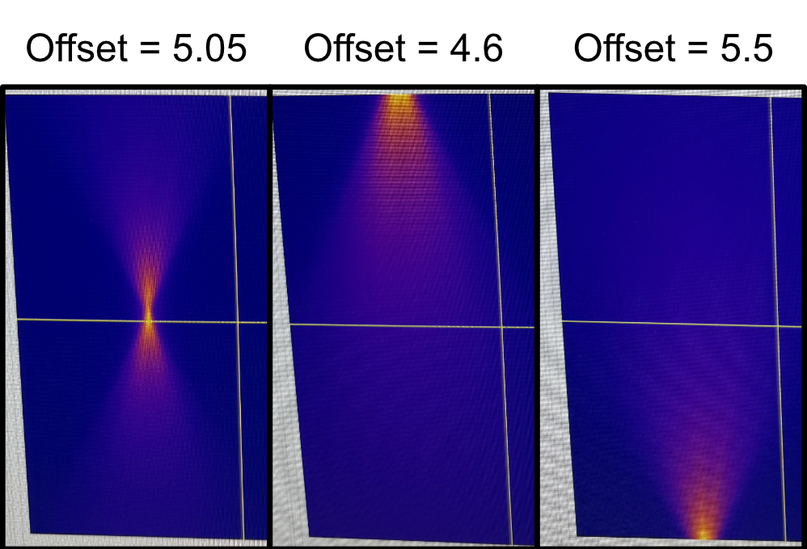

    **Figure 9:** Manually changing the voicecoil offset to scan the beam across the image FoV.

If either of these aren't true, there's likely an element in the optical assembly that needs to be adjusted. It's
difficult to provide a precise prescription of steps to take as each system will be different, but here are some
sanity checks or steps that can be helpful with figuring out the ideal alignment:

    1. As you scan the beam back and forth, observe the top-down shape of the beam in the chamber by eye. Make sure
       that it looks symmetrical in profile (i.e. it's not slanted towards either side). If it is, you might need to
       adjust the horizontal positioning of L6, L7, and the ILO relative to one another.
    2. You can use the threaded irises used in the other alignment steps on L6 and L7 to ensure that the beam is
       passing through the center of these elements. When stopping down the beam centered on L6, the beam coming out of
       the ILO should also look like it's coming from the center and going in a straight line, not tilted in any
       particular direction. If not, adjust the XY offsets of L6 and L7 until everything is centered even with a
       stopped down beam.
    3. If you want, in waveform parameters you can give the system a little bit of amplitude (anywhere from 0.4
       to 1) briefly. It's difficult to describe, but as the circular beam spot is pulsing on L6, L7 and the back
       pupil of the ILO it should look like it's pulsing radially outwards equally in all directions. If it looks
       like the pulsing movement is biased towards any direction in particular (i.e. it looks like it extends further
       in one direction than others as the beam spot pulses), then it's likely that you'll need to adjust the XY offset
       of L6 and L7 to make the beam pulse radially. When it looks good, just remove the amplitude again until the
       next steps.
    4. There's also the potential that your detection path isn't exactly orthogonal to your illumination objective if
       with the prior suggestions your beam still isn't looking as expected. Re-adjusting your detection path position
       and going through the previous suggestions again can help hone in on the proper orientation.

When your beam profile looks sharp and fixed horizontally as it's scanned vertically across your FoV, you can move
forward with `optimizing the rest of your waveform parameters <https://thedeanlab.github
.io/altair/baseplate2_alignment/baseplate2_alignment
.html#tuning-remote-focus-waveform>`_.

---------------------------

Step 12: Add in Powell Lens
^^^^^^^^^^^^^^^^^^^^^^^^^^^

**Section Goal: Incorporate Powell Lens, do a final fine-tuning alignment of system elements.**

With your system producing a uniform-looking beam profile across your FoV, you can now move forward with
incorporating the Powell lens into the optical path. Screw the AD9F mount with the Powell lens inside it into the
LRM1 assembly.

This step is most easily accomplished through imaging a fluorescent collagen sample, but theoretically can be done
with fluorescent beads in agarose as well.

With a fluorescent collagen sample in, the alignment process is straightforward:

    1. Move your collagen sample such that it's in your beam path and present in your FoV.
    2. Remove any amplitude on your waveform parameter and run a normal-mode continuous scan. You want to rotate your
       Powell lens until you essentially see a horizontal region in your FoV that looks consistently in/out of focus.
       You can adjust your focus position as well during this step. Your end goal should be producing a horizontal
       region of your sample that looks consistently in-focus.

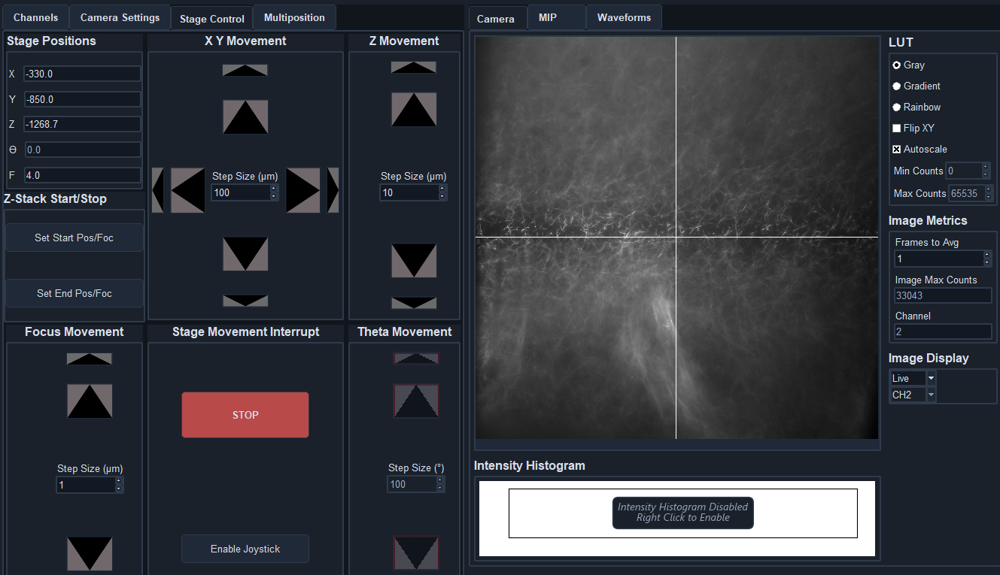

    **Figure 10:** How the image should look in normal mode for a properly oriented Powell lens.

    3. Stop the continuous mode acquisition and switch to light-sheet mode (we set the number of pixels parameter to be
       5 for most of our imaging cases), then start the continuous mode acquisition again.
    4. Now adjust the amplitude and delay of your waveform parameters until the entire FoV of your image looks in
       focus and crisp.

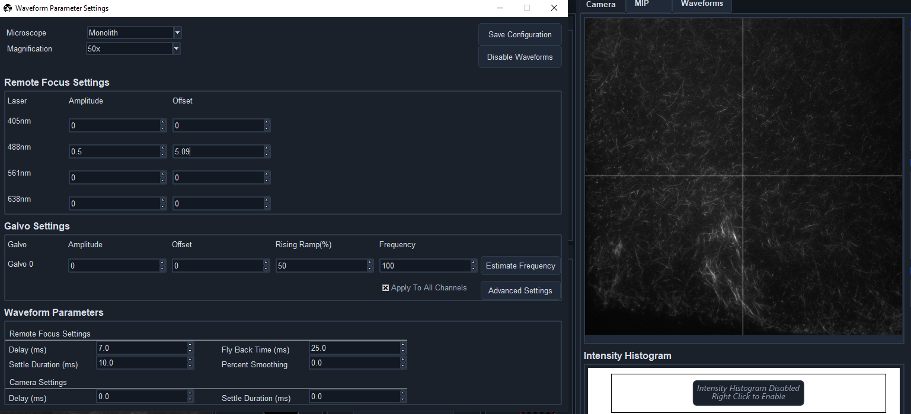

    **Figure 11:** When your waveform is optimized, your image should look in focus across the full FoV.

With that, your system should be aligned, optimized, and ready to image actual samples!

---------------

Troubleshooting
_______________

Optimizing Lens Placement/Orientation Using Backreflections
^^^^^^^^^^^^^^^^^^^^^^^^^^^^^^^^^^^^^^^^^^^^^^^^^^^^^^^^^^^

Optimizing Powell Lens Placement
^^^^^^^^^^^^^^^^^^^^^^^^^^^^^^^^

The placement of the Powell lens in the optical path takes a bit of fine-tuning compared to some of the other lenses
in our system. The lens itself is particularly sensitive to displacements in x and y, where if it's off it is easily
visible in the profile of the beam on the front surfaces of the lenses that follow. Using the beam profile on the
front of L2 as an example, when the Powell lens has a vertical (y) displacement, the beam profile starts to take on
more of the conical shape instead of the more rectangular or pill-shaped profile from our simulations.

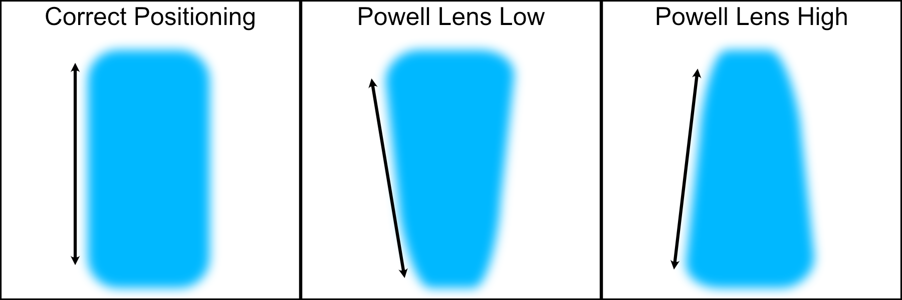

    **Figure 1:** Potential misaligned Powell lens beam profiles on the front surface of L2

In addition, due to tolerances with the Powell lenses we use in simulation compared to the physical ones purchased,
there can be an additional z offset needed between the Powell lens and L2 for the beam profile to match simulations. In
our particular case, we found that having an additional 2.6 mm spacing between the Powell lens and L2 made the rest
of the system follow closely with our simulations, but this value might be different for different Powell lenses. We
found this optimized spacing value by observing the beam profile on the front of L2 and L4, comparing it to
simulated profiles in the same locations, and iteratively adjusting the LNR25M dial until the profiles matched closely.

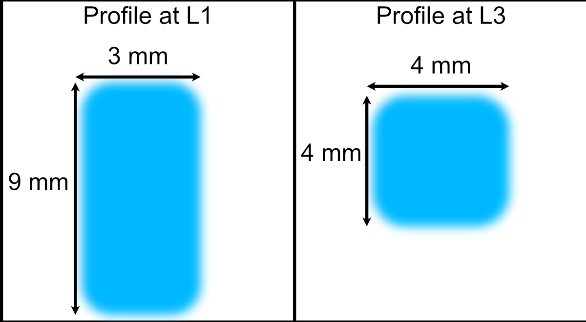

    **Figure 2:** Example profiles at L2 and L4 front surfaces used to optimize z-displacement of L1
