.. _dvopmassembly-home:

######################################
DV-OPM Baseplate Assembly & Alignment
######################################

Detection Train Assembly
________________________

The detection assembly consists of a Mitakon Speedmaster 65 mm f/1.4 photographic lens serving as the primary objective (O1), followed by a filter wheel, a 90° folding mirror, a Nikon AF-S NIKKOR 85 mm f/1.4G lens serving as the secondary objective (O2), and a CMOS camera (Ximea MU196MR) for image acquisition. In contrast to conventional oblique plane microscopy (OPM) systems employing an objective lens and tube lens, this configuration relies solely on two coupled photographic lenses with careful alignment. Without tube lenses, the overall resolution of the system is limited by the pixel size of the detection camera; hence, the Ximea MU196MR was selected for its 1.4 µm pixel pitch. All optical elements were precisely calculated, pre-aligned, and mounted onto a custom baseplate, resulting in a mechanically constrained configuration that requires minimal alignment.

Due to the spatial and mechanical constraints of each optical element, as well as the non-telecentricity of the two photographic lenses, the relative spacing between them was predetermined and optimized using Zemax simulations to ensure optimal imaging performance.

The alignment procedure is centered around the filter wheel, which serves as the primary optical reference. Alignment begins with establishing a reference beam for the baseplate.

**Setting up the reference beam:**

1. Place the laser source on an elevated platform above the baseplate so that the beam propagates downward onto the baseplate.
2. Generate a collimated beam from the source using a collimator. A reflective collimator (Thorlabs RC08APC-P01) was used here to produce a beam diameter of 7.3 mm.
3. Direct the collimated beam downward using a 45° folding mirror. A 1" right-angle kinematic mount (Thorlabs KCB1) was used to reflect the beam downward toward the detection assembly.
4. Mount both the collimator and the folding mirror on translation stages to allow fine positioning of the beam.
5. Install two irises along the propagation path.
6. Place a flat mirror on the optical table at the beam incidence point to check for back-reflection.
7. Iteratively adjust the tip, tilt, and rotation of the 1" mirror to ensure the back-reflected beam passes through both irises.
8. Once complete, this establishes a straight and stable reference beam for downstream alignment.

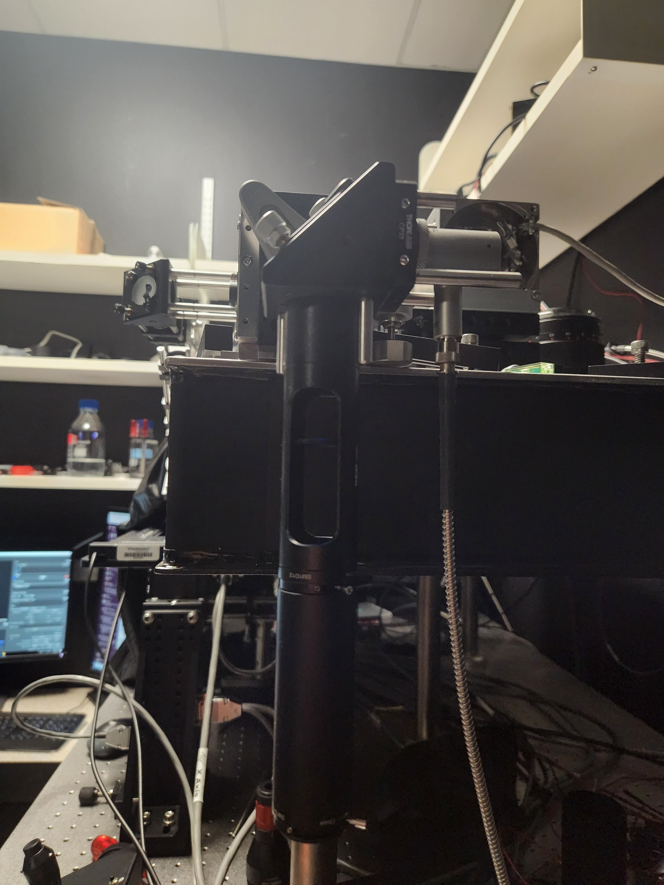

   Reference beam with irises mounted on translation stages.

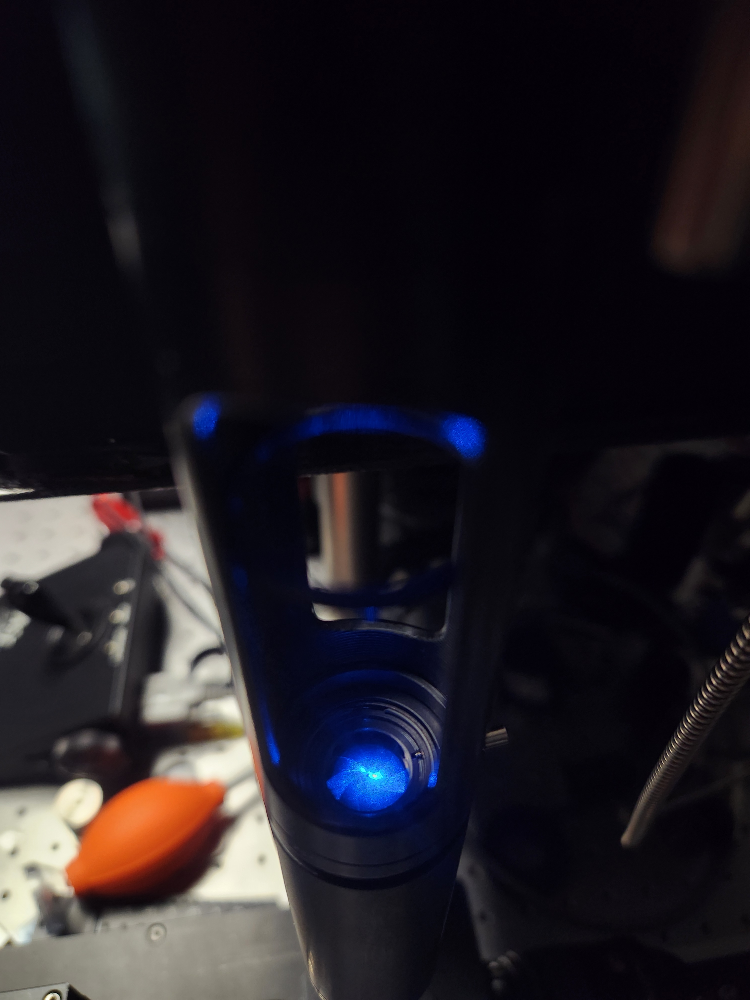

   Verify that the beam is centered on each iris aperture.

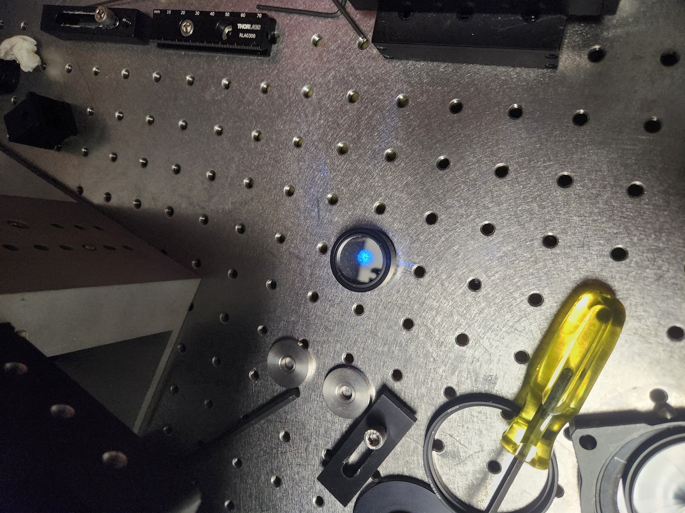

   Installation of a flat mirror for back-reflection alignment verification.

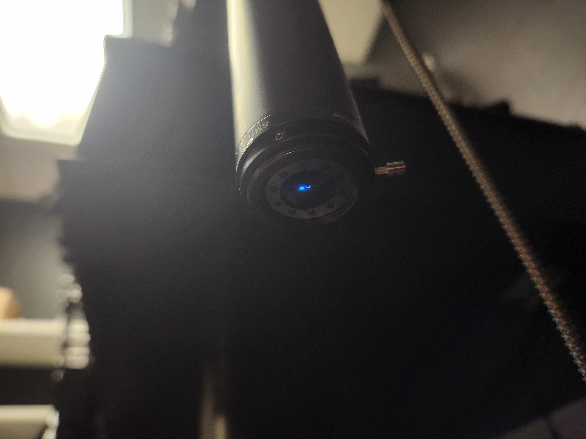

   Example of a misaligned reference beam. The beam does not pass through the iris aperture.

The next step is to configure the photographic lenses. Because neither lens is telecentric, correct setup is critical for minimizing aberrations and achieving optimal performance.

O2 must be operated with its focus locked at infinity and its aperture fully open. Setting O2 to infinity focus immobilizes the internal focusing groups, fixing the effective focal length and the locations of the entrance and exit pupils.

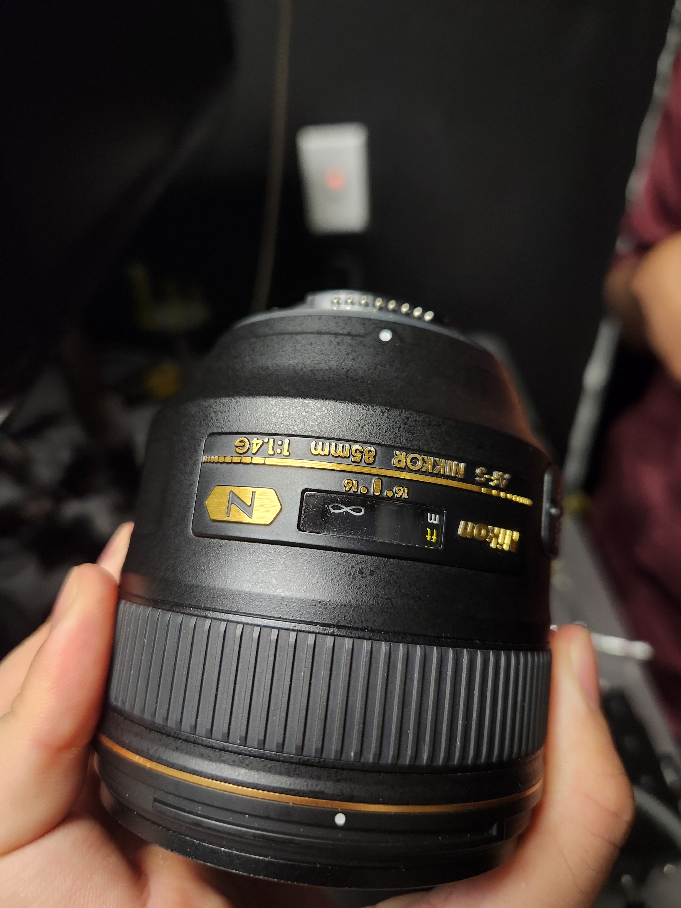

   Lock the focus of O2 to infinity by rotating its focus adjustment ring.

Because the Nikon AF-S NIKKOR 85 mm f/1.4G does not include a mechanical aperture ring, the aperture must be opened manually. This can be accomplished by inserting a thin, rigid piece of material (e.g., hard cardboard) into the aperture control lever on the rear bayonet face of the lens. This fully opens the aperture and allows the lens to be stepped up to the camera.

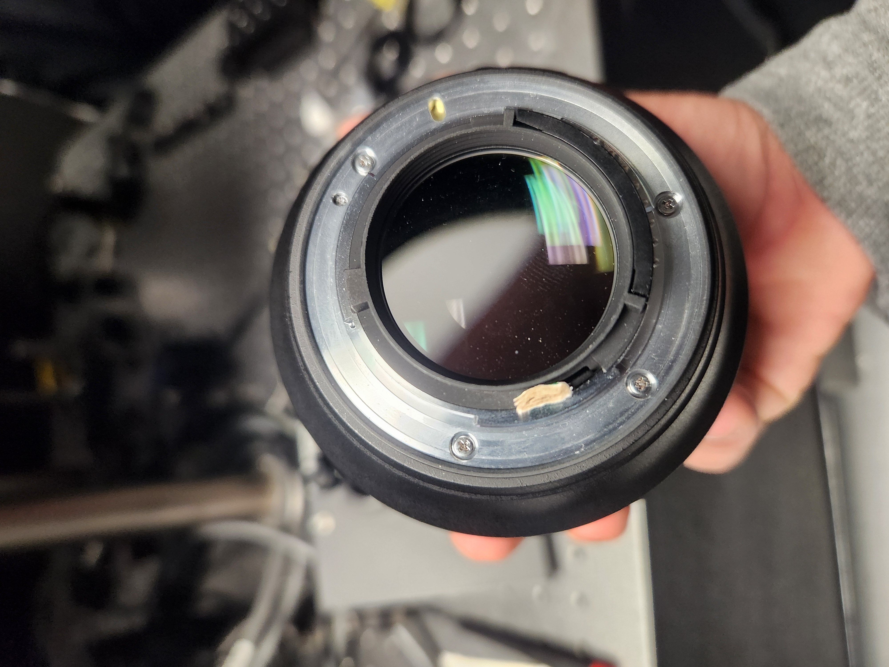

   Open O2's aperture by inserting a cardboard shim into the aperture control lever on the rear of the lens.

The focus of O1 does not critically affect overall system performance and may be left at an arbitrary setting. However, O1 includes a mechanical aperture ring that allows the effective NA to be adjusted. The system can in principle be operated at full aperture (NA = 0.36). Due to the non-telecentric, non-corrected nature of the photographic lenses and the fact that the filter wheel aperture in the current configuration is smaller than the back pupil of O1, operating at full NA will introduce significant astigmatism without a corresponding improvement in resolution. It is therefore recommended to set O1 to a reduced aperture.

**Assembling the baseplate:**

1. Install a 2" mirror into a 2" kinematic mount (Thorlabs KCB2) and mount the filter wheel at its predetermined position on the custom baseplate.
2. Place a ground-glass diffuser or pinhole at the entrance aperture of the filter wheel.
3. Position the baseplate so that the reference beam passes straight through the pinhole. Light should be visible exiting the baseplate on the far side.
4. Install a mirror in a 4" lens tube and check for back-reflection while adjusting the tip and tilt of the kinematic mirror to establish a straight beam path for the exiting beam.

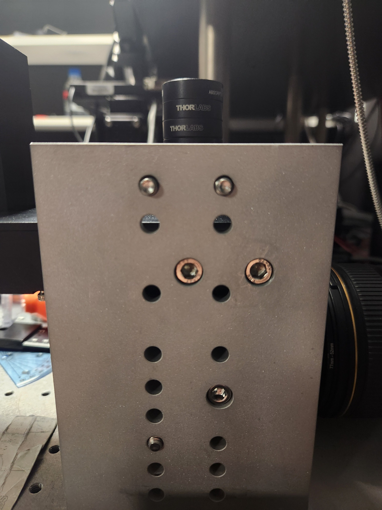

   Filter wheel and kinematic mirror mount installed at their predetermined positions on the custom baseplate.

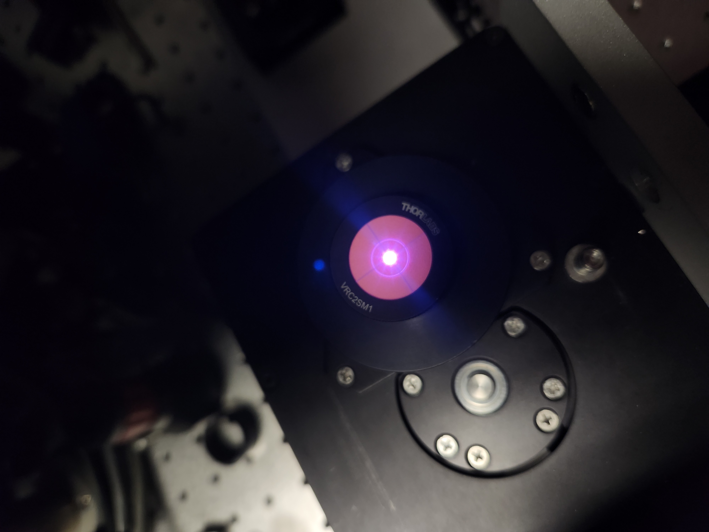

   Center alignment demonstrated by translating the reference beam through the filter wheel entrance aperture.

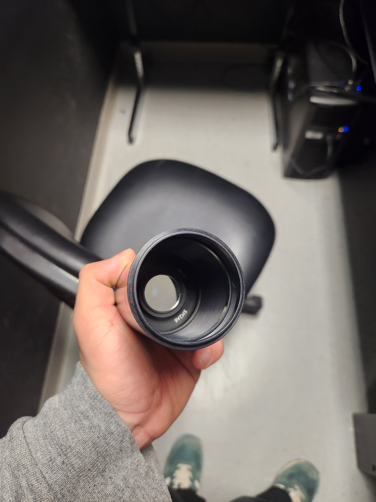

   Mirror mounted on a lens tube used to verify alignment of the kinematic mount via back-reflection.

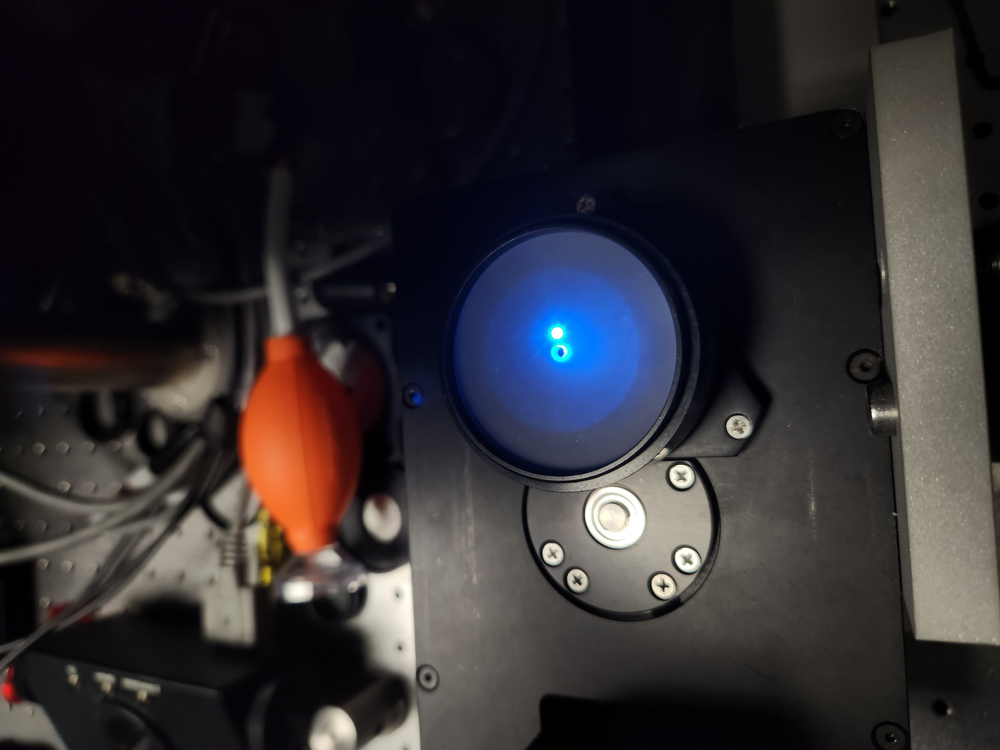

   Example of a misaligned beam: adjusting the tip and tilt of the kinematic mirror shifts the back-reflection off-axis.

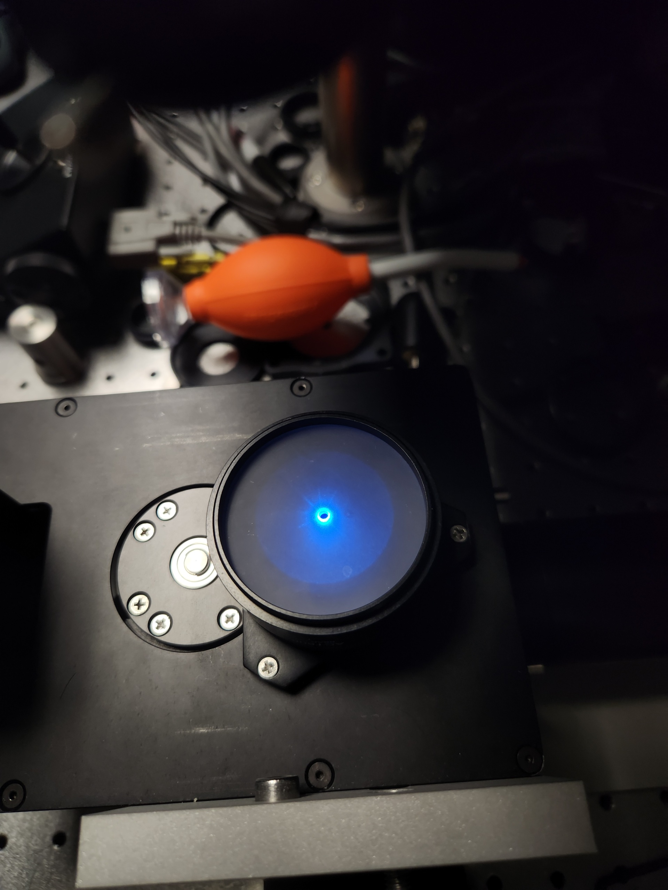

   Example of an aligned beam: back-reflection is coaxial with the incident beam after tip/tilt correction of the kinematic mirror.

Once the beam path is established, install O2 in a reversed configuration and mount the camera to locate the optimal focus position. Rotate the camera to approximately 45° so that its entrance pupil is parallel to O2. Illuminate O2 with a large-diameter beam (ideally filling its back aperture) and translate the axial stage until a sharp focus is observed on the camera using its acquisition software. Insert neutral-density filters if necessary to avoid sensor saturation.

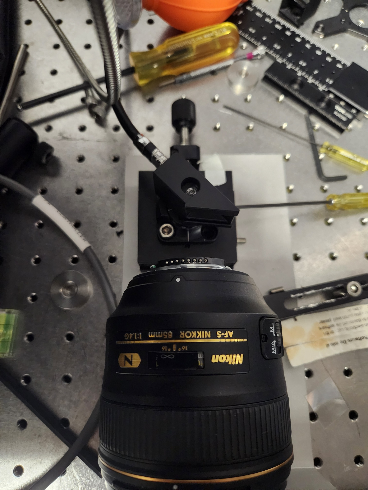

   Setup for locating the optimal focus position of the camera relative to O2.

Illumination Train Assembly
___________________________

Placeholder
