.. _dvopmassembly-home:

######################################
DV-OPM Baseplate Assembly & Alignment
######################################

Detection Train Assembly
________________________

The detection assembly consists of a Mitakon Speedmaster 65 mm f/1.4 photographic lens serving as the primary objective (O1), followed by a filter wheel, a 90° folding mirror, a Nikon AF-S NIKKOR 85 mm f/1.4G lens serving as the secondary objective (O2), and a CMOS camera (Ximea MU196MR) for image acquisition. In contrast to conventional oblique plane microscopy (OPM) systems employing an objective lens and tube lens, this configuration relies solely on two coupled photographic lenses with careful alignment. Without tube lenses, the overall resolution of the system is limited by the pixel size of the detection camera; hence, the Ximea MU196MR was selected for its 1.4 µm pixel pitch. All optical elements were precisely calculated, pre-aligned, and mounted onto a custom baseplate, resulting in a mechanically constrained configuration that requires minimal alignment.

Due to the spatial and mechanical constraints of each optical element, as well as the non-telecentricity of the two photographic lenses, the relative spacing between them was predetermined and optimized using Zemax simulations to ensure optimal imaging performance.

The alignment procedure is centered around the filter wheel, which serves as the primary optical reference. Alignment begins with establishing a reference beam for the baseplate.

**Setting up the reference beam:**

1. Place the laser source on an elevated platform above the baseplate so that the beam propagates downward onto the baseplate.
2. Generate a collimated beam from the source using a collimator. A reflective collimator (Thorlabs RC08APC-P01) was used here to produce a beam diameter of 7.3 mm.
3. Direct the collimated beam downward using a 45° folding mirror. A 1" right-angle kinematic mount (Thorlabs KCB1) was used to reflect the beam downward toward the detection assembly.
4. Mount both the collimator and the folding mirror on translation stages to allow fine positioning of the beam.
5. Install two irises along the propagation path.
6. Place a flat mirror on the optical table at the beam incidence point to check for back-reflection.
7. Iteratively adjust the tip, tilt, and rotation of the 1" mirror to ensure the back-reflected beam passes through both irises.
8. Once complete, this establishes a straight and stable reference beam for downstream alignment.

.. figure:: Images/iris_tube.png
   :align: center
   :width: 50%
   :alt: Reference beam with irises mounted on translation stages.

   **Figure 1:** Reference beam with irises mounted on translation stages.

.. figure:: Images/iris_check_alignment.png
   :align: center
   :width: 50%
   :alt: Checking beam symmetry at the irises.

   **Figure 2:** Verify that the beam is centered on each iris aperture.

.. figure:: Images/flat_mirror.png
   :align: center
   :width: 75%
   :alt: Flat mirror installed for back-reflection alignment check.

   **Figure 3:** Installation of a flat mirror for back-reflection alignment verification.

.. figure:: Images/iris_not_align.png
   :align: center
   :width: 75%
   :alt: Example of a misaligned reference beam.

   **Figure 4:** Example of a misaligned reference beam. The beam does not pass through the iris aperture.

The next step is to configure the photographic lenses. Because neither lens is telecentric, correct setup is critical for minimizing aberrations and achieving optimal performance.

O2 must be operated with its focus locked at infinity and its aperture fully open. Setting O2 to infinity focus immobilizes the internal focusing groups, fixing the effective focal length and the locations of the entrance and exit pupils.

.. figure:: Images/o2_focus.png
   :align: center
   :width: 50%
   :alt: O2 focus ring locked to infinity.

   **Figure 5:** Lock the focus of O2 to infinity by rotating its focus adjustment ring.

Because the Nikon AF-S NIKKOR 85 mm f/1.4G does not include a mechanical aperture ring, the aperture must be opened manually. This can be accomplished by inserting a thin, rigid piece of material (e.g., hard cardboard) into the aperture control lever on the rear bayonet face of the lens. This fully opens the aperture and allows the lens to be stepped up to the camera.

.. figure:: Images/o2_aperture.png
   :align: center
   :width: 75%
   :alt: O2 aperture opened with a cardboard shim.

   **Figure 6:** Open O2's aperture by inserting a cardboard shim into the aperture control lever on the rear of the lens.

The focus of O1 does not critically affect overall system performance and may be left at an arbitrary setting. However, O1 includes a mechanical aperture ring that allows the effective NA to be adjusted. The system can in principle be operated at full aperture (NA = 0.36). Due to the non-telecentric, non-corrected nature of the photographic lenses and the fact that the filter wheel aperture in the current configuration is smaller than the back pupil of O1, operating at full NA will introduce significant astigmatism without a corresponding improvement in resolution. It is therefore recommended to set O1 to a reduced aperture.

**Assembling the baseplate:**

1. Install a 2" mirror into a 2" kinematic mount (Thorlabs KCB2) and mount the filter wheel at its predetermined position on the custom baseplate.
2. Place a ground-glass diffuser or pinhole at the entrance aperture of the filter wheel.
3. Position the baseplate so that the reference beam passes straight through the pinhole. Light should be visible exiting the baseplate on the far side.
4. Install a mirror in a 4" lens tube and check for back-reflection while adjusting the tip and tilt of the kinematic mirror to establish a straight beam path for the exiting beam.

.. figure:: Images/baseplate_mounting.png
   :align: center
   :width: 50%
   :alt: Filter wheel and kinematic mirror mount installed on the baseplate.

   **Figure 7:** Filter wheel and kinematic mirror mount installed at their predetermined positions on the custom baseplate.

.. figure:: Images/filter_entrance.png
   :align: center
   :width: 75%
   :alt: Center alignment demonstrated by translating the reference beam through the filter wheel entrance.

   **Figure 8:** Center alignment demonstrated by translating the reference beam through the filter wheel entrance aperture.

.. figure:: Images/mirror_tubes.png
   :align: center
   :width: 50%
   :alt: Mirror mounted on a lens tube for back-reflection alignment check.

   **Figure 9:** Mirror mounted on a lens tube used to verify alignment of the kinematic mount via back-reflection.

.. figure:: Images/misaligned_filter.png
   :align: center
   :width: 75%
   :alt: Example of a misaligned mirror mount showing off-axis back-reflection.

   **Figure 10:** Example of a misaligned beam: adjusting the tip and tilt of the kinematic mirror shifts the back-reflection off-axis.

.. figure:: Images/aligned_filter.png
   :align: center
   :width: 50%
   :alt: Example of an aligned mirror mount with on-axis back-reflection.

   **Figure 11:** Example of an aligned beam: back-reflection is coaxial with the incident beam after tip/tilt correction of the kinematic mirror.

Once the beam path is established, install O2 in a reversed configuration and mount the camera to locate the optimal focus position. Rotate the camera to approximately 45° so that its entrance pupil is parallel to O2. Illuminate O2 with a large-diameter beam (ideally filling its back aperture) and translate the axial stage until a sharp focus is observed on the camera using its acquisition software. Insert neutral-density filters if necessary to avoid sensor saturation.

.. figure:: Images/o2_camera.png
   :align: center
   :width: 50%
   :alt: Setup for locating the optimal camera focus position relative to O2.

   **Figure 12:** Setup for locating the optimal focus position of the camera relative to O2.

---------------

Illumination Train Assembly
___________________________

Breakdown of Baseplate Holes
^^^^^^^^^^^^^^^^^^^^^^^^^^^^

The baseplate includes a series of holes for mounting the various optical components of the illumination train. Most of the optical components are mounted on Thorlabs Polaris Post with Polaris mounts, with a few exceptions. And there are some holes which purely for alignment purposes and would not be used once done with the alignment process. The following figure is a breakdown of the holes on the baseplate and their intended use:

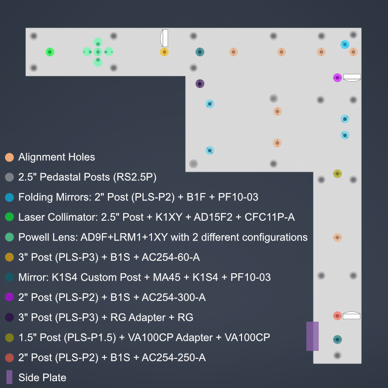

   **Figure 13:** Labelled schematic of the baseplate showing the intended use of each hole for mounting optical components or for alignment purposes.

Overview of the Illumination Train Assembly Process
^^^^^^^^^^^^^^^^^^^^^^^^^^^^^^^^^^^^^^^^^^^^^^^^^^^

The assembly of the illumination train is a multi-step process that involves the careful installation and alignment of various optical components. The following steps outline the general procedure for assembling the illumination train:

1. Mount the baseplate on the pedastal posts

2. Laster Collimation and Alignment

3. Mounting the Galvo Scanner and the first K1S4 mount with mirror 

4. Mounting the foldings Mirrors and ensuring alignment

5. Mounting the Optical Lenses

6. Mount the second K1S4 mount with mirror to fold the beam up

7. Gluing the D-Shaped Mirror on the Side Plate

8. Fastening the Side Plate on the main Baseplate.

9. Mounting the Powell Lens

10. Mounting Mechanical Slit

10.Cross-check the positon of the Powell and use the translation stage to fine-tune the position of the Powell lens.

---------------

Mounting Baseplate on Optical Table
^^^^^^^^^^^^^^^^^^^^^^^^^^^^^^^^^^^

To mount the baseplate onto an optical table, the process requires screwing 1/4"-20 screws onto 2.5" pedastal posts (`RS2.5P <https://www.thorlabs.com/item/RS2.5P>`_). There are multiple holes on the baseplate for pedastal posts, we recommend at least using the 5 pedastal posts for all 5 vertices. You could either use clamps to fasten the pedastal posts on the optical table or use cap screws in which case first fasten the pedastal posts on the optical table and then mount the baseplate on top of the pedastal posts. 
The whole system has been made keeping in mind of the height of the pedastal posts, so using 2.5" pedastal posts will ensure that the baseplate is at the proper height to correctly couple with the detection module.

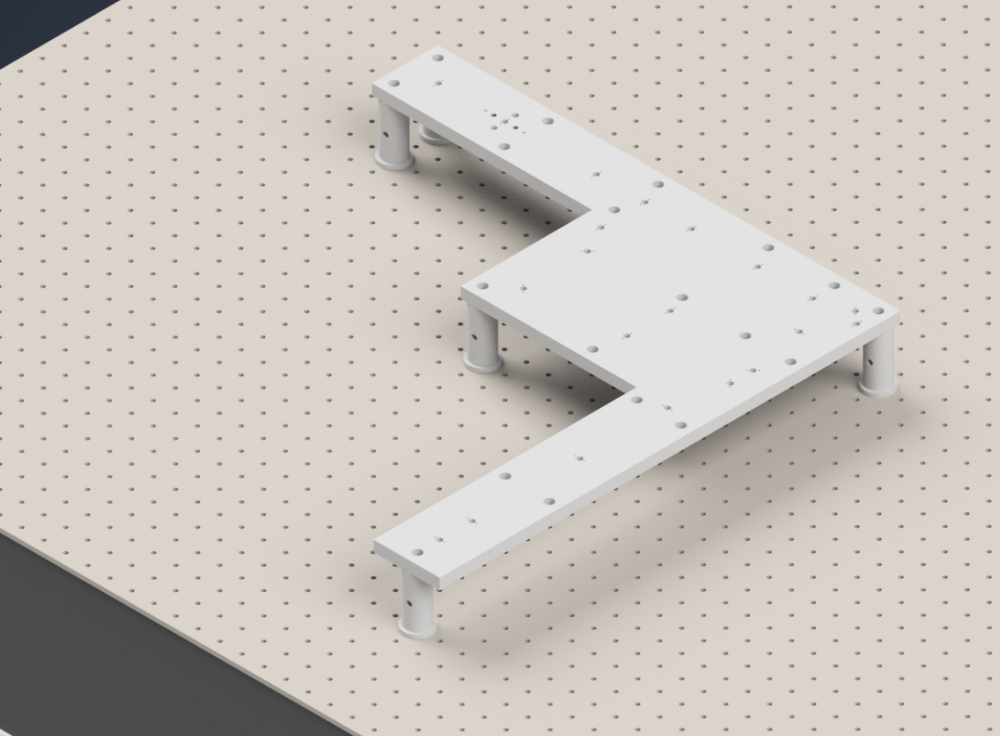

    **Figure 14:** Mounting the baseplate on the optical table using pedastal posts.

---------------

Initial Laser Collimation
^^^^^^^^^^^^^^^^^^^^^^^^^

When first assembling the system, ensuring proper output collimation from the fiber laser source is critical. There are multiple checks that one can take for this step, but we utilize a combination of a `shear-plate interferometer <https://www.thorlabs.com/newgrouppage9.cfm?objectgroup_id=2970>`_ and two pinhole apertures placed at opposite ends along the length of the baseplate. Shear-plate interferometers are designed to split and interfere an input beam of coherent light, such that when the beam is collimated there are interference fringes aligned vertically with a reference line. The fiber laser collimator we used for this system is the `Thorlabs CFC11A-A <https://www.thorlabs.com/thorproduct.cfm?partnumber=CFC11A-A>`_, which features an adjustable barrel which controls the position of collimation optics within the element.

The basic assembly process involves first inserting and fixing the CFC11A-A into a Thorlabs AD15S2 adapter, which allows it to then be mounted into a 2.5" Polaris K1XY mount (We used a combination of a custom machined 0.5" spacer with 2" Polaris Post). This assembly is then mounted onto the respective Polaris post at the start of the baseplate. The fiber laser source is then able to be directly mounted into the CFC11A-A, making sure that the protrusion on the fiber wire aligns with the open section of the CFC11A-A port. The basic process of ensuring collimation then involves turning on the laser source, and placing the shear-plate interferometer such that the input port aligns with the output of the laser unit. Then, by slowly adjusting the barrel of the CFC11A-A and observing the interference fringe orientations along the top display of the interferometer, one is able to adjust the beam until it is properly collimated.

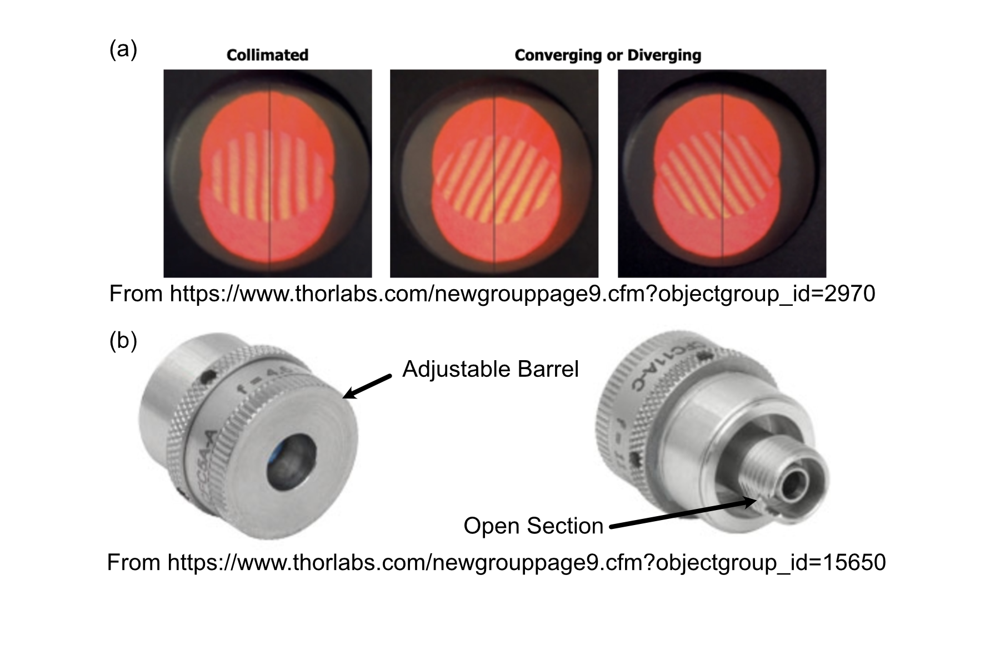

    **Figure 15:** Shear Plate interferometer and collimator lens

----------------

Initial Alignment
^^^^^^^^^^^^^^^^^

With the beam collimated, the process of beam alignment involves adjusting the position control knobs on the K1XY to have the beam pass through two pinhole apertures along the optical path. The height of the initial laser output is designed to be at 3.75" above the top surface of the baseplate, so selecting appropriate post heights for the apertures such that their centers rest at 3.75" is essential. 
In our case we use a 2.5" post with 1XY mount to hold the `P2000K1 pinhole apertures <https://www.thorlabs.com/thorproduct.cfm?partnumber=P2000K1>`_ or any adjustable iris which has SM1 threading, however  if using Polaris 1XY mount, **the user must not adjust the XY adjusment screws on the 1XY mount and treat it as fixed in the whole alignmennt process**.
The other way is using `Thorlabs ID12 <https://www.thorlabs.com/thorproduct.cfm?partnumber=ID12>`_ pinhole apertures, so using a post height of 3.25" will ensure that they are at the proper height for alignment. We designed a `custom ID12 to Polaris adapter <https://github.com/TheDeanLab/altair/tree/main/downloads/common/cad>`_ to ensure the aperture is at the proper height and properly aligned along the designated Polaris axis. 
Either way, the key is to ensure that the pinholes are at the correct height and you could have one of these pinholes placed at the powell lens hole and one at the other end of the baseplate as shown in the figure below. There are multiple alignments holes in between and one can use them too, it is always better to check far away. 
With the pinholes placed, the process becomes iterative by making small adjustments on the K1XY tip/tilt knobs and XY position screws until the beam passes through both pinholes.

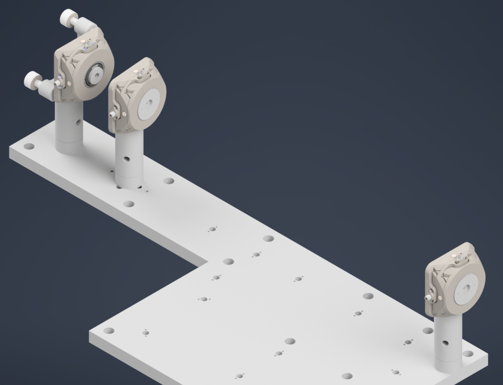

    **Figure 16:** Alignment setup with a pair of pinholes with 1XY mount for initial beam alignment.

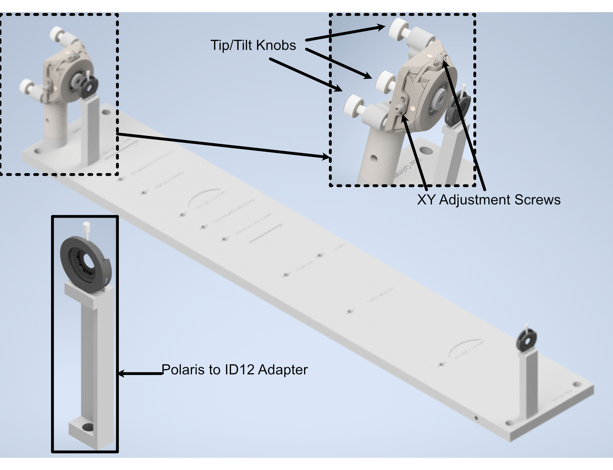

    **Figure 17:** Performing beam alignment using ID12 and custom adapter for it.

---------------

Placing the Galvo and the K1S4 Mirror Mount
^^^^^^^^^^^^^^^^^^^^^^^^^^^^^^^^^^^^^^^^^^^

Now that the beam is collimated and aligned, the next step is to mount the galvo scanner and the first K1S4 mount with mirror, which will decrease the optical axis height by a inch. 
For the Resonant Galvanometer, use a 3" Polaris Post, and mount the custom galvo adapter on top of the post using dowell pins and 3/8" screw, then carefully insert the galvo scanner through the adapter bore and fasten a little using 3/8" screws but do not tighten yet. Make sure the reflecting surface faces the correct direction.
For the K1S4 mount, use a custom K1S4 post and mount the K1S4 on top of the post using dowell pins, then insert a mirror into the mount and fasten it using the provided screw. 
Now we also put in the first folding mirror which is at the corner of the baseplate, and this mirror is mounted in a B1F mount which gets mounted on the 2" Polaris Post. Detailed instructions for mounting the optics in B1F can be accessed in ThorLabs Specs Sheet.
We need to have atleast 2 pinholes for this step, one nearest to the K1S4 mount and one at the end of the baseplate. We need to use 1.5" post with 1XY mount to hold the pinhole.
The figure below shows the galvo scanner, the first K1S4 mount with mirror, the first folding mirror mounted on the baseplate and a pinhole at the end of the baseplate.
Now the goal is to make sure that the beam reflects off the mirror and passes through the pinhole at the end of the baseplate and at this point. For the vertical alignment, you can adjust the tip knob on the K1S4 mount and the rotation of the galvo scanner. Adjust the galvo scanner to make sure the beam the passthrough the first pinhole and adjust the tip knob of the K1S4 mount to make sure the beam passes through the second pinhole at the end of the baseplate. Iteratively adjusting both will make the beam at the correct height throughout, if beam is laterally shifted on the pinholes, use the tilt knob on the K1S4 mount to make the adjustment.
Once the beam is passing through the pinhole at the end of the baseplate, you can then tighten the screws on the galvo scanner.

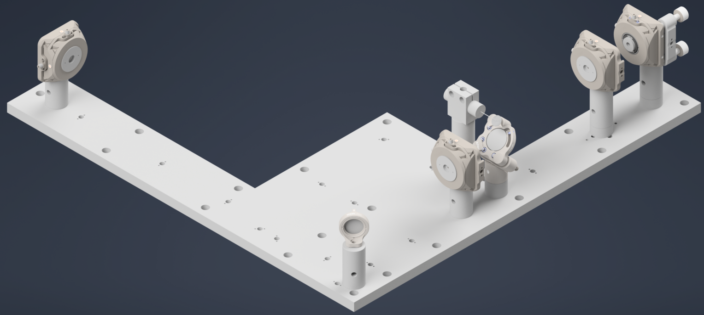

    **Figure 18:** Aligning the beam across the baseplate through the galvo scanner and the first K1S4 mount and the first folding mirror

---------------

Folding Mirrors
^^^^^^^^^^^^^^^

Now, the next step is to mount the remaining folding mirrors and ensure that the beam still passes through the pinholes. We begin by only the corner mirror first.
Ideally, you wouldn't need to make any adjustment to make the beam pass through the pinholes, if the beam aligned correctly in the previous step and that the folding mirrors are correctly mounted. 
If there is still slight misalignment, you can first try to rotate the folding mirrors' post (they have a little room play with) if not you can adjust the tip/tilt knobs on the K1S4 mount until the reflected beam passes through both pinholes.
Also, you could use the aligment holes in between the folding mirrors at different positions to inspect at which point is the beam getting misaligned if any, and make the adjustment accordingly.

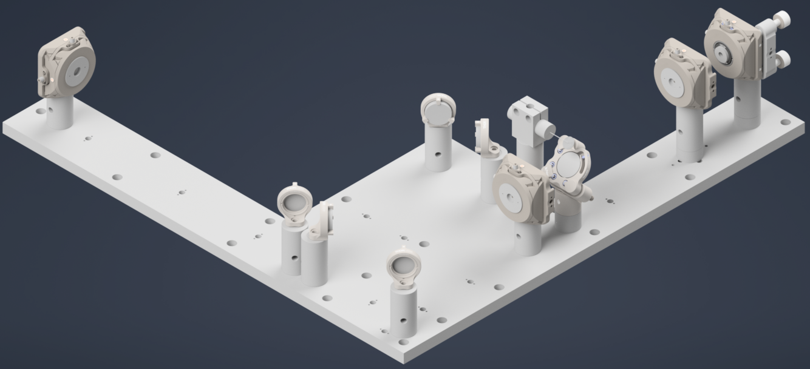

    **Figure 19:** Mounting all the folding mirrors in the path and ensuring the beam is properly aligned through the pinholes.

---------------

Mounting the Optical Lenses
^^^^^^^^^^^^^^^^^^^^^^^^^^^

Now that the beam is properly aligned with the folding mirrors, the next step is to mount the optical lenses. 
We only mount the achromatic doublet lens first, and the powell lens is mounted at the end.

The f=60mm AC254-60-A achromatic doublet lens is mounted on a 3" polaris post in a B1S mount, and the f=300mm AC254-300-A achromatic doublet lens is mounted on a 2" polaris post in a B1S mount and the f=250mm AC254-250-A achromatic doublet lens is mounted on a 2" polaris post in a B1S mount as well.
The process of mounting the lenses is straightforward, but the key is to ensure that the lenses are mounted at the correct positions, facing the correct direction, and that the beam passes through the center of the lenses. The figure below shows the achromatic doublet lenses mounted on the baseplate.
You could chose to check the back reflection of the lenses to make sure they are properly mounted and that the beam is passing through the center of the lenses, but it is not necessary.

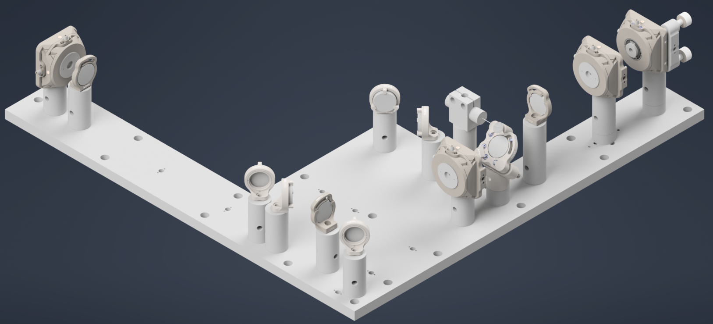

    **Figure 20:** Mounting the achromatic doublet lenses on the baseplate

---------------

Fold the Beam Up
^^^^^^^^^^^^^^^^

Now, switch the 1XY mount with pinhole at the end of the baseplate with the second K1S4 mount with a mirror which will fold the beam up.

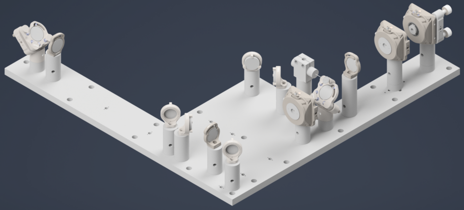

    **Figure 21:** Mounting the second K1S4 mount with mirror

Now, the final alignment check is to make sure the beam is correctly folding  up and passing through the center.
For this step, we used a `DG10-1500-H1-MD <https://www.thorlabs.com/thorproduct.cfm?partnumber=DG10-1500-H1-MD>`_ put on a custom adapter. The custom adapter can be mounted to the side of the baseplate and you can just place the Alignment disk on top of the adapter.

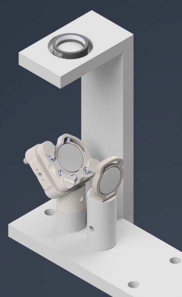

    **Figure 22:** Alignment disk mounted on the side of the baseplate for final alignment check.

---------------

Gluing the D-Shaped Mirror on the Side Plate
^^^^^^^^^^^^^^^^^^^^^^^^^^^^^^^^^^^^^^^^^^^^

Now, we need to glue the D-Shaped mirror on the side plate and then fasten the side plate on the main baseplate. The D-shaped mirror is used to reflect the beam from the illumination train into the detection module, so it is crucial to ensure that it is properly aligned and securely attached.
The D-shaped mirror is glued onto the side plate using a high-quality optical adhesive. We used `Norland Optical Adhesive 81 <https://www.thorlabs.com/thorproduct.cfm?partnumber=NOA81>`_, which is a UV-curable adhesive that provides strong bonding and excellent optical clarity. 
The process involves applying a small amount of the adhesive to the socket in the side plate where the D-shaped mirror will be placed. You don't a thick layer of adhesive, just a thin layer evenly applied to the base and curved surface. Then place the D-Shaped mirror followed by curing from all the directions, and then curing it under UV light according to the manufacturer's instructions.

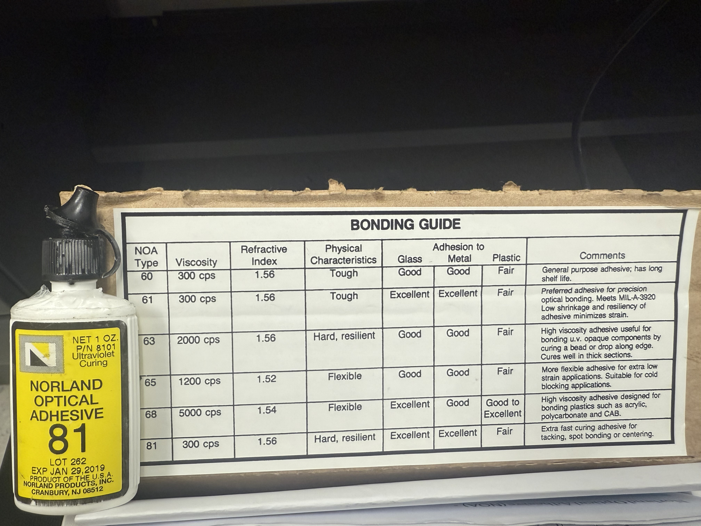

    **Figure 23:** The choice of glue used for attaching the D-Shaped mirror.

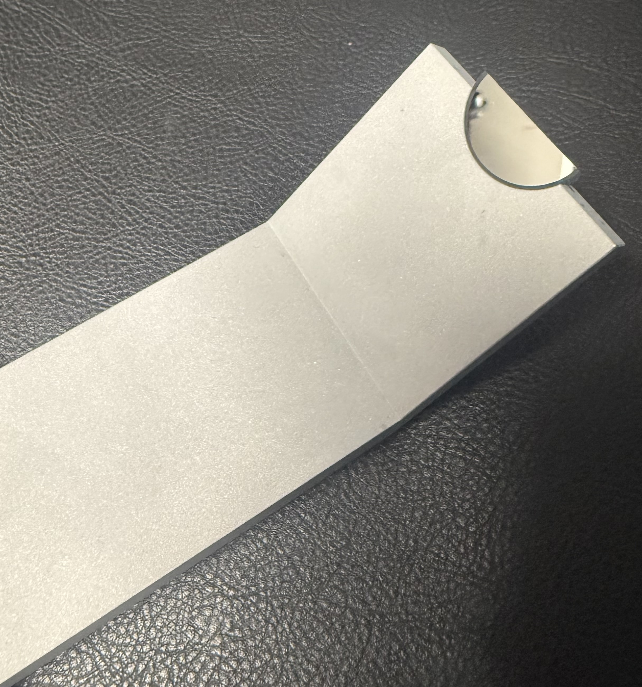

    **Figure 24:** D-Shaped mirror glued onto the side plate.

---------------

Mounting the Side Plate 
^^^^^^^^^^^^^^^^^^^^^^^

Once the D-shaped mirror is securely attached to the side plate, the next step is to fasten the side plate onto the main baseplate. The side plate is designed to be mounted onto the main baseplate using dowell pins and 1/4-20 screws, so you will need to put the dowell pins in the baseplate side holes and then align the holes on the side plate on the main baseplate and then secure it in place using screws.

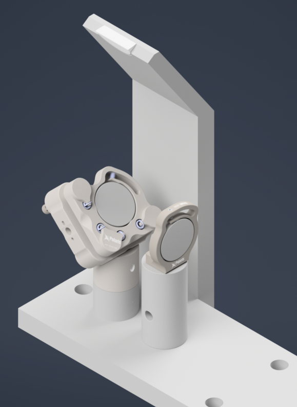

    **Figure 25:** Side plate fastened onto the main baseplate.

-------------------------

Powell Lens Assembly
^^^^^^^^^^^^^^^^^^^^

Our illumination path utilize a Powell lens as the element that forms the light sheet profile. Our mounting scheme for the Powell lens offers control over all 3 axes (x, y,
and z), where the Polaris 1XY Mount covers x and y and the LNR25M covers z. We found that outside of the Polaris 1XY
for centering the Powell lens precisely on the beam, due to tolerances of the Powell lens from Laserline, we
also needed to adjust the distance between the Powell lens and L2 to have our physical system align with our
simulations.

**Step 1: Fixing the Powell lens into the AD9F Mount**

For the first step, get a piece of optical tissue paper and the AD9F and Powell lens. Place the flat face of the
Powell lens onto the tissue paper, and then place the AD9F onto the Powell lens such that the front surface of the
smaller side of the AD9F is flush with the flat face of the Powell lens. Use the two mounting screws on the AD9F to
secure the lens in place.

.. card:: Powell Lens into AD9F Assembly

   .. raw:: html

      <video controls style="width:50%;">
        <source src="Images/Videos/Assembly/PowellAD9F.mp4" type="video/mp4">
        your browser doesn't support video
      </video>

**Step 2: Install the LRM1 rotation Mount into the Polaris 1XY**

Screw the threaded portion of the LRM1 into the threaded hole on the Polaris 1XY until the back surface of the LRM1
is flush with the front of the 1XY.

.. figure:: Images/LRM1into1XY.png
    :align: center
    :alt: Screwing the LRM1 into the 1XY

    **Figure 26:** Screwing the LRM1 into the 1XY

**Step 3: Install the LNR25M onto the Baseplate**

There are a variety of holes on the baseplate that one can use to fix the LNR25M in place. In the graphic below, the
two holes in red on the top of the LNR25M allow you to thread 1/4-20 screws directly through the LNR25M into the
threaded holes on the baseplate below. There are also two 3 mm-diameter dowel pins on the bottom of the LNR25M that
have corresponding holes on the baseplate in blue. Finally, there are three holes on the baseplate in yellow that
correspond to threaded holes on the bottom of the LNR25M, 1/4-20 screws can be used to secure the LNR25M through
these holes the same way that one would fix the other Polaris posts on the baseplate in place.

.. figure:: Images/LNR25MontoBaseplate.png
    :align: center
    :alt: placing the LNR25M onto the baseplate

    **Figure 27:** placing the LNR25M onto the baseplate

**Step 4: Fix the 1" Polaris Post onto the LNR25M to Polaris adapter**

Then take the LNR25M to Polaris adapter and using the same 2 mm dowel pins and 1/4-20 screws that the other Polaris
posts in the system use, fix the 1" Polaris post onto the adapter by screwing in a 1/4-20 screw from the bottom of
the adapter into the post.

.. figure:: Images/P1onLNR25Adapter.png
    :align: center
    :alt: placing the 1" Polaris Post onto the LNR25M Adapter

    **Figure 28:** placing the 1" Polaris Post onto the LNR25M Adapter

**Step 5: Install the LNR25M to Polaris adapter onto the LNR25M**

Then using the four holes on the top of the adapter surrounding the 1" post, place 1/4-20 screws in those holes and
screw them into the top of the LNR25M

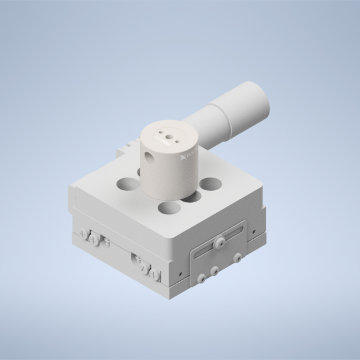

    **Figure 29:** placing the LNR25M Adapter onto the LNR25

**Step 6: Fix the Polaris 1XY onto the 1" Polaris post**

Using an 8-32 screw and the 2 mm dowel pins, fix the Polaris 1XY onto the top of the 1" Polaris post assembly.

.. figure:: Images/PowellLNR25MLRM1.png
    :align: center
    :alt: Fixing the Polaris 1XY onto the 1" Polaris Post

    **Figure 30:** Fixing the Polaris 1XY onto the 1" Polaris Post

**Step 7: Screw in the AD9F into the LRM1 mount until it's fully threaded**

Finally, screw in the AD9F fully into the LRM1 mount threading.

.. figure:: Images/PowellLNR25M.png
    :align: center
    :alt: Threading the AD9F into the LRM1 mount

    **Figure 31:** Threading the AD9F into the LRM1 mount

There will also an alternate way to mount the 1XY on the baseplate, which is to use XP10X with an actuator XP10X-C1.
You will first mount a 1.5" Polaris Mount with a custom height adapter on the baseplate.
Then you will mount the XP10X on top of the Polaris Mount using dowel pins and 1/4-20 screw, and then mount the Polaris 1XY onto the XP10X-C1 using dowel pins and 8-32 screw.

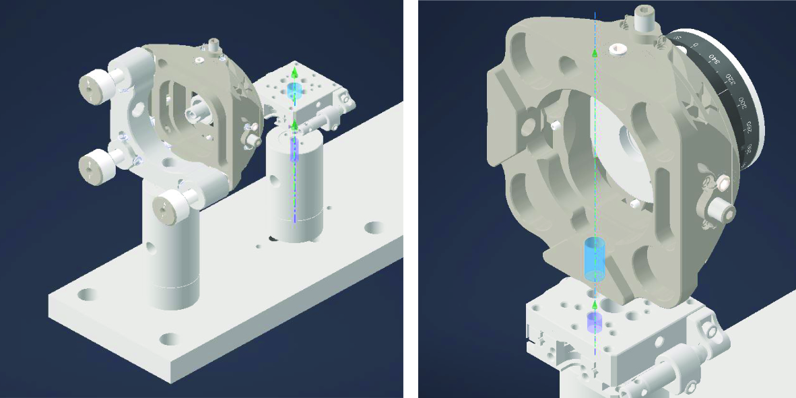

    **Figure 32:** Mounting the Polaris 1XY onto the XP10X-C1

------------------

Mechanical Slit Assembly
^^^^^^^^^^^^^^^^^^^^^^^^

We use a mechanical slit to control the aperture of the light sheet.
We first mount the VA100CP mechanical slit on the custom adapter usign 3/8" screw, and then mount the custom adapter onto the Polaris Mount using dowel pins and 3/8" screw. Finally, we mount the Polaris Mount onto the baseplate using dowel pins and 1/4-20 screws.
The slit should be placed at the focal plane of the second achromatic doublet, so that it can effectively control the aperture of the light sheet. If you can't find the focus at the mechanical slit, you can play with the position of the powell lens a little using the translation stage it sits on, and you should be able to find the focus at the mechanical slit.

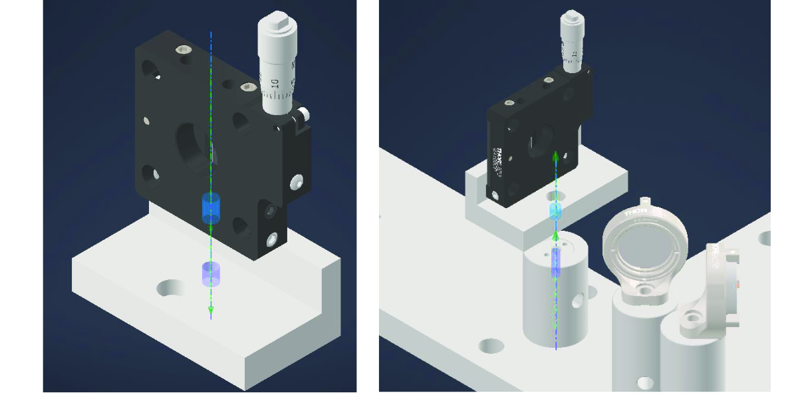

    **Figure 33:** Mounting the mechanical slit onto the baseplate
   
------------------

The final baseplate assembly should look like the figure below.

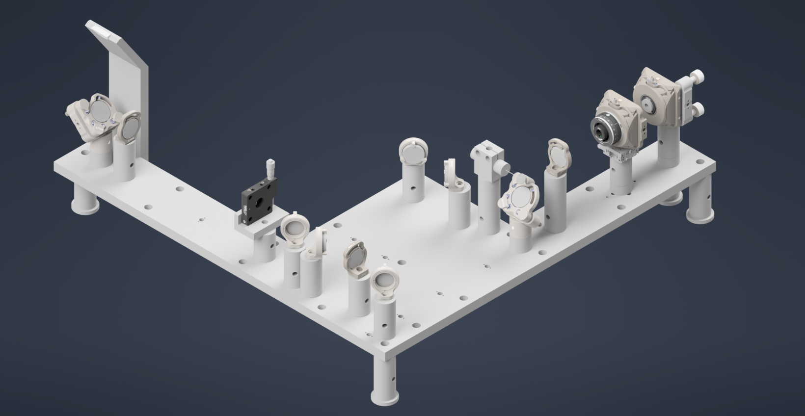

    **Figure 34:** Final Assemlby of the Illumination Train on the Baseplate

------------------

Coupling the Illumination Train with the Detection Module
^^^^^^^^^^^^^^^^^^^^^^^^^^^^^^^^^^^^^^^^^^^^^^^^^^^^^^^^^

Finally with both the illumination train and the detection module assembled, we can then couple the illumination train with the detection module. The key is to make sure that the beam from the illumination train is properly reflected by the D-shaped mirror into the detection module, and that it is properly aligned with the optical path of the detection module.

The stage essentially integrates the illumination and detetion trains.
The stage assemlby includes the following S561-2235B, Dual-LS-50-FTP with LS-5007 and LS-1010-K.

**Important: The height of the stage must be set to over 260mm from the optical table to the bottom surface of the stage**

Place stage over the illumination train 4" away from the pedastal post at the end of the baseplate. For the detection module, use a `PT1B stage <https://www.thorlabs.com/thorproduct.cfm?partnumber=PT1B>`_ with a `MSAP90 bracket <https://www.thorlabs.com/thorproduct.cfm?partnumber=MSAP90>`_ to mount the detection module and place under the stage. Then, you can use the translation stage to adjust the position of the detection module such that the pupil of the objective is nearly in the center of the stage field of view.
The figure below shows the final assembly of the stage with the detection module mounted on it, and the stage placed over the illumination train.

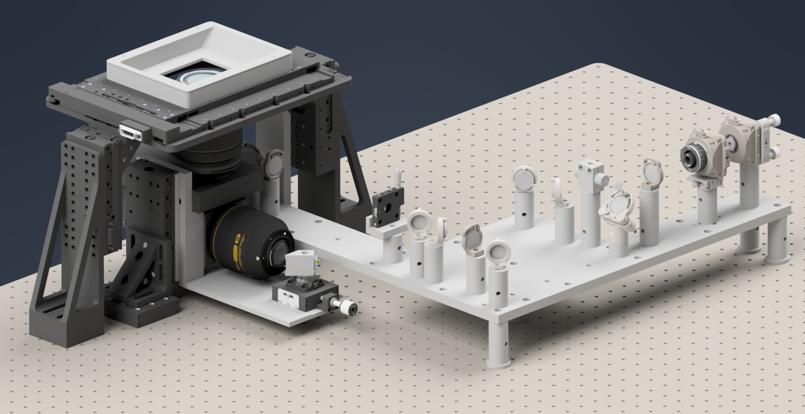

    **Figure 35:** Final assembly of the stage with the detection module mounted on it, and the stage placed over the illumination train.

------------------