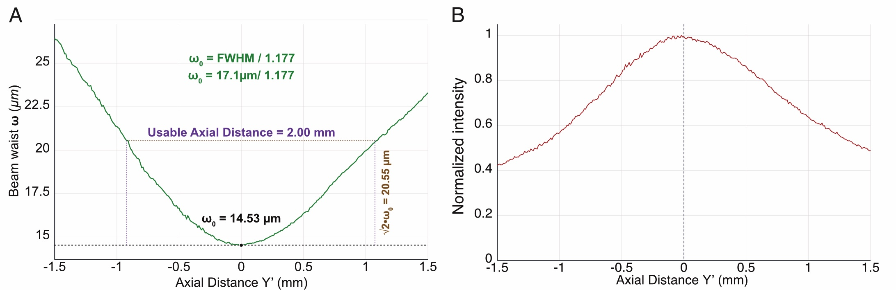
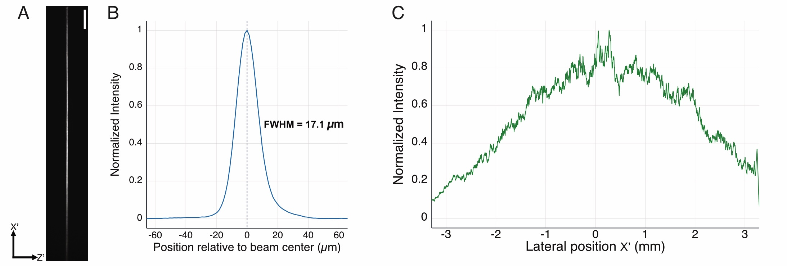
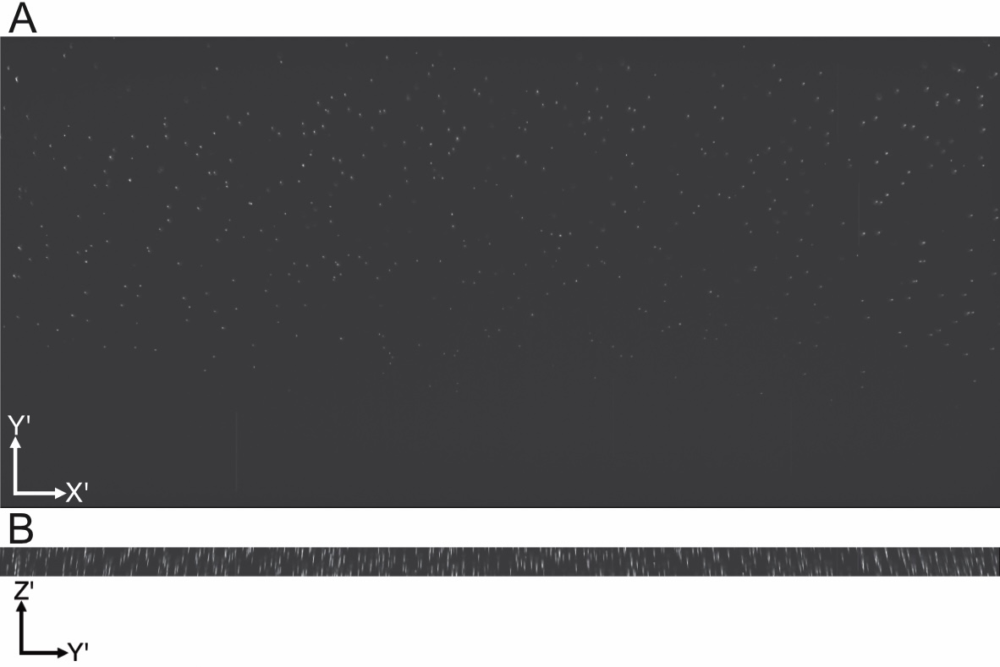
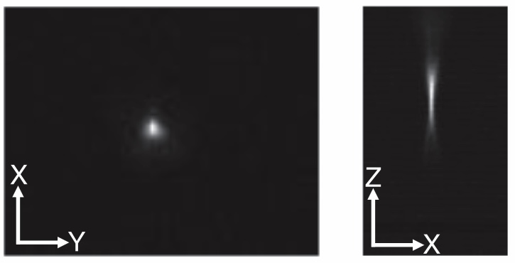
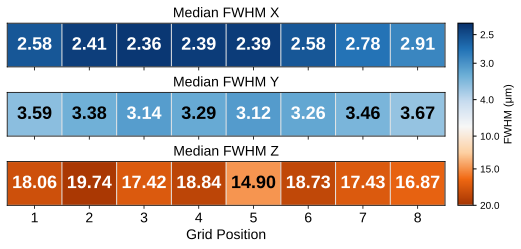

.. _dvopmcharacterization-home:

##############################
Altair DV-OPM Characterization
##############################

To characterize the performance of the Altair DV-OPM, we evaluated the illumination train by imaging the light-sheet profile, and we quantified the system resolution using 1 µm fluorescent beads.

---------------

Beam Characterization
_____________________

To characterize the illumination beam profile, we imaged the light sheet in air while translating the camera through a series of axial positions along the propagation direction, :math:`Y'`. A fixed lateral region near the center of the sheet was selected so that the thickness measurement was obtained from the same representative region at each axial position.

For each axial plane, the background-corrected intensity profile along the sheet-thickness direction, :math:`Z'`, was extracted and fit with a Gaussian function. The fitted Gaussian standard deviation, :math:`\sigma`, was converted to full width at half maximum (FWHM) using

.. math::

    \mathrm{FWHM} = 2\sqrt{2\ln 2}\,\sigma \approx 2.355\sigma

after applying the camera pixel size calibration.

The FWHM was then converted to the Gaussian beam waist, :math:`w`, using

.. math::

    w = \frac{\mathrm{FWHM}}{\sqrt{2\ln 2}}

where :math:`w` corresponds to the :math:`1/e^2` intensity radius of the beam.

The best-focus plane was defined as the axial position corresponding to the minimum FWHM. At this plane, we measured a minimum FWHM of :math:`17.1~\mu\mathrm{m}`, corresponding to a beam waist of :math:`w_0 = 14.53~\mu\mathrm{m}`.

The usable axial extent of the light sheet was determined experimentally from the measured waist profile as the axial range over which

.. math::

    w(Y') \leq \sqrt{2}\,w_0

yielding a usable distance of approximately :math:`2.00~\mathrm{mm}`.

    **Figure 1:** Characterization of the light-sheet profile in air along the axial direction.

At the best-focus plane, we additionally characterized the spatial distribution of the sheet. A representative image was used to visualize the light-sheet morphology and its lateral extent along :math:`X'`. The normalized background-corrected intensity profile along :math:`Z'` was used to quantify the sheet thickness, while the lateral intensity profile along :math:`X'` was calculated by summing the background-corrected intensity along :math:`Z'` at each lateral position. This provided a measure of the illumination uniformity across the approximately :math:`6.5~\mathrm{mm}` lateral extent of the sheet.

    **Figure 2:** Characterization of the light-sheet profile in air at the best-focus plane. A. Camera image of the light sheet at the best-focus plane. B. Normalized intensity profile along the sheet-thickness direction, :math:`Z'`. C. Normalized intensity profile along the lateral direction, :math:`X'`.

Resolution Quantification
_________________________

To quantify the imaging resolution of the system, we imaged 1 µm fluorescent beads embedded in agarose.

Beads were imaged at different axial positions along the propagation direction, :math:`Y'`, and the FWHM of the bead images was measured along the lateral and axial directions to quantify system resolution across the field of view.

To prepare the fluorescent bead sample, 1 µm YG fluorescent nanospheres were diluted 1:1000 in deionized water and sonicated for 3 minutes to minimize aggregation. The resulting solution was subsequently mixed at a 1:100 dilution ratio with 2% low-melting-point agarose for volumetric imaging.

    **Figure 3:** Images of 1 µm fluorescent beads embedded in agarose and imaged with the Altair DV-OPM. A. Maximum-intensity projection of the bead sample in the :math:`X'Y'` plane. B. Maximum-intensity projection of the bead sample in the :math:`X'Z'` plane.

    **Figure 4:** Zoomed-in image of a single fluorescent bead shown in the :math:`X'Y'` and :math:`X'Z'` planes.

We measured the full width at half maximum (FWHM) from images of 1 µm fluorescent beads (:math:`n = 302` beads). The measurements were grouped into eight grids based on lateral position across the field of view, and the median FWHM values for each section are reported in micrometers along the :math:`X'`, :math:`Y'`, and :math:`Z'` directions.

    **Figure 5:** Median FWHM values measured from images of 1 µm fluorescent beads, grouped by lateral position across the field of view.