.. _dvopmdesign-home:

##############################
Design Process
##############################

Detection Path: Design
______________________

The detection path is designed as a compact remote-imaging relay that projects the oblique image plane directly onto the camera sensor.

The relay is formed using a pair of photographic lenses: a 65 mm Mitakon Zhongyi Speedmaster lens (O1) and an 85 mm Nikon AF-S NIKKOR lens (O2). The use of photographic lenses enables a compact and mechanically accessible relay configuration while allowing intermediate components to be incorporated within the optical path. The focal length ratio of these lenses provides an effective magnification of approximately 1.308×, which sets the image scale at the sensor.

An emission filter wheel is positioned between the two lenses to enable fluorescence filtering while preserving the relay geometry. The physical presence of this filter wheel introduces a minimum spacing constraint in the relay, which is carried forward into both the optical and mechanical design.

Image acquisition is performed using a Ximea MU196MR-ON camera with a pixel size of 1.4 µm and an active sensor area of 7.2 mm × 5.4 mm. These parameters define both the sampling and the maximum field of view of the system. With a magnification of 1.308×, the corresponding object-space field of view is approximately:

.. math::

   \frac{7.2\ \text{mm}}{1.308} \approx 5.5\ \text{mm}

This object-space field of view defines the usable imaging region and directly determines the minimum required light-sheet length in the illumination subsystem.

------------------------------

Detection Path: Zemax Simulation Setup
______________________________________

The detection relay was modeled in Zemax using a sequential optical system to evaluate image formation across the field and refine the relay geometry prior to implementation.

The photographic lenses were incorporated using reverse-engineered black-box lens files representing their optical behavior. These models ensure that the Zemax simulation reflects the actual imaging performance of the relay lenses. Additional detail on the construction or validation of these lens files can be provided or referenced elsewhere if required.

The emission filter wheel was modeled as a planar optical element to preserve the physical spacing constraints it introduces within the relay.

The system aperture was defined using the Object Space NA aperture type in Zemax. The value was entered as:

.. math::

   NA = \frac{1}{2 (1.4 + 1.4)} = \frac{1}{5.6} \approx 0.1786

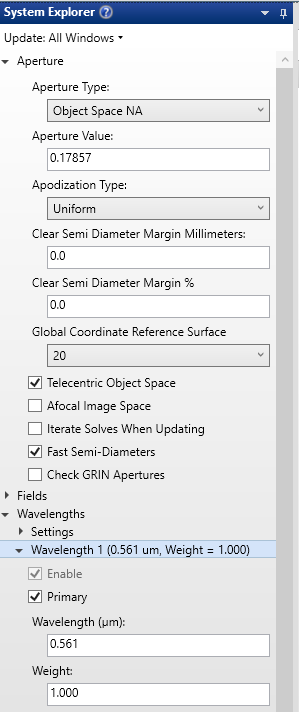

   **Figure 1:** A screenshot of Aperture settings in System Explorer in Zemax

**Object Geometry**

The object surface represents the oblique imaging plane within the specimen. To reproduce the system geometry, it was defined as a plane tilted by 45° and embedded in water.

Because of this tilt, positions across the object correspond to both lateral displacement and changes in depth within the sample. This ensures that the Zemax model accurately reflects the intended imaging condition.

**Field Definition**

A rectangular grid of field points was used to sample the tilted object surface. The field ranges were defined as:

- y: −2.75 mm to +2.75 mm  
- x: −1 mm to +1 mm  

The y-range is determined by the camera-limited field of view (~5.5 mm object space). The x-range is constrained by the specimen thickness intersected by the tilted plane. Because of the 45° tilt, displacement along x corresponds to a change in depth within the specimen. For a specimen thickness of approximately 2 mm, the field was restricted to ±1 mm so that all field points remain within the sample.

The fields themselves were weighted to prioritize central regions. The x and y coordinates in the Optimization Wizard were not independently weighted; rather, the weighting was applied through the field definitions, which influences the optimization process.

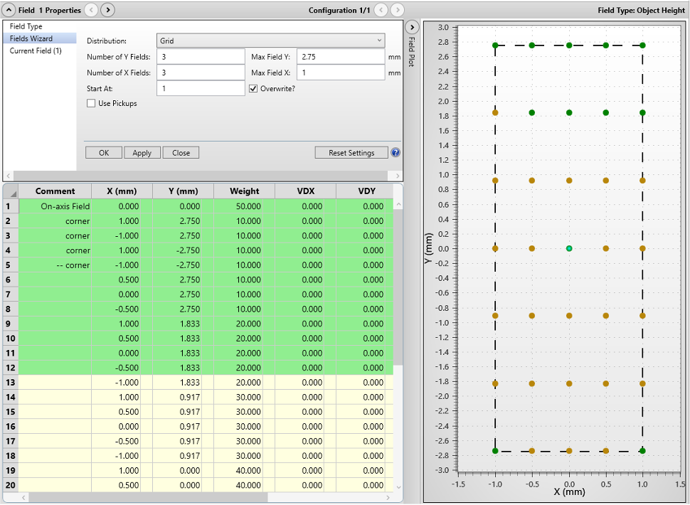

   **Figure 2:** Settings and Plot of field points in Zemax on a 2D plane

Because the object is tilted, this setup is essentially a 3D visualization, where the field points on the xy plane are also having different depth or z.

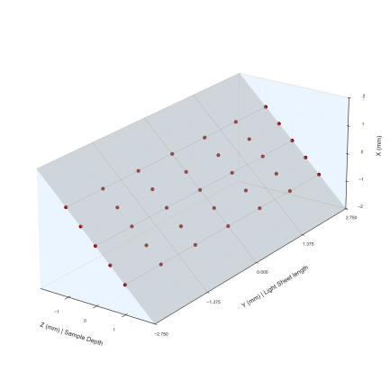

   **Figure 3:** A 3D visualization of the object surface and field points in the object as modelled in Zemax

**Optimization**

The detection relay was refined using the Zemax Optimization Wizard.

The primary optimization variables were:
- relay distances  
- camera (image plane) tilt  

The relay distances correspond to the physical separations between system components:
- specimen to O1  
- O1 to fold mirror (minimum spacing set by filter wheel)  
- fold mirror to O2 (minimum spacing set by kinematic mount)  
- O2 to camera  

Among these, the O2-to-camera distance and the camera tilt angle were found to be the most sensitive parameters. These directly control image plane alignment and defocus sensitivity, making them the dominant contributors to final image quality.

Because the system images an oblique plane, the image surface was allowed to tilt so that it aligns with the projected image formed by the relay.

The folllowing optimization settings were used:
- Image Quality: Spot  
- Reference: Centroid  
- Gaussian Quadrature: maximum arms and rings 

The optimization process was carried out iteratively, adjusting one parameter at a time to improve focus and reduce aberrations across the field. The resulting configuration established the final geometric arrangement of the detection relay used in the physical implementation of the system.

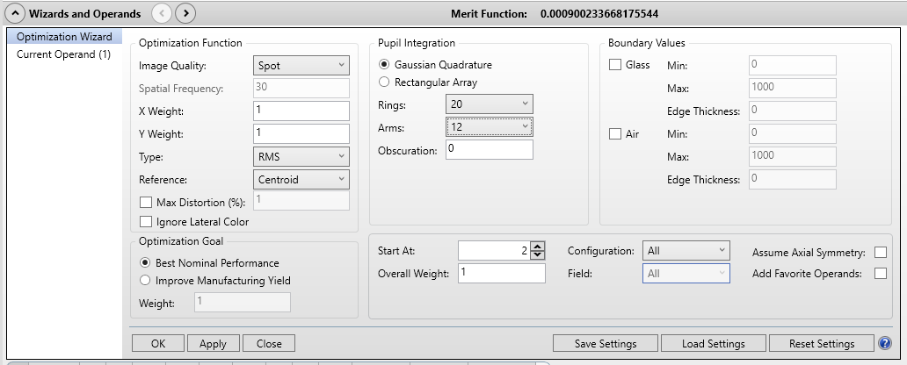

   **Figure 4:** Optimization Wizard in Zemax. We are optimizng for the spot size of our detection path.

Detection Path: Zemax Analysis
______________________________

The imaging performance of the detection path was evaluated using the modulation transfer function (MTF). The MTF describes how effectively the optical system transfers contrast at different spatial frequencies from the object to the image. Low spatial frequencies correspond to coarse features, while higher spatial frequencies correspond to finer details. As spatial frequency increases, contrast decreases due to aberrations and diffraction, and the MTF curve captures this behavior.

MTF was computed at each field point in both tangential and sagittal directions. These two directions are defined locally at each field point and correspond to orthogonal orientations of spatial variation. In general, the tangential direction lies along the direction of increasing field height, while the sagittal direction is orthogonal to it. Because these directions are defined locally, they rotate across the field and do not correspond directly to global x and y axes.

Resolution was quantified using the MTF20 criterion, defined as the spatial frequency at which the MTF drops to 20% contrast. This threshold provides a practical measure of the smallest resolvable feature size under typical imaging conditions.

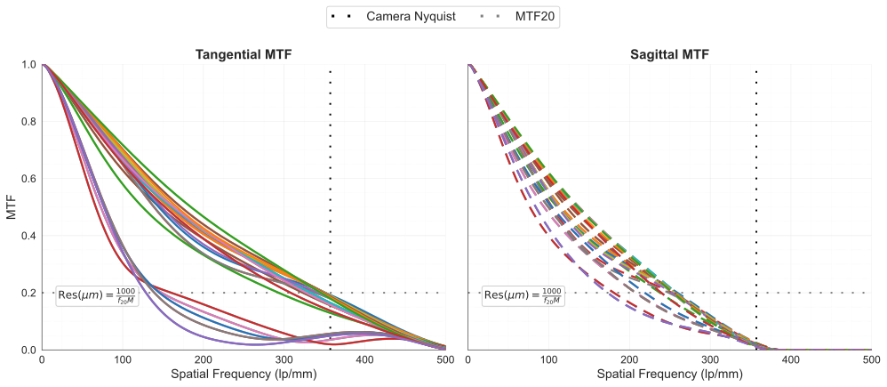

   **Figure 5:** MTF curves for all field points in both tangential and sagittal directions

The spatial frequency obtained from Zemax is reported in image space (lp/mm). To express resolution in object space, the following relationship was used:

.. math::

   \mathrm{Resolution} = \frac{1000}{f_{\mathrm{image}} \cdot M}

where :math:`f_{\mathrm{image}}` is the spatial frequency at MTF20 (in lp/mm), :math:`M = 1.308` is the system magnification, and the factor of 1000 converts the result to micrometers.

At the center field, the measured resolutions are:

- Tangential: 2.262885 µm  
- Sagittal: 3.077209 µm  

Across the full field:

- Tangential resolution ranges from approximately 2.18 µm in the central region to 5.94 µm toward the field boundaries  
- Sagittal resolution ranges from approximately 2.95 µm in the central region to 4.43 µm toward the field boundaries  

These results indicate that the best imaging performance is achieved near the central region of the field, where aberrations are minimal. As the field position moves toward the edges, both tangential and sagittal resolutions degrade due to increasing off-axis aberrations. The tangential direction exhibits a larger variation across the field, indicating that it is more sensitive to field-dependent aberrations in this relay configuration.

The full MTF curves provide additional insight beyond the MTF20 metric by showing how contrast decays across spatial frequencies for each field point. In particular, they reveal whether performance degradation occurs gradually or abruptly at different field locations, which is useful for understanding edge-of-field behavior.

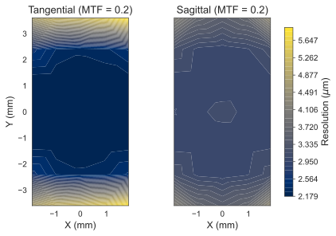

   **Figure 6:** Interpolated heatmaps showing spatial variation of tangential and sagittal resolution across the field

------------------------------

Illumination Path: Design
_________________________

The illumination path was designed to generate an oblique light sheet matched to the detection field of view.

From the detection design, the required object-space coverage is approximately 5.5 mm. To ensure full utilization of the camera field, the light sheet was designed to extend beyond this value, targeting a length exceeding 7 mm.

The illumination begins with a Powell lens, which converts the input beam into a fan with a uniform intensity distribution. This improves illumination uniformity across the field.

The beam is relayed using achromatic doublets. Longer focal length lenses were selected to provide sufficient propagation distance before focusing into a thin sheet. This allows all lenses to remain in a consistent orientation on a common baseplate while still enabling the sheet to be formed at the correct location on the stage. The increased working distance also simplifies mechanical integration.

A resonant galvo is placed between L2 and L3 to introduce rapid angular pivoting and reduce shadowing artifacts.

In the physical system, the beam is folded using mirrors. After L4, the beam is redirected upward and then reflected by an inclined mirror (35° relative to normal), launching the sheet into the specimen at approximately 20° relative to the stage.

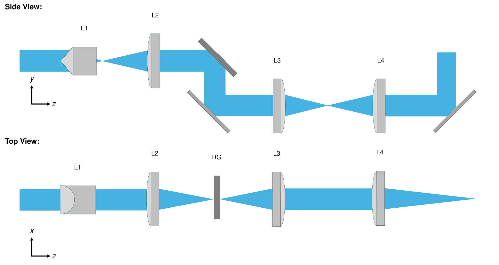

   **Figure 7:** A schematic of the illumination path for light sheet generation

The implemented lens sequence uses the following lenses listed in the table. 

.. list-table::
       :header-rows: 1

       * - Lens #
         - Lens Description
       * - L1
         - Powell Lens LOCP-8.9R10-2.0
       * - L2
         - Achromatic Doublet f = 60 mm
       * - L3
         - Achromatic Doublet f = 300 mm
       * - L4
         - Achromatic Doublet f = 250 mm
       * - RG
         - Resonant Galvo

------------------------------

Illumination Path: Zemax Simulation Setup
_________________________________________

The illumination system was modeled in Zemax using a collimated input beam at 561 nm with a pupil diameter of 2 mm. In the physical system, this corresponds to the collimated beam produced by the source and collimator prior to the Powell lens.

The Powell lens was incorporated using a reverse-engineered lens model representing its optical behavior. The resonant galvo was modeled as a planar mirror, capturing its static geometric effect on the beam path without including dynamic scanning.

The illumination path was constructed sequentially, with beam propagation controlled independently in orthogonal dimensions. This approach allows each stage of the relay to be designed with a clear optical objective rather than relying on a single global optimization.

**Sequential Design Procedure**

- The design begins by placing L1 (Powell lens) and L2, and adjusting the distance between them so that the beam becomes collimated in the y-dimension after L2.

- A mirror representing the resonant galvo (Mirror 1) is then placed after L2 to redirect the beam downward, and the distance between L2 and this mirror is adjusted so that the beam is focused in the x-dimension at this location.

- A second mirror (Mirror 2) is introduced to restore the beam propagation direction, and the distance between Mirror 1 and Mirror 2 is fixed at 25.564 mm to match the physical system constraint.

- L3 is then placed after Mirror 2, and the distance between Mirror 2 and L3 is adjusted so that the beam becomes collimated in the x-dimension after L3.

- L4 is placed after L3, and the distance between L3 and L4 is adjusted to achieve collimation in the y-dimension after L4.

- A third mirror (Mirror 3) is introduced to invert the beam upward.

- A fourth mirror (Mirror 4), inclined at 35°, is placed after Mirror 3 to launch the beam toward the specimen, and the distance between Mirror 3 and Mirror 4 is fixed at 91.5 mm.

- Finally, the distance between Mirror 4 and the image plane is adjusted so that the beam reaches the desired focus in the x-dimension after L4 and final launch.

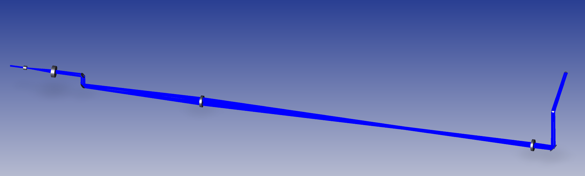

   **Figure 8:** A 3D Layout of the complete illumination train as modelled in Zemax

------------------------------

Illumination Path: Zemax Analysis
_________________________________

The illumination performance was evaluated using both Huygens PSF Cross-Section and 2D Huygens PSF analyses.

The cross-section analysis was used to quantify light-sheet thickness. The full width at half maximum (FWHM) was measured to be:

- Thickness: 13.65 µm (561 nm)

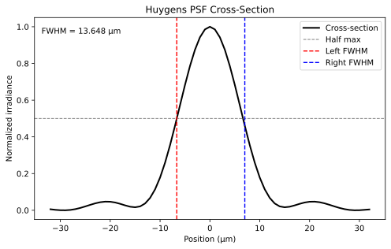

   **Figure 9:** Huygens PSF Cross-Section of the light sheet having an FWHM of 13.65µm

The 2D PSF was used to evaluate sheet extent and continuity. It is not used to quantify thickness.

The simulated sheet extends beyond 7 mm, exceeding the required ~5.5 mm coverage defined by the detection system.

These results confirm that the illumination system satisfies both thickness and length requirements.

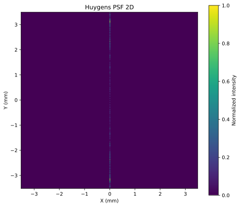

   **Figure 10:** 2D Huygens PSF with normalized intensity map illustrates the extended sheet used to estimate the sheet length.

Detection Path: Baseplate Design
________________________________

The detection subsystem was translated from the Zemax model into a dedicated baseplate assembly. The purpose of this baseplate is not only to hold the optical components, but to preserve the optimized relay geometry in a form that is mechanically reproducible and practical to align.

The relay is implemented as a folded geometry using a 90° beam fold. O1 is positioned to collect the emitted fluorescence from below the specimen and direct it through the emission filter wheel region toward the fold mirror. The kinematic mirror mount then redirects the beam so that O2 can be positioned orthogonally to O1. This folded arrangement allows the compact relay architecture to be physically realized while still accommodating the required components within the optical path.

The filter wheel occupies the region between O1 and the folded portion of the relay, and because it imposes a minimum spacing requirement, it directly affects the mechanical placement of adjacent components on the baseplate. Likewise, the kinematic mirror mount defines another minimum spacing region that must be respected when placing O2.

The entire detection module is mounted on a vertical translation stage so that the imaging plane can be adjusted relative to the specimen for focusing. At the camera end, a manual linear stage provides fine axial adjustment, and a rotary stage enables alignment of the camera sensor to the tilted image plane. These degrees of freedom are essential, since the optical performance of the system is particularly sensitive to the O2-to-camera distance and camera angle, as observed during the Zemax optimization.

The baseplate therefore has a dual purpose. First, it constrains the relative positions of the major relay elements so that the optimized optical geometry can be reproduced. Second, it preserves the specific alignment degrees of freedom that are still required in the physical system. This reflects the core Altair design principle: constrain what should be fixed, and preserve only the adjustments that are necessary for achieving optimal performance.

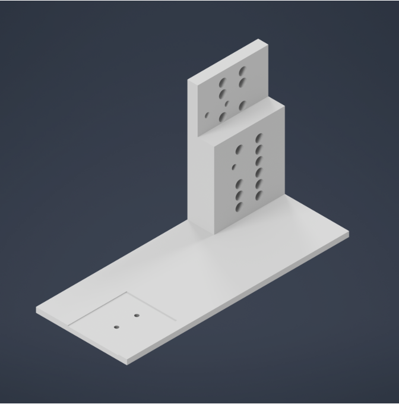

   **Figure 11:** CAD rendering of the detection baseplate showing component placement and folded relay geometry

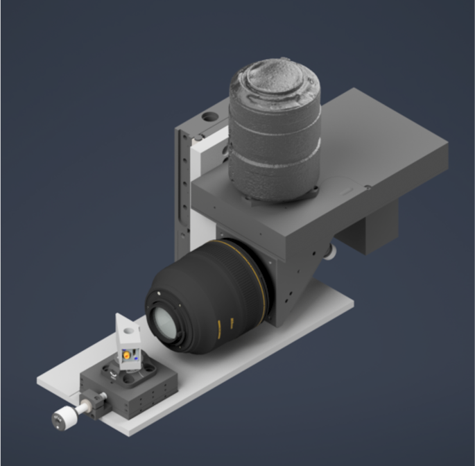

   **Figure 12:** Isometric view of the assembled detection subsystem

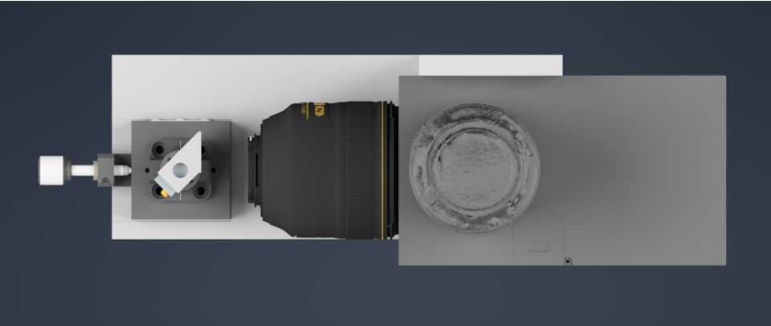

   **Figure 13:** Top view of the detection assembly illustrating optical path layout and spacing constraints

------------------------------

Illumination Path: Baseplate Design
___________________________________

The illumination subsystem was similarly translated from the Zemax design into a dedicated baseplate assembly. As with the detection subsystem, the goal of the baseplate is to make the optimized optical geometry physically realizable, stable, and reproducible.

The illumination path is implemented as a sequence of mounted optical elements arranged primarily on a common planar baseplate. This reflects a key design decision: the use of longer focal length achromatic doublets allows the lenses to be kept in a consistent orientation on the same baseplate while still providing sufficient propagation distance to shape the beam into the required light sheet at the stage.

Because the relay uses longer focal length lenses, the physical optical path becomes relatively long. To prevent the footprint from becoming impractically large, the beam is folded using mirrors in the physical system. This beam folding is therefore not an incidental feature, but a direct mechanical consequence of the long-focal-length design choice made to satisfy both optical and integration requirements.

Near the end of the illumination path, the beam must leave the planar relay geometry and be directed upward toward the sample. This is achieved using a vertical inversion mirror followed by a final inclined mirror that launches the beam toward the specimen at approximately 20° relative to the stage. This final section is particularly important, as it represents the point where the optical relay geometry and the physical stage geometry intersect. The baseplate and mounting configuration must therefore preserve not only the lens spacings, but also the correct beam height and launch angle.

The illumination baseplate design thus extends beyond simply placing optical elements in sequence. It must coordinate planar relay optics, beam folding, vertical redirection, final launch geometry, and stage height constraints within a single mechanically stable system. As a result, this subsystem represents one of the most integration-intensive aspects of the overall instrument design.

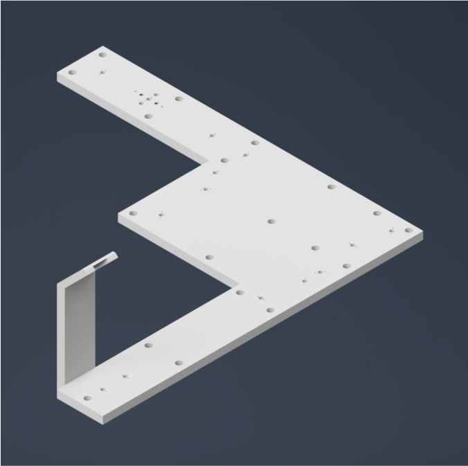

   **Figure 14:** CAD rendering of the illumination baseplate showing folded beam path and component layout

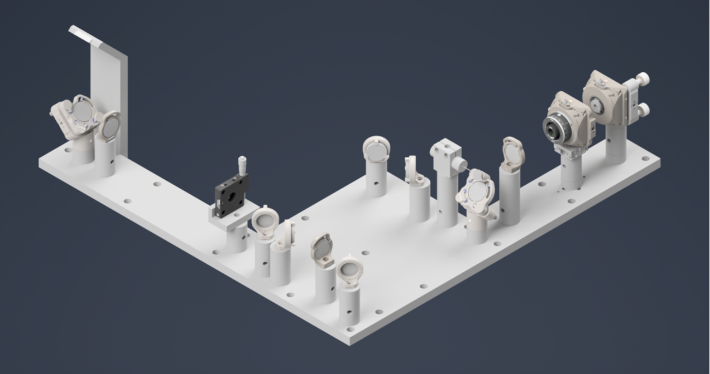

   **Figure 15:** Isometric view of the assembled illumination subsystem

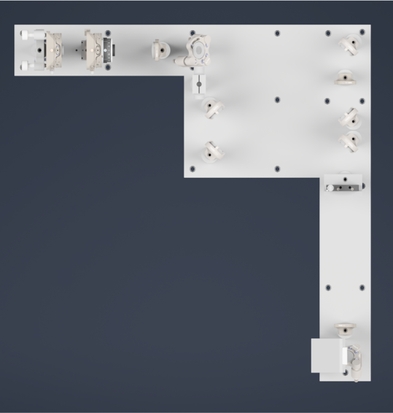

   **Figure 16:** Top view of the illumination assembly highlighting beam folding and optical path arrangement

------------------------------

System Integration and Stage
____________________________

Before presenting the complete system assembly, it is useful to describe how the optical subsystems integrate with the stage, since the system operates in a stage-scanning acquisition geometry.

The illumination and detection baseplates are mounted on the optical table as fixed subsystems. The sample is mounted above them on a motorized stage. During imaging, the sample is translated through the stationary illumination and detection planes, allowing volumetric data to be acquired without moving the optical subsystems.

The specific stage hardware used in this implementation is documented in the parts list and is not the primary focus of this section. Instead, the emphasis here is on the system-level relationship: the optical subsystems remain fixed and geometrically constrained, while the stage provides controlled motion of the sample.

This arrangement separates optical alignment from volumetric acquisition. Once the detection and illumination paths are aligned and fixed on their respective baseplates, volumetric imaging is achieved entirely through stage motion rather than through repeated adjustment of the optical system. This significantly improves both stability and repeatability.

The complete system assembly can therefore be understood as the integration of three primary components: the fixed detection baseplate, the fixed illumination baseplate, and the motorized stage positioned above them.

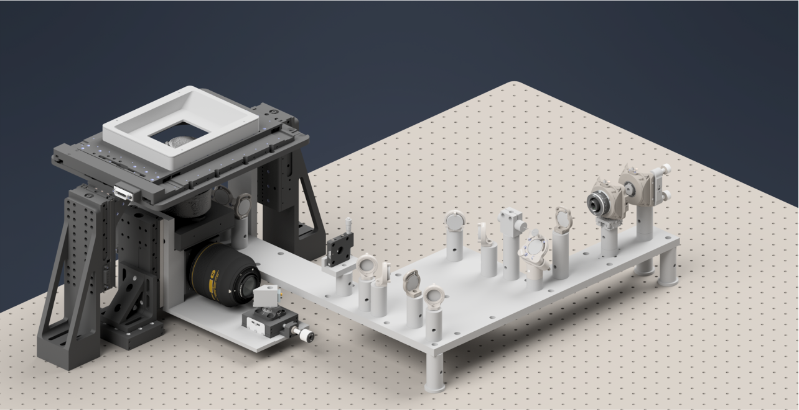

   **Figure 17:** Complete Altair dvOPM system assembly showing integration of detection, illumination, and stage subsystems

