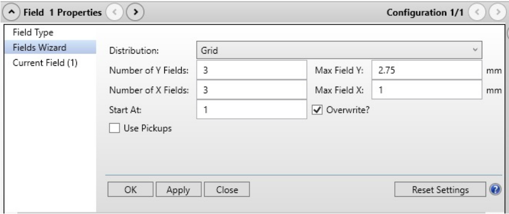
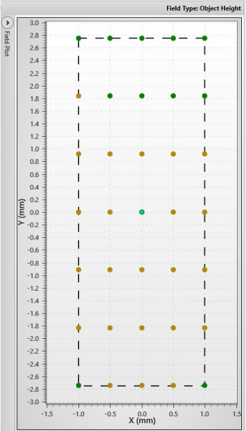
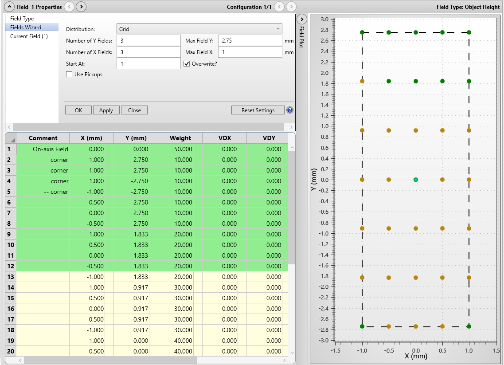
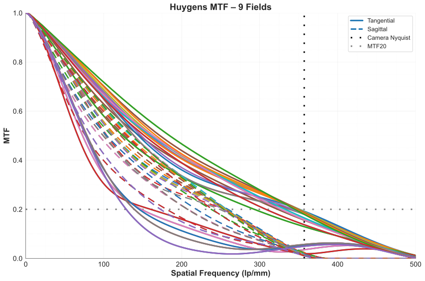

.. _dvopmdesign-home:

##############################
Design Process
##############################

Detection Train Design
______________________

The detection path was designed around a compact remote-imaging architecture that projects the oblique image plane directly onto the camera sensor. A pair of photographic lenses was selected to form this relay, consisting of a `65 mm Mitakon Zhongyi Speedmaster lens` as O1 and an `85 mm Nikon AF-S NIKKOR lens` as O2. This combination provides an effective magnification of approximately 1.308×, which establishes the image scale at the sensor while remaining compatible with specimens mounted in water-based media. An emission filter wheel is positioned within the relay to support fluorescence imaging while maintaining the modular layout of the detection assembly.

Image acquisition is performed using a compact Ximea MU196MR-ON camera. The small physical size of the sensor allows it to be positioned directly in the remote image space while maintaining the required tilt of the imaging plane. The sensor pixel size and active imaging area determine the effective sampling and the maximum field of view supported by the detection system. These parameters establish the lateral imaging extent of the microscope and define the region that must be illuminated by the light sheet in the illumination subsystem.

The optical configuration described above establishes the geometric and sampling constraints of the detection path. This configuration was subsequently modeled and evaluated in Zemax to analyze imaging performance across the field and to guide optimization of lens spacing, image plane orientation, and overall system geometry prior to physical implementation.

------------------------------

Detection Path: Zemax Simulation Setup
______________________________________

To evaluate the optical performance of the detection subsystem and to optimize the relay distances and angle of the camera, the configuration was modeled in Zemax. The simulation environment was used to analyze image formation across the field and to guide refinement of the relay geometry prior to implementation.

A sequential optical system was constructed in Zemax representing the detection relay. The aperture of the system was defined using the effective numerical aperture of the photographic relay lenses (NA ≈ 0.1786), derived from the combined f-number of the two f/1.4 lenses used in the relay. The photographic relay lenses were incorporated using black-box lens files corresponding to the Mitakon 65 mm and Nikon 85 mm lenses. The emission filter wheel positioned within the relay was represented as a planar optical element to preserve the physical spacing of the components within the model.

.. figure:: Images/
   :alt: A screenshot of System Explorer in Zemax.
   :align: center
   :width: 60%

   **Figure 1:** Aperture dropdown in System Explorer in Zemax

**Object Geometry:** 

The object surface in the Zemax model represents the oblique imaging plane within the specimen. To reproduce the imaging geometry of the microscope, this surface was defined as a plane tilted by 45° and embedded in a water medium. 

.. figure:: Images/
   :alt: Screenshot of the settings for Object Surface in the Zemax.
   :align: center
   :width: 75%

   **Figure 2:** Object Surface settings in Zemax 

**Field Definition:**

A rectangular grid of field points was used to sample the tilted object surface. The fields were defined symmetrically about the optical axis, spanning −2.75mm to +2.75mm in y and −1 mm to +1 mm in x.

The extent in the y-direction is limited by the camera sensor. With a sensor width of 7.2 mm and system magnification of approximately 1.307, the object-space field of view is ~5.5mm which defines the Zemax field range of ±2.75 mm. The x-direction is instead constrained by the specimen thickness intersected by the tilted imaging plane. For a specimen thickness of approximately 2 mm, the field was restricted to ±1 mm to ensure that all modeled field points remain within the sample volume.

During optimization, central field points were assigned higher weighting than peripheral fields. When optimizing, this prioritizes imaging performance near the center of the field of view.

   **Figure 3:** Description

   **Figure 4:** Plot of field points in Zemax on a 2D plane

Because the object is tilted, this setup is essentially a 3D visualization, where the field points on the xy plane are also having different depth or z.

.. figure:: Images/tilted_plane_visualization.svg
   :alt: Schematic of a Fields setup in a physical sense
   :align: center
   :width: 75%

   **Figure 5:** A 3D visualization of the object surface and field points in the object as modelled in Zemax

**Optimization:**

The optical configuration of the detection relay was refined using the Zemax Optimization Wizard. Optimization variables included the spacing between relay components and the orientation of the image plane representing the camera sensor. Because the system images an oblique plane, the image surface was allowed to tilt during optimization to align with the projected image plane formed by the relay optics.

Optimization was performed across the defined field grid, incorporating the field weighting described previously. Central field points were prioritized during optimization to maintain high image quality near the center of the field of view while preserving acceptable performance across the full imaging region.

The optimization process was carried out iteratively, adjusting one parameter at a time to improve focus and reduce aberrations across the field. The resulting configuration established the final geometric arrangement of the detection relay used in the physical implementation of the system.

   **Figure 6:** Optimization Wizard in Zemax. We are optimizng for the spot size of our detection path.

------------------------------

Illumination Train Design
____________________________

The illumination train was designed to generate an oblique light sheet matched to the imaging requirements established by the detection path. Based on the camera-limited detection field of view of approximately 5.5 mm in object space, the illumination system was designed to provide a light-sheet length of at least 6–7 mm to ensure full field coverage. In addition to sheet length, the illumination path was designed to produce a sheet thickness in the few-micron range, providing optical sectioning appropriate for mesoscopic imaging.

The illumination relay consists of a 10° Powell lens followed by a sequence of achromatic doublets. The Powell lens shapes the input beam into a fan angle for sheet generation, while the relay optics control the propagation and focusing of the sheet at the sample. 

.. figure:: Images/Illumination_design.svg
   :alt: Schematic of Illumination Train.
   :align: center
   :width: 100%

   **Figure 7:** A schematic of the illumination path for light sheet generation

The implemented lens sequence uses the following lenses listed in the table. A resonant galvo is positioned between L2 and L3 to introduce rapid angular pivoting of the illumination, reducing shadowing artifacts during imaging while preserving the overall light-sheet geometry.

.. list-table::
       :header-rows: 1

       * - Lens #
         - Lens Description
         - Link
       * - L1
         - Powell Lens LOCP-8.9R10-2.0
         - https://laserlineoptics.com/products/powell-lens-10-degree?variant=44313731334178
       * - L2
         - Achromatic Doublet f = 60 mm
         - https://www.thorlabs.com/item/AC254-060-A
       * - L3
         - Achromatic Doublet f = 300 mm
         - https://www.thorlabs.com/item/AC254-300-A
       * - L4
         - Achromatic Doublet f = 250 mm
         - https://www.thorlabs.com/item/AC254-250-A
       * - RG
         - Resonant Galvo
         - https://www.findlight.net/laser-material-processing/machine-parts/galvo-scanners/crs-4-khz-resonant-scanner

------------------------------

Illumination Path: Zemax Simulation Setup
__________________________________________

The illumination system was modeled in Zemax using black-box optical models for each lens obtained from the Thorlabs library. A new Zemax file was created to represent the illumination assembly, with the system aperture set to match the input laser beam diameter of 2.0 mm and at 561 nm wavelength.

The optical layout was developed using an element-by-element design approach. Each lens was introduced sequentially, and its position was adjusted before adding subsequent components. At each stage, the beam condition after the element was constrained to achieve either collimation or controlled focusing along the relevant axis, depending on the intended function of that element within the illumination train.

This approach allowed the beam propagation to be controlled independently in orthogonal directions, consistent with the requirements of light-sheet formation. By enforcing the desired beam behavior after each element, the relay geometry was refined progressively to produce the required sheet length and thickness at the sample plane. This strategy also avoided global optimization of the full system, providing greater control and stability during the design process.

.. figure:: Images/3DLayout.pdf
   :alt: 3D Layout of illumination train
   :align: center
   :width: 100%

   **Figure 8:** A 3D Layout of the complete illumination train as modelled in Zemax

------------------------------

Detection Path: Zemax Analysis
______________________________

MTF / Resolution Analysis:

The imaging performance of the detection path was evaluated using the modulation transfer function (MTF) computed in Zemax. Full MTF curves were extracted at each field position for both tangential and sagittal directions.

   **Figure 9:** Plot of MTF curves for all 35 fields both tangential and sagittal. Visualized in Python

Resolution was quantified using the MTF20 criterion, defined as the spatial frequency at which the MTF drops to 20% contrast. The corresponding spatial frequency values (in line pairs per millimeter) were obtained from the MTF curves at each field point.

To express resolution in object space, the spatial frequency values were converted by accounting for the system magnification. The resolution was computed as:
Resolution=\frac{1000}{f_{image}\ \cdot M} 
where f_{image} is the spatial frequency in \frac{lp}{mm} reported by Zemax, M\approx1.3 is the system magnification, and the factor of 1000 converts the result to micrometers. This calculation was applied independently to both tangential and sagittal MTF20 values at each field location.

The MTF data were exported from Zemax as raw numerical values and processed externally for analysis. The resulting resolution values across all 35 field points (7 × 5 grid) were mapped onto the tilted object plane and visualized as an interpolated heatmap, providing a spatial representation of resolution variation across the imaging region.

The tangential and sagittal resolution at the main axis are µm and µm respectively.

.. figure:: Images/Res_Heatmaps.svg
   :alt: Heatmap visualization of tangential resolution on a 2D plane
   :align: center
   :width: 75%

   **Figure 10:** An interpolated heatmap visualization of tangential and sagittal resolutions on the image plane.

------------------------------

Illumination Path: Zemax Analysis
_________________________________

The illumination performance was evaluated in Zemax using Huygens PSF Cross-Section and Huygens PSF analyses.

The Huygens PSF Cross-Section was used to evaluate the light-sheet thickness. This tool provides the intensity cross-section of the beam, allowing direct quantification of the sheet thickness. The thickness was measured using the full width at half maximum (FWHM) of the intensity profile. At a wavelength of 561 nm, the light-sheet thickness was measured to be approximately 12 µm.

.. figure:: Images/cross_section_fwhm.svg
   :alt: Plot of the Huygens PSF Cross-Section
   :align: center
   :width: 75%

   **Figure 11:** Huygens PSF Cross-Section of the light sheet having an FWHM of 13.65µm

The Huygens PSF was used to evaluate the spatial extent of the light sheet along the propagation direction. This analysis provides a visualization of the beam profile, allowing verification that the sheet maintains sufficient extent across the imaging region. The simulated light sheet was observed to span greater than 7 mm, exceeding the required illumination length defined by the detection field of view.

.. figure:: Images/psf2d_map.svg
   :alt: Plot of 2D Huygens PSF in True Color
   :align: center
   :width: 75%

   **Figure 12:** 2D Huygens PSF with normalized intensity map illustrates the extended sheet used to estimate the sheet length.

------------------------------

Detection Path: Baseplate Design
________________________________

The detection module was implemented on a dedicated baseplate using the optimized surface-to-surface distances obtained from Zemax simulations. These distances directly defined the placement of all optical components, ensuring that the mechanical implementation preserves the designed optical geometry.

The detection subsystem follows an inverted layout incorporating two photographic lenses arranged at 90° relative to each other, with an emission filter wheel positioned between them. The baseplate was designed to provide mounting interfaces for the filter wheel allowing the first photographic lens (O1) to be aligned with the input axis of the relay.

A kinematic mirror mount is positioned directly below the filter wheel to introduce a 90° beam fold, enabling the orthogonal arrangement of the relay. The second photographic lens (O2) is attached to the output port of the mirror mount using appropriate adapters, completing the detection path.

The entire detection assembly is mounted on a linear translation stage, allowing adjustment of the imaging plane relative to the specimen for focusing. At the camera end, a manual linear stage provides fine axial adjustment, and a rotary stage enables alignment of the camera sensor with the tilted image plane.

 .. figure:: Images/Detection_Baseplate_Isometric.png
   :alt: CAD rendering of the detection path baseplate; isometric view
   :align: center
   :width: 75%

   **Figure 13:** A CAD rendering of the baseplate for the detection train of dvOPM

This baseplate design constrains the relative positioning of optical components while preserving the required degrees of freedom for focus and sensor alignment, reducing the complexity of system assembly.

.. figure:: Images/Detection_Assembly_Isometric.png
   :alt: CAD rendering of the detection train assembly on the baseplate; isometric view
   :align: center
   :width: 75%

   **Figure 14:** An isometric view CAD rendering of the detection train assmebly on the baseplate

.. figure:: Images/Detection_Assembly_Top.png
   :alt: CAD rendering of the detection train assembly on the baseplate; top view
   :align: center
   :width: 100%

   **Figure 15:** A top view CAD rendering of the detection train assmebly on the baseplate

------------------------------

Illumination Path: Baseplate Design
___________________________________

The illumination baseplate was designed following the same principles established in the Altair platform for translating Zemax-optimized optical layouts into physical assemblies. The optimized element-to-element distances obtained from the Zemax model were used to define the relative placement of components, while standardized mounting using the Thorlabs Polaris system provides mechanical stability and repeatable alignment. The general baseplate design approach is consistent with the methodology described in the Altair documentation.

The illumination train is implemented as a sequence of mounted optical elements arranged on a planar baseplate, preserving the relay geometry defined during simulation.

However, unlike a purely planar optical system, the illumination path must deliver the beam to an inverted imaging stage and intersect the specimen at an oblique angle of approximately 20° relative to the stage.
To achieve this, the final section of the baseplate incorporates a vertical mounting structure with an inclined arm, which redirects the beam upward and sets the required incidence angle at the sample. This folded geometry allows the illumination system to remain mechanically constrained within the baseplate while positioning the light sheet at the correct height, location, and angle relative to the detection objective.

Also because the use of achromatic doublets with longer focal lengths, the illumination path gets pretty long, so to efficiently use the space the beam is folder using four mirrors.

This design extends the standard Altair baseplate approach to accommodate the geometric constraints of oblique-plane illumination, while preserving the advantages of constrained alignment and reproducible system assembly.

 .. figure:: Images/Illumination_Baseplate_Isometric.png
   :alt: CAD rendering of the illumination path baseplate; isometric view
   :align: center
   :width: 80%

   **Figure 16:** A CAD rendering of the baseplate for the illumination train of dvOPM

.. figure:: Images/Illumination_Assembly_Isometric.png
   :alt: CAD rendering of the ilumination train assembly on the baseplate; isometric view
   :align: center
   :width: 75%

   **Figure 17:** An isometric view CAD rendering of the illumination train assmebly on the baseplate

.. figure:: Images/Illumination_Assembly_Top.png
   :alt: CAD rendering of the illumination train assembly on the baseplate; top view
   :align: center
   :width: 75%

   **Figure 18:** A top view CAD rendering of the illumination train assmebly on the baseplate

.. figure:: Images/Full_Assembly.png
   :alt: CAD rendering of the complete system assembly on the baseplate; Isometric view
   :align: center
   :width: 100%

   **Figure 19:** An isometric view of CAD rendering of the complete Altair dvOPM System

------------------------------