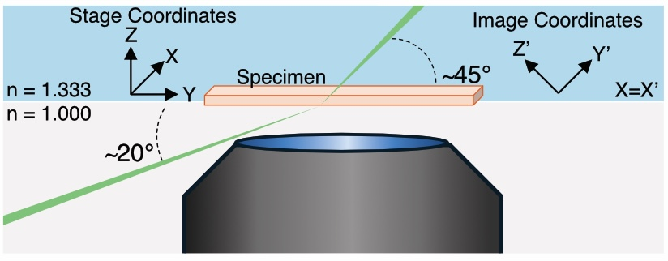

.. _dvopmoverview-home:

##############################
Introduction
##############################

Direct-View OPM
_______________

Direct-View Oblique Plane Microscopy (dvOPM) is an oblique-plane light-sheet microscopy technique designed for mesoscopic fluorescence imaging of extended specimens. In this approach, an oblique imaging plane within the sample is optically sectioned using a light sheet and directly projected onto a camera sensor.

Conventional oblique-plane microscopy systems typically rely on a tertiary imaging objective to re-image the tilted plane onto the detector. In contrast, dvOPM eliminates this requirement by forming the remote image directly on the camera sensor using a simplified relay. This reduces optical complexity and system footprint while preserving the optical sectioning capability of light-sheet microscopy.

As a result, dvOPM enables imaging over large fields of view with optical sectioning in a compact and accessible optical configuration.

------------------------------

System Architecture
___________________

A typical dvOPM system consists of separate illumination and detection optical paths arranged around a shared sample region. The illumination path generates an oblique light sheet that intersects the specimen, while the detection path collects fluorescence from the illuminated plane and relays the tilted image onto a camera sensor.

In general implementations, the detection path is formed using microscope objectives and relay optics, often requiring multiple objectives to re-image the oblique plane. The illumination path is typically implemented separately from the detection optics, particularly when using low numerical aperture objectives that do not support integrated light-sheet delivery. The system is commonly operated in a stage-scanning configuration, where the sample is translated through the stationary illumination and detection planes to acquire volumetric data.

The Altair dvOPM presented here follows this overall architecture while implementing a specific realization of the system as described below.

The detection subsystem is implemented as a remote-imaging relay using a pair of photographic lenses with external pupils. An emission filter wheel (FW1000, Applied Scientific Instrumentation) is positioned within the relay to enable fluorescence imaging. The image is formed directly onto a compact camera (Ximea MU196MR-ON) with a pixel size of 1.4 µm. The entire detection assembly is mounted on a modular baseplate and attached to a motorized linear translation stage, allowing the detection train to be positioned relative to the specimen.

The illumination subsystem is implemented as a separate optical train. It begins with a Powell lens, followed by a sequence of three achromatic doublets that relay and shape the beam. A resonant galvo is incorporated within the illumination path, and the resulting beam forms a micron-scale light sheet that is launched obliquely into the specimen.

The system operates in a stage-scanning geometry, where the sample is translated through the stationary illumination and detection planes. The illumination and detection subsystems are mounted as independent modular baseplates on the optical table, while the stage is positioned above them.

    **Figure 1:** Schematic Geometry of the Altair DV-OPM system. 

The above the schematic illustrates the optical geometry of the system, showing the relative arrangement of the illumination and detection paths around the sample region and the axes defining the oblqiue plane and the stage coordinates.
The illumination light-sheet is launched externally through the coverslip at an angle of approximately 20◦ and refracts to approximately 45◦ upon entering the aqueous specimen. Fluorescence from the obliquely illuminated plane is collected in the epi-direction by the photographic-lens-based detection path. Unprimed axes denote the stage coordinate system, in which Y is the sample-scanning direction, Z is the specimen-depth direction and X is parallel to the long axis of the light-sheet. Primed axes denote the oblique image coordinate system recorded by the camera, in which Y′ is the light-sheet propagation direction, X′ is the long
axis of the light-sheet and Z′ defines the light-sheet thickness. The stage X axis corresponds to the image X′ axis. Thus, each camera frame captures an X′Y′ oblique plane, while volumetric imaging is performed by translating the specimen along stage Y . Following acquisition, image stacks are computationally sheared and rotated into the stage coordinate frame for visualization. 

------------------------------

The detailed optical design and implementation of the detection and illumination subsystems are described in the following section.

------------------------------