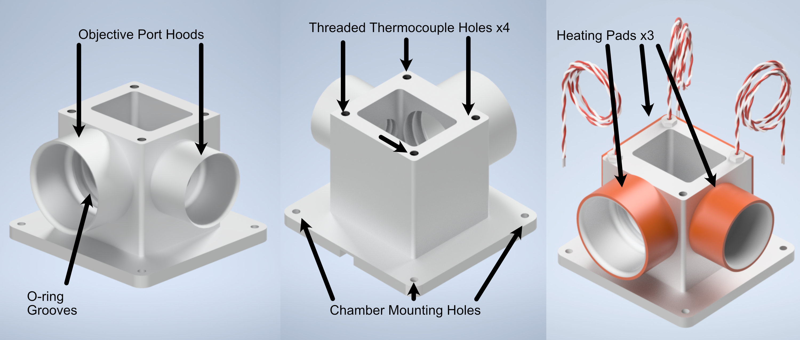
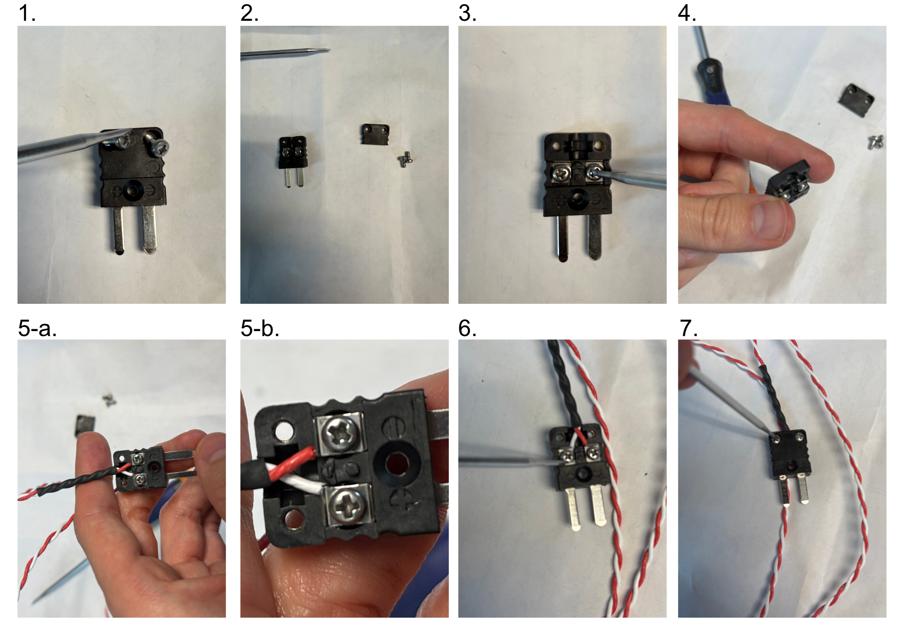
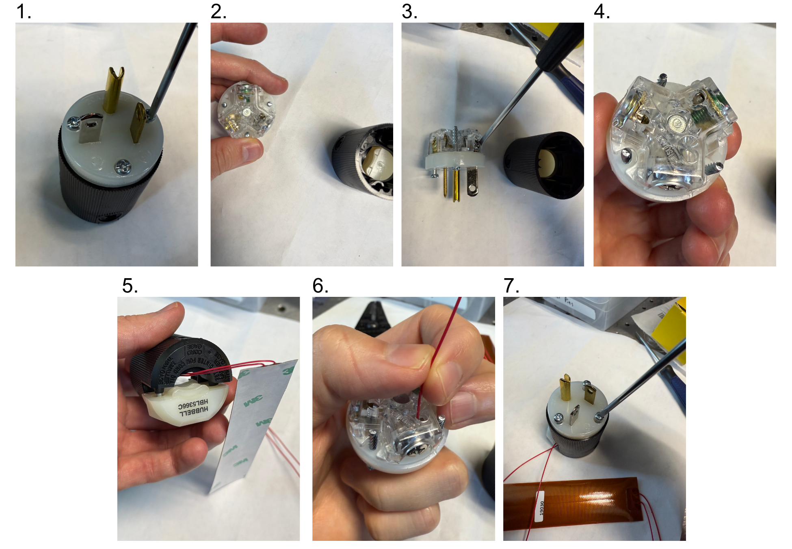
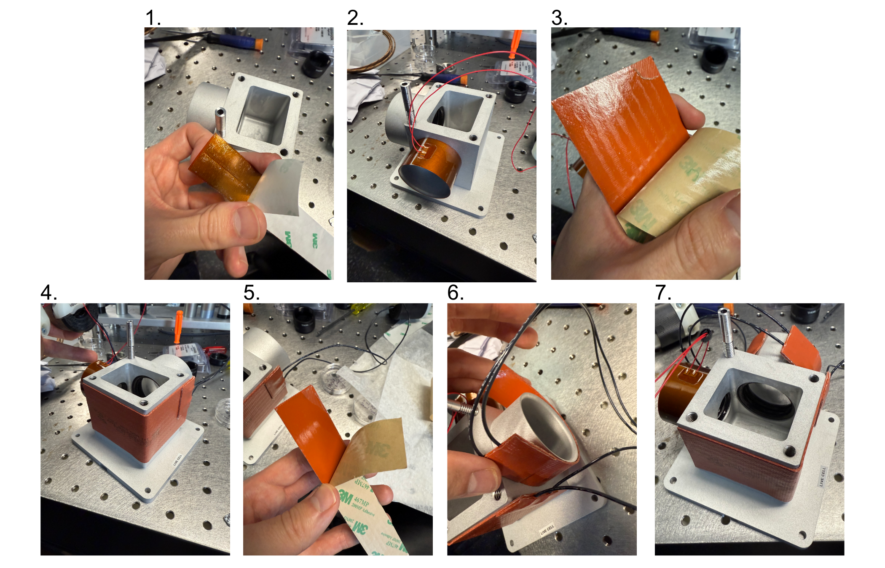
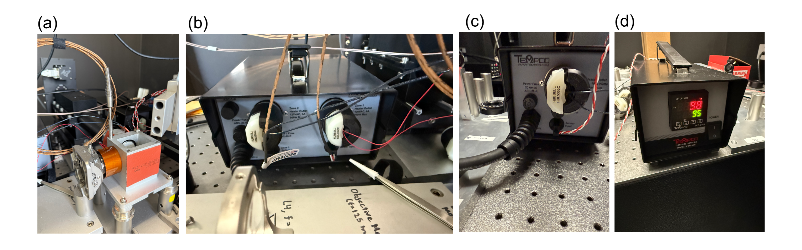
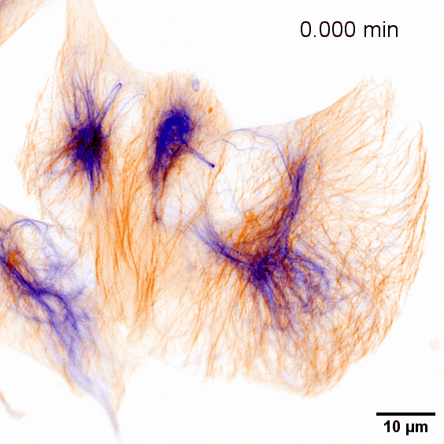
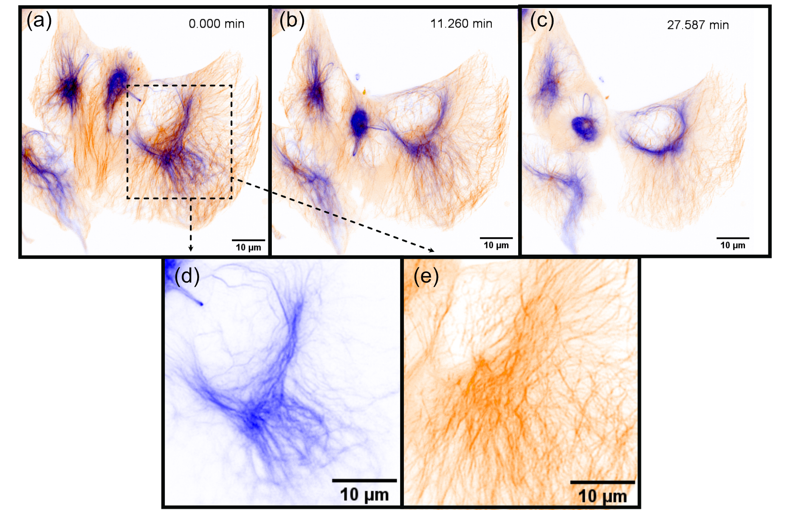

.. _livecellimaging-home:

#################
Live-Cell Imaging
#################

Sample Chamber Design
_____________________

In addition to fixed-cell imaging, there are also a variety of live-cell imaging applications where observing the
evolution or behavior of a cell over time can be valuable. To be able to perform live-cell imaging, the most
important aspect that needs to be addressed compared to fixed-cell imaging is that of a heat-regulated
environment for the cells. In live-cell imaging, the typical temperature ranges that one would use are between
25-37C, with 90% of applications being done at 37C. We've traditionally done this temperature regulation in the past
using a combined system comprised of thermocouples (for detection the ambient temperature), heating pads (to heat the
cell sample chamber), and a heating controller (to manage signals to and from the thermocouples and heating pads and
ensure the chamber remains at a specific temperature). It's also important to note that in addition to the sample
chamber, gently heating the microscope objectives used is also advised to reduce potential effects of thermal
drifting that effect imaging performance.

Our live-cell imaging chamber is meant to serve as an upgrade to our pre-existing sample chamber design and provide
an all-in-one way to accurately heat the sample chamber as well as the two objectives used. The chamber
is designed for the Thorlabs TL20X-MPL illumination objective and Nikon N25X-APO-MP detection objective pairing. As
with our traditional chamber, there are two ports for these objectives with sets of o-ring grooves within them to
form a water-tight seal around the objectives themselves.

In comparison to our traditional chamber design, there are a few changes made in this variant. The first is that
there is not an additional third port for imaging of the light sheet itself. This allows us to place a heating pad
along the two sides of the chamber with no ports and increase the overall surface area that is actively heated on the
chamber. The other large change is that of additional large hoods around each of the objective ports. These hoods are
designed for heating pads to be able to be wrapped around them to apply indirect air heating to the objectives.

    **Figure 1** Our custom live-cell sample chamber

----------

Parts List
__________

Similarly to our philosophy when trying to source all of our components in our system from as few distinct vendors as
possible, we sourced all of the heating elements for this system directly from Mcmaster Carr. There are ceratinly
other options one can go with to accomplish similar heating capabilities, but we'll be basing our full heating
assembly based on the following components:

.. collapse:: Live-Cell Heating Equipment

    .. list-table::
       :header-rows: 1

       * - **Part**
         - **Vendor**
         - **Purpose**
       * - Live-Cell Sample Chamber
         - Xometry
         - Custom-designed live-cell sample chamber
       * - Benchtop Autotuning Temperature Controller, Type J Thermocouple, 1 Bay
         - Mcmaster Carr (Tempco)
         - 1 Bay Temperature Controller for the larger heating pad on the sample chamber side
       * - Benchtop Autotuning Temperature Controller, Type J Thermocouple, 2 Bay
         - Mcmaster Carr (Tempco)
         - 2 Bay Temperature Controller for the heating pads associated with the microscope objectives
       * - 3" Dual Thermocouple Type J, 1/8" Diameter Probe
         - Mcmaster Carr (Reotemp)
         - Optional Dual-Probe Thermocouple for controlling objective temperatures
       * - 1" Threaded Thermocouple 1/4"-20 Threading
         - Mcmaster Carr
         - Threaded Thermocouples to screw into sample chamber, 3 total if not using Dual-Probe thermocouple
       * - 2x5" Adhesive Backed Heat Sheet
         - Mcmaster Carr (Benchmark Thermal)
         - Large heating pad to be placed on the outer surfaces of the sample chamber without objective ports
       * - 5x1" Ultrathin Heat Sheet
         - Mcmaster Carr (All flex solutions)
         - Heating pad to wrap around illumination objective port
       * - 6x1" Adhesive Backed Heat Sheet
         - Mcmaster Carr (Benchmark Thermal)
         - Heating pad to wrap around detection objective port

-------------------------------

Live-Cell Imaging Full Assembly
_______________________________

Thermocouple Adapter Assembly
^^^^^^^^^^^^^^^^^^^^^^^^^^^^^

Thermocouples often come without the necessary adapter placed on the end of their wiring to connect them to a
temperature controller. Below in Figure 2 we show the general process to attaching one of these adapters to the two
thermocouple wires:

    1. Unscrew the screws on the outer shell of the adapter.
    2. Remove the outer shell element of the adapter.
    3. Unscrew the inner screws over both terminals
    4. Ensure that the inner screws are undone enough such that the metal plates underneath can be lifted.
    5. Place the ends of the thermocouple wires beneath the metal plates of each terminal where red = - & white = +.
    6. Screw the inner terminal screws tight.
    7. Place the outer shell element back on the adapter and screw both screws into place on it.

    **Figure 2:** Thermocouple adapter assembly process

-----------------------

Heater Adapter Assembly
^^^^^^^^^^^^^^^^^^^^^^^

The heaters we utilize also lack the necessary adapter placed on the end of their wiring to connect them to a
temperature controller. It also should be noted that for the heater elements, the two wires associated with them are
unpolarized. Below in Figure 3 we show the general process to attaching one of these adapters to the two heater unit
wires:

    1. Unscrew the screws on the side of the adapter with the prongs sticking out
    2. Remove the inner element of the adapter.
    3. Unscrew the side screws over the gold and silver terminals on the inner element
    4. Ensure that the plates within the terminals of the inner element are able to move
    5. Thread the heater wires through the center hole of the detached front side of the adapter
    6. Insert one heater wire into the silver terminal and one into the gold terminal and secure them by tightening
       the side screws.
    7. Place the two adapter elements together, aligning the three screws on the inner element with the respective
       holes on the outer element, and tighten all the screws

    **Figure 3:** Heater adapter assembly process

-------------------------------------

Placing O-rings in the Sample Chamber
^^^^^^^^^^^^^^^^^^^^^^^^^^^^^^^^^^^^^

In order to ensure a watertight seal around our objectives, both of our objective ports feature two sets of o-rings
surrounding their circumference. For our smaller port associated with the TL20X-MPL objective, we use oil-resistant
Buna-N O-Rings with 11/16" inner diameter (ID) and 13/16" outer diameter (OD). For the larger port associated with
the Nikon 20X objective, we used Buna o-rings with roughly 1.3" ID and 1.7" OD. These o-rings and their associated
grooves are first coated with vacuum grease in the following process:

    1. Unscrew vacuum grease container
    2. Using either a finger or a cotton-tipped applicator, apply a layer of vacuum grease into and around the grooves
       on both ports
    3. Put more vacuum grease on the cotton-tipped applicator
    4. Using a finger or cotton-tipped applicator, take an o-ring and coat it fully in the vacuum grease.
    5. Place the o-ring in the appropriate groove using a finger or tweezers to help ensure it sits within the groove
    6. Repeat steps 3-5 for all 4 o-ring grooves in the chamber

.. figure:: Images/OringPlacement.png
    :align: center
    :alt: Preparation and Placement of O-rings in the Sample Chamber

    **Figure 4:** Preparation and Placement of O-rings in the Sample Chamber

---------------------------------------------------

Placement of the Heating Pads on the Sample Chamber
^^^^^^^^^^^^^^^^^^^^^^^^^^^^^^^^^^^^^^^^^^^^^^^^^^^

The placement of heating pads on the chamber is a straightforward process, particularly with the adhesive-backed pads
we detailed in our parts list. In the application process, a general consideration should be made as to the
direction the wires from the thermocouple are pointed in, as the actual wire lengths are relatively short you want
to be as efficient as possible with them.The general assembly process is as follows:

    1. Remove protective backing for the 5x1" ultrathin heat sheet
    2. Wrap the 5x1" heat sheet carefully around the exterior of the smaller port on the sample chamber, oriented
       such that the wires are pointed towards the direction your heating controller will be.
    3. Remove protective backing for the 2x5" heat sheet
    4. Wrap the 2x5" heat sheet carefully around the exterior sides of the sample chamber with no ports on them,
       oriented such that the wires are pointed towards the direction of your heating controller.
    5. Remove protective backing for the 6x1" ultrathin heat sheet
    6. Wrap the 6x1" heat sheet carefully around the exterior of the larger port on the sample chamber, oriented
       such that the wires are pointed towards the direction your heating controller will be.

    **Figure 5:** Preparation and Placement of Heating Pads on the Sample Chamber

--------------------------------------------

Temperature Controller Assembly and Settings
^^^^^^^^^^^^^^^^^^^^^^^^^^^^^^^^^^^^^^^^^^^^

With the individual components of our heating assembly prepared, the full assembly of the system is straightforward.
There is some variation in terms of if one opts to use 3 threaded thermocouples or a combination of one dual-probe
thermocouple and one threaded thermocouple, but in principle both configurations are valid and will yield the same
system properties. In our case, we began by testing the dual-probe + 1 threaded thermocouple system which is
reflected in our figure below. Our general process is as follows:

    1. Mount the sample chamber and position it such that both objectives are able to enter the chamber
       (more detailed setup on aligning the objectives and positioning them can be found on our Microscope Assembly
       page).
    2. Place chosen thermocouples into position in one of the 4 threaded thermocouple holes on the top of the sample
       chamber. We chose the dual-probe thermocouple to simultaneously control the heating of both objectives, so we
       placed it in the hole between the two objective ports. For our threaded thermocouple we chose it to correspond
       to our larger heating pad on the exterior of the chamber walls, and placed it in the corner that was closest to
       where we were able to physically place our individual controller for it.
    3. Plug the thermocouple adapters for each thermocouple into their respective ports on their temperature
       controllers. In our case we had our two-bay controller for our two objective ports, and the one-bay controller
       for the larger exterior heating pad.
    4. Plug the heating pad modules into the outlets on the back of the controllers corresponding to their respective
       ports
    5. Plug the temperature controllers into an outlet and turn on the power
    6. Using the two middle arrow buttons on the temperature controller display, adjust the temperature to the
       desired value. The controller will take temperature values from the thermocouples and automatically heat the
       heating pads accordingly to match the set value.

    **Figure 6:** Final Assembly and Setting of the Temperature Controllers

-------------------------------

Live-Cell Imaging Examples
_______________________________

As a demonstration of the live cell imaging capabilities of our first Altair-LSFM baseplate iteration, we imaged
dual-channel retinal pigment epithelial (RPE) cells with the microtubules and vimentin tagged with GFP and TagRFP-T,
respectively. Images were acquired over a ~30 minute time period, where 50 frames were taken for both channels. Shown
in Figures 7 and 8 below, the cells exhibited robust motility, where vimentin and microtubule structures are
reorganized over the course of the timelapse.

    **Figure 7:** Final Assembly and Setting of the Temperature Controllers

    **Figure 8:** Stills from our live cell video showing actively migrating retinal pignment epithelial (RPE) cells,
    showing vimentin (blue) and microtubules (orange). The series comprises of 50 frames; representative time points are
    displayed.